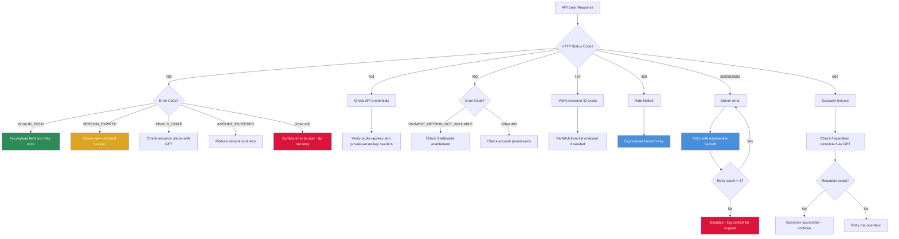
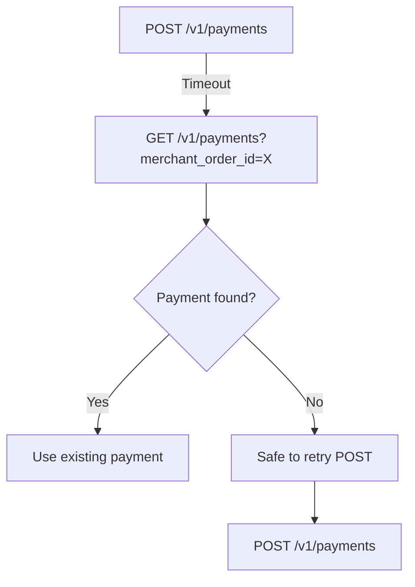
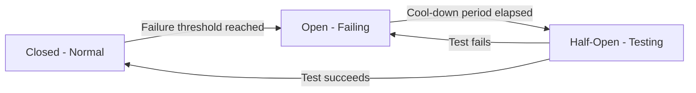

## Overview

AI agents must handle errors gracefully across multi-step payment workflows. This guide provides decision trees, retry patterns, and recovery strategies for every failure mode an agent may encounter.

<Note>
Payment APIs involve real money. Incorrect error handling can lead to duplicate charges, missed refunds, or stuck transactions. Follow these patterns precisely.
</Note>

---

## Error Decision Tree

Use this decision tree to determine the correct action for any HTTP error response.



---

## Retry vs. Fallback vs. Escalate

| HTTP Code | Category | Retryable? | Strategy |
|-----------|----------|------------|----------|
| 400 | Client error | No (fix first) | Parse error, fix payload, submit corrected request |
| 401 | Auth error | No | Verify credentials; do not retry with same keys |
| 403 | Permission | No | Check merchant configuration in Dashboard |
| 404 | Not found | No | Verify resource ID; re-fetch from list endpoint |
| 429 | Rate limit | Yes | Exponential backoff: 1s, 2s, 4s (max 3 retries) |
| 500 | Server error | Yes | Exponential backoff: 1s, 2s, 4s (max 3 retries) |
| 502 | Bad gateway | Yes | Exponential backoff: 2s, 4s, 8s (max 3 retries) |
| 503 | Unavailable | Yes | Exponential backoff: 2s, 4s, 8s (max 3 retries) |
| 504 | Timeout | Conditional | Check if operation completed before retrying |

---

## Exponential Backoff Pattern

All retryable errors should use exponential backoff with jitter to avoid thundering herd problems.

```javascript
async function retryWithBackoff(fn, maxRetries = 3, baseDelay = 1000) {
  for (let attempt = 0; attempt <= maxRetries; attempt++) {
    try {
      return await fn();
    } catch (error) {
      const isRetryable = [429, 500, 502, 503].includes(error.status);
      const isLastAttempt = attempt === maxRetries;

      if (!isRetryable || isLastAttempt) {
        throw error;
      }

      // Exponential backoff with jitter
      const delay = baseDelay * Math.pow(2, attempt);
      const jitter = delay * 0.1 * Math.random();
      await sleep(delay + jitter);
    }
  }
}
```

---

## Timeout Handling with Polling Fallback

When a payment request times out, the payment may have been created successfully on the server. Always check before retrying.



### Implementation

```javascript
async function createPaymentWithTimeoutRecovery(paymentPayload) {
  try {
    return await yuno.createPayment(paymentPayload);
  } catch (error) {
    if (error.code === "ECONNABORTED" || error.status === 504) {
      // Check if payment was created despite timeout
      const payments = await yuno.listPayments({ limit: 5 });
      const existing = payments.find(
        p => p.checkout_session === paymentPayload.checkout_session
      );

      if (existing) {
        return existing; // Payment was created
      }

      // Safe to retry
      return await yuno.createPayment(paymentPayload);
    }
    throw error;
  }
}
```

---

## Partial Failure Recovery

Multi-step workflows can fail partway through. Each step requires specific recovery logic.

### Session Created, Payment Failed

**Scenario:** `createCheckoutSession` succeeded but `createPayment` returned an error.

**Recovery:**
1. Parse the payment error to determine if the payload needs fixing
2. If fixable (400 with `INVALID_FIELD`): correct the payload and retry `createPayment` using the same `checkout_session`
3. If not fixable (403, method not available): create a new checkout session with different parameters
4. Checkout sessions expire after a configurable period -- do not reuse stale sessions

```javascript
async function recoverFromPaymentFailure(checkoutSession, originalPayload, error) {
  if (error.status === 400 && error.body?.error?.code === "INVALID_FIELD") {
    // Fix the specific field mentioned in the error
    const fixedPayload = fixPayloadField(originalPayload, error.body.error);
    return await yuno.createPayment(fixedPayload);
  }

  if (error.status === 403) {
    // Payment method not available -- cannot use same session
    // Surface to user: "Payment method X is not enabled for country Y"
    throw new Error(
      `Payment method ${originalPayload.payment_method.type} ` +
      `not available in ${originalPayload.country}. ` +
      `Enable it in Dashboard > Settings > Payment Methods.`
    );
  }

  throw error;
}
```

### Payment Succeeded, Webhook Not Received

**Scenario:** Payment shows `SUCCEEDED` but webhook was not delivered.

**Recovery:**
1. Poll `getPayment` to confirm status
2. If SUCCEEDED, proceed with order fulfillment regardless of webhook
3. Implement idempotent webhook processing so late-arriving webhooks do not cause duplicate actions

```javascript
async function pollPaymentStatus(paymentId, timeout = 30000) {
  const startTime = Date.now();
  const pollInterval = 3000;

  while (Date.now() - startTime < timeout) {
    const payment = await yuno.getPayment(paymentId);

    if (payment.status !== "PENDING") {
      return payment;
    }

    await sleep(pollInterval);
  }

  // Timeout reached -- payment still pending
  return { status: "PENDING", paymentId, action: "CONTINUE_POLLING_OR_ESCALATE" };
}
```

### Capture Failed After Authorization

**Scenario:** Payment was authorized but capture request failed.

**Recovery:**
1. Check if the capture actually went through (GET the payment)
2. If still AUTHORIZED: retry the capture
3. If authorization has expired (typically 7 days): cannot capture; must create a new payment
4. If already SUCCEEDED: capture went through despite the error response

```javascript
async function safeCapturePayment(paymentId, captureAmount) {
  try {
    return await yuno.capturePayment(paymentId, { amount: captureAmount });
  } catch (error) {
    // Verify actual state before retrying
    const payment = await yuno.getPayment(paymentId);

    if (payment.status === "SUCCEEDED") {
      return payment; // Capture succeeded despite error
    }

    if (payment.status === "AUTHORIZED") {
      // Safe to retry
      return await retryWithBackoff(
        () => yuno.capturePayment(paymentId, { amount: captureAmount })
      );
    }

    // Authorization expired or cancelled
    throw new Error(`Payment is in ${payment.status} status. Cannot capture.`);
  }
}
```

---

## Idempotent Retry Patterns

For multi-step flows, use idempotency keys and deduplication to prevent duplicate operations.

### Deduplication Strategy

| Operation | Deduplication Key | Strategy |
|-----------|------------------|----------|
| Create session | `merchant_order_id` | Check if session already exists for this order |
| Create payment | `checkout_session` | Only one payment per session; second call returns error |
| Refund | `payment_id` + `amount` | Check current refund total before submitting |
| Create recipient | `merchant_recipient_id` | Query existing recipients before creating |
| Create payout | `merchant_reference` | Use unique references per payout attempt |

### Example: Safe Refund

```javascript
async function safeRefund(paymentId, refundAmount) {
  // Step 1: Check current payment state
  const payment = await yuno.getPayment(paymentId);

  if (payment.status === "REFUNDED") {
    return { already_refunded: true, payment };
  }

  if (payment.status === "PARTIALLY_REFUNDED") {
    // Calculate remaining refundable amount
    // (This requires tracking previous refund amounts)
    // Verify refundAmount does not exceed remaining
  }

  if (!["SUCCEEDED", "PARTIALLY_REFUNDED"].includes(payment.status)) {
    throw new Error(`Cannot refund: payment is in ${payment.status} status`);
  }

  // Step 2: Execute refund with retry
  return await retryWithBackoff(
    () => yuno.refundPayment(paymentId, {
      amount: { currency: payment.amount.currency, value: refundAmount },
      reason: "Agent-initiated refund"
    })
  );
}
```

---

## Circuit Breaker Pattern

When a provider experiences sustained outages, implement a circuit breaker to avoid wasting API calls and degrading user experience.



### Implementation

```javascript
class CircuitBreaker {
  constructor(failureThreshold = 5, cooldownMs = 60000) {
    this.failureThreshold = failureThreshold;
    this.cooldownMs = cooldownMs;
    this.failures = 0;
    this.state = "CLOSED";
    this.lastFailureTime = 0;
  }

  async call(fn) {
    if (this.state === "OPEN") {
      if (Date.now() - this.lastFailureTime > this.cooldownMs) {
        this.state = "HALF_OPEN";
      } else {
        throw new Error("Circuit breaker is OPEN. Provider unavailable.");
      }
    }

    try {
      const result = await fn();
      this.onSuccess();
      return result;
    } catch (error) {
      this.onFailure();
      throw error;
    }
  }

  onSuccess() {
    this.failures = 0;
    this.state = "CLOSED";
  }

  onFailure() {
    this.failures++;
    this.lastFailureTime = Date.now();
    if (this.failures >= this.failureThreshold) {
      this.state = "OPEN";
    }
  }
}

// Usage
const paymentCircuit = new CircuitBreaker(5, 60000);

async function createPaymentWithCircuitBreaker(payload) {
  return paymentCircuit.call(() => yuno.createPayment(payload));
}
```

---

## Error Code Mapping Table

Complete mapping of error codes to agent actions.

| Error Code | HTTP | Meaning | Agent Action | Example |
|-----------|------|---------|-------------|---------|
| `INVALID_REQUEST` | 400 | Malformed request body | Parse error, fix schema, retry once | Missing required field |
| `INVALID_FIELD` | 400 | Specific field validation failed | Fix the named field, retry once | Wrong document format |
| `SESSION_EXPIRED` | 400 | Checkout session timed out | Create new session | Session older than TTL |
| `INVALID_STATE` | 400 | Operation not valid for current state | GET resource to check actual state | Capture on non-AUTHORIZED payment |
| `AMOUNT_EXCEEDED` | 400 | Amount exceeds allowed limit | Reduce amount | Refund > remaining balance |
| `UNAUTHORIZED` | 401 | Bad or missing API keys | Verify headers: `public-api-key`, `private-secret-key`, `account-code` | Typo in API key |
| `FORBIDDEN` | 403 | Account lacks permission | Check Dashboard settings | Feature not enabled |
| `PAYMENT_METHOD_NOT_AVAILABLE` | 403 | Method not enabled for country | Enable in Dashboard > Payment Methods | PIX not enabled for BR |
| `NOT_FOUND` | 404 | Resource does not exist | Verify ID, query list endpoint | Wrong payment_id |
| `RATE_LIMITED` | 429 | Too many requests | Exponential backoff, max 3 retries | Burst of API calls |
| `PROVIDER_ERROR` | 500 | Downstream provider failure | Retry with backoff; if persistent, escalate | Provider outage |
| `INTERNAL_ERROR` | 500 | Yuno server error | Retry with backoff, max 3 retries | Transient server issue |
| `SERVICE_UNAVAILABLE` | 503 | Yuno maintenance or overload | Retry with backoff, check status page | Planned maintenance |
| `GATEWAY_TIMEOUT` | 504 | Request timed out | Check if operation completed, then retry | Slow provider response |

---

## Webhook Error Handling

Agents processing webhooks should handle these failure scenarios:

### Duplicate Webhooks

Yuno may deliver the same webhook multiple times. Use `webhook_id` for deduplication.

```javascript
const processedWebhooks = new Set();

function handleWebhook(event) {
  if (processedWebhooks.has(event.webhook_id)) {
    return { status: 200, body: "Already processed" };
  }

  processedWebhooks.add(event.webhook_id);
  // Process the event...
}
```

### Out-of-Order Webhooks

Webhooks may arrive out of order. Always check the `timestamp` and current payment status.

```javascript
async function handlePaymentWebhook(event) {
  const payment = await yuno.getPayment(event.data.payment_id);

  // Use the actual payment status, not the webhook status
  // The payment status from GET is always the source of truth
  await updateOrderStatus(payment.merchant_order_id, payment.status);
}
```

### Failed Webhook Delivery

If your webhook endpoint is down, Yuno retries with exponential backoff. Implement a reconciliation job that periodically polls `listPayments` to catch any missed webhooks.

```javascript
async function reconcilePayments(since) {
  const payments = await yuno.listPayments({ limit: 100 });

  for (const payment of payments) {
    const order = await getOrder(payment.merchant_order_id);
    if (order.status !== mapPaymentStatus(payment.status)) {
      await updateOrderStatus(order.id, payment.status);
    }
  }
}
```

---

## Escalation Checklist

When automated recovery fails, provide this context to Yuno support:

```
Subject: [Error Code] - [One-line summary]

Environment: Sandbox / Production
Timestamp: [ISO 8601 from error response]
Merchant ID: [Redacted if sensitive]

Request:
  Method: POST
  Endpoint: /v1/payments
  Headers: [List relevant headers, redact keys]
  Body: [Full request payload]

Response:
  Status: 500
  Body: [Full error response]

Recovery attempted:
  - Retried 3 times with exponential backoff
  - Verified checkout session is still ACTIVE
  - Confirmed payment method is enabled in Dashboard

Documentation reference: https://docs.y.uno/reference/create-payment
```
