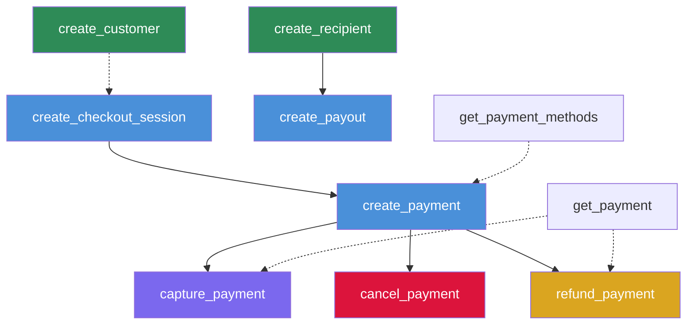
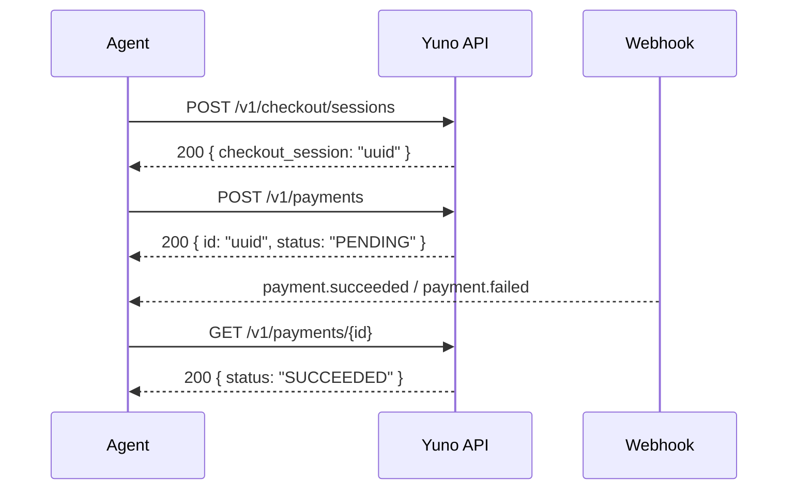
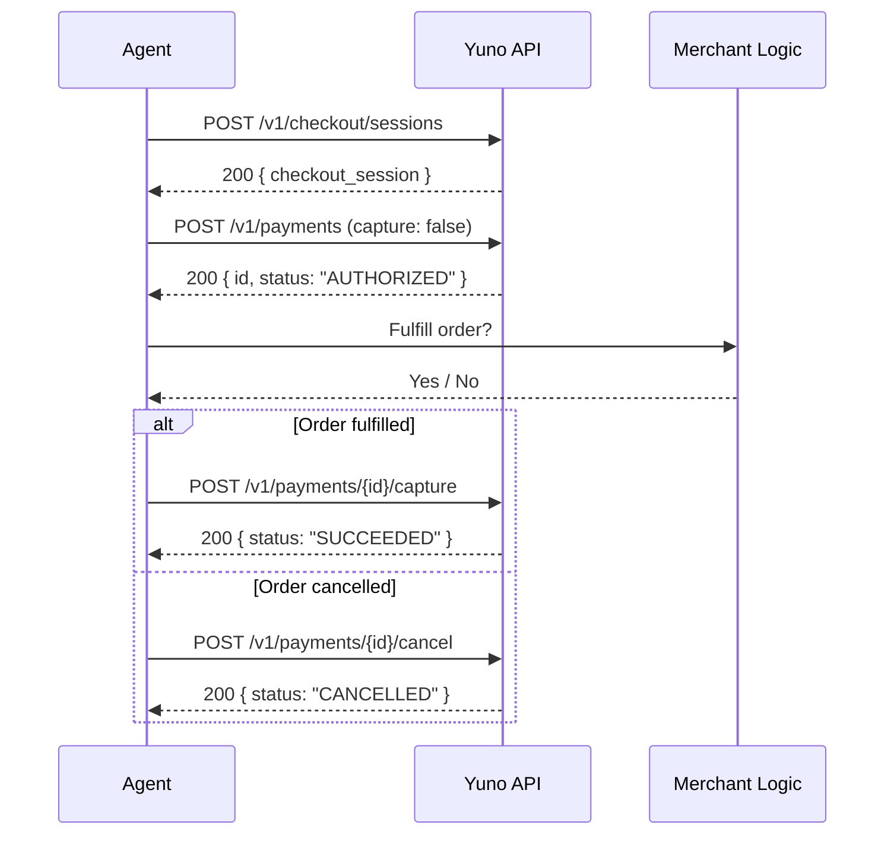
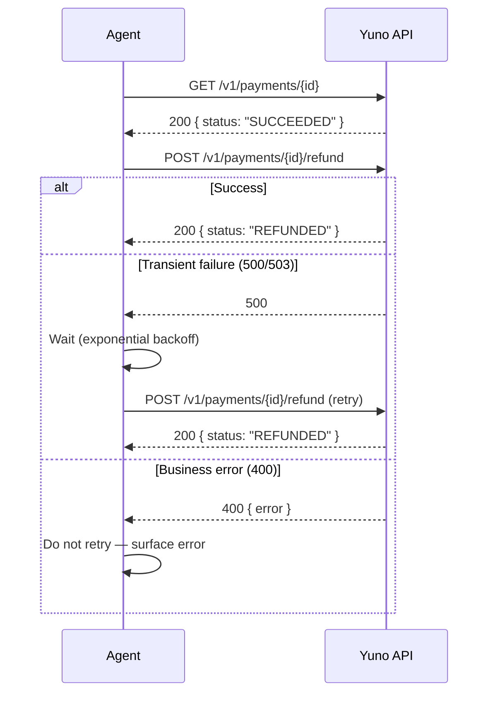
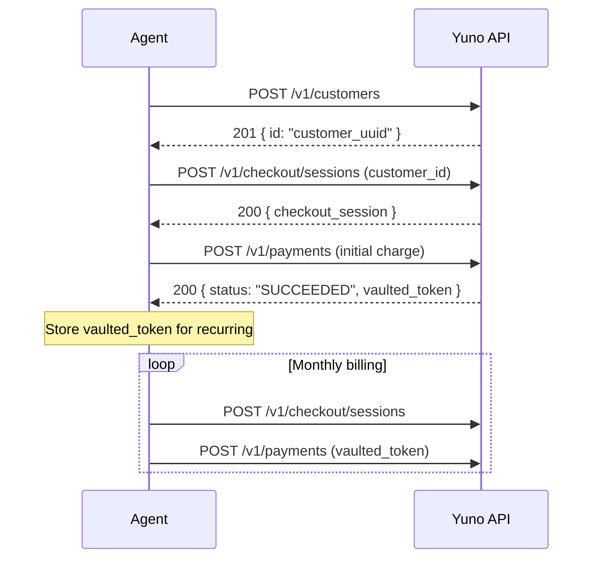
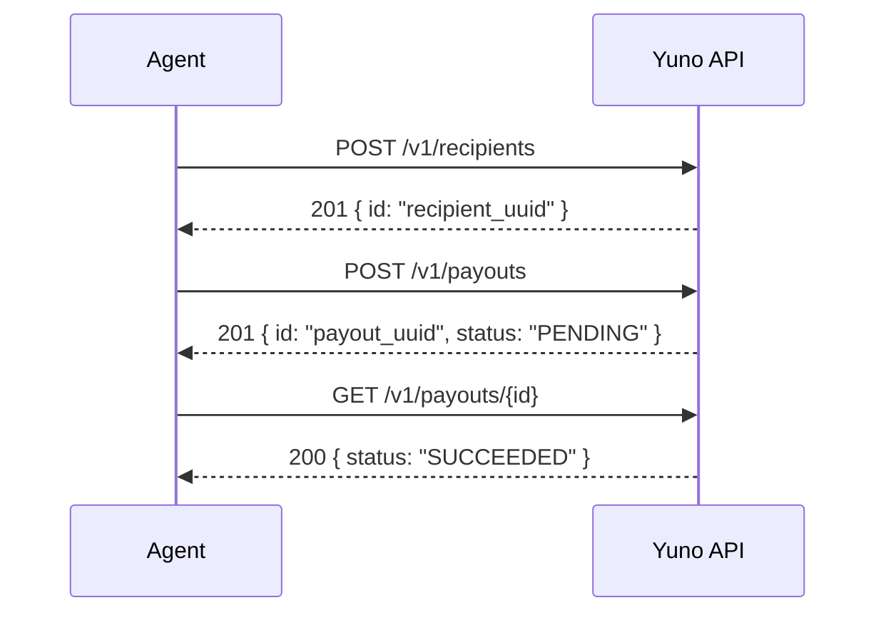

## Overview

This guide documents multi-step orchestration workflows for AI agents integrating with Yuno's payment APIs. Each workflow includes a dependency graph, step-by-step instructions, error boundaries, and code examples.

<Note>
These workflows assume the agent has access to Yuno MCP tools or direct API access. See [MCP Tool Reference](/ai/mcp-tool-reference) for tool specifications and [Error Recovery](/ai/agent-error-recovery) for failure handling patterns.
</Note>

---

## Tool Dependency Graph

Before executing any workflow, agents must understand which API calls depend on prior calls.



**Legend:**
- Solid arrows: strict dependency (must complete before next step)
- Dashed arrows: optional dependency (improves flow but not required)

---

## State Management Between Calls

Agents must persist the following values across multi-step workflows:

| Value | Source | Used By |
|-------|--------|---------|
| `checkout_session` | `createCheckoutSession` response | `createPayment` |
| `payment_id` | `createPayment` response | `capturePayment`, `refundPayment`, `cancelPayment`, `getPayment` |
| `customer_id` | `createCustomer` response | `createCheckoutSession` (optional) |
| `recipient_id` | `createRecipient` response | `createPayout` |

<Warning>
Never hardcode IDs across steps. Always extract them from the previous step's response and pass them dynamically.
</Warning>

---

## Workflow 1: Standard Checkout Flow

The most common integration pattern: create a session, collect payment, and confirm via webhook.

### Sequence Diagram



### Step-by-Step Instructions

<Steps>
  <Step title="Create checkout session">
    Call `createCheckoutSession` with amount, country, and merchant order ID.

    **Required fields:** `amount.currency`, `amount.value`, `country`, `merchant_order_id`

    **Error boundary:** If this fails with 400, validate the payload schema. If 401, check API credentials.
  </Step>

  <Step title="Create payment">
    Extract `checkout_session` from Step 1 response. Call `createPayment` with payment method details.

    **Required fields:** `checkout_session`, `payment_method.type`, `amount`, `country`

    **Error boundary:** If 400 with "customer.document required", add customer document fields for the payment method (e.g., CPF for PIX in Brazil).
  </Step>

  <Step title="Handle webhook or poll">
    Wait for `payment.succeeded` or `payment.failed` webhook. If no webhook within 30 seconds, poll `getPayment` with the payment ID.

    **Error boundary:** If payment stays in PENDING for more than 5 minutes, check provider status.
  </Step>
</Steps>

### Code Example

```javascript
async function standardCheckoutFlow(orderDetails) {
  // Step 1: Create checkout session
  const session = await yuno.createCheckoutSession({
    amount: { currency: "BRL", value: orderDetails.total },
    country: "BR",
    merchant_order_id: orderDetails.orderId,
    payment_description: orderDetails.description
  });

  const checkoutSessionId = session.checkout_session;

  // Step 2: Create payment
  const payment = await yuno.createPayment({
    checkout_session: checkoutSessionId,
    payment_method: { type: "PIX" },
    amount: { currency: "BRL", value: orderDetails.total },
    country: "BR",
    customer: {
      document: { document_type: "CPF", document_number: orderDetails.cpf },
      email: orderDetails.email
    }
  });

  // Step 3: Poll for final status if not using webhooks
  let status = payment.status;
  let attempts = 0;
  while (status === "PENDING" && attempts < 10) {
    await sleep(3000);
    const updated = await yuno.getPayment(payment.id);
    status = updated.status;
    attempts++;
  }

  return { paymentId: payment.id, status };
}
```

---

## Workflow 2: Authorize and Capture Flow

For merchants who need to authorize first, then capture after fulfillment.

### Sequence Diagram



### Decision Points

| Condition | Action |
|-----------|--------|
| Payment status = `AUTHORIZED` | Proceed to capture or cancel decision |
| Payment status = `DECLINED` | Do not retry capture; investigate decline reason |
| Capture amount < authorized amount | Partial capture is supported |
| Authorization expired (typically 7 days) | Cannot capture; must create new payment |

### Code Example

```javascript
async function authCaptureFlow(orderDetails) {
  // Step 1: Create session
  const session = await yuno.createCheckoutSession({
    amount: { currency: "BRL", value: orderDetails.total },
    country: "BR",
    merchant_order_id: orderDetails.orderId
  });

  // Step 2: Authorize (do not auto-capture)
  const payment = await yuno.createPayment({
    checkout_session: session.checkout_session,
    payment_method: {
      type: "CARD",
      token: orderDetails.cardToken
    },
    amount: { currency: "BRL", value: orderDetails.total },
    country: "BR"
  });

  if (payment.status !== "AUTHORIZED") {
    return { error: "Authorization failed", status: payment.status };
  }

  // Step 3: Decide — capture or cancel
  const shouldFulfill = await checkInventoryAndFraud(orderDetails);

  if (shouldFulfill) {
    const captured = await yuno.capturePayment(payment.id, {
      amount: { currency: "BRL", value: orderDetails.total }
    });
    return { paymentId: payment.id, status: captured.status };
  } else {
    const cancelled = await yuno.cancelPayment(payment.id);
    return { paymentId: payment.id, status: cancelled.status };
  }
}
```

---

## Workflow 3: Refund with Retry Flow

Process refunds with built-in retry logic for transient failures.

### Sequence Diagram



### Step-by-Step Instructions

<Steps>
  <Step title="Verify payment status">
    Call `getPayment` to confirm the payment is in `SUCCEEDED` status. Refunds cannot be issued for `PENDING`, `DECLINED`, or `CANCELLED` payments.
  </Step>

  <Step title="Submit refund">
    Call `refundPayment` with optional amount (omit for full refund) and reason.

    **Error boundary:** 400 errors are not retryable (e.g., refund exceeds balance). 500/503 errors should be retried with exponential backoff.
  </Step>

  <Step title="Confirm refund">
    Poll `getPayment` to verify the status changed to `REFUNDED` or `PARTIALLY_REFUNDED`. Listen for `refund.succeeded` or `refund.failed` webhooks.
  </Step>
</Steps>

### Code Example

```javascript
async function refundWithRetry(paymentId, refundAmount, reason) {
  // Step 1: Verify payment is refundable
  const payment = await yuno.getPayment(paymentId);

  if (!["SUCCEEDED", "PARTIALLY_REFUNDED"].includes(payment.status)) {
    throw new Error(`Cannot refund payment in ${payment.status} status`);
  }

  // Step 2: Attempt refund with retry
  const maxRetries = 3;
  for (let attempt = 0; attempt < maxRetries; attempt++) {
    try {
      const result = await yuno.refundPayment(paymentId, {
        amount: refundAmount
          ? { currency: payment.amount.currency, value: refundAmount }
          : undefined,
        reason: reason || "Customer requested refund"
      });
      return result;
    } catch (err) {
      if (err.status >= 500 && attempt < maxRetries - 1) {
        await sleep(Math.pow(2, attempt) * 1000);
        continue;
      }
      throw err;
    }
  }
}
```

---

## Workflow 4: Subscription Creation Flow

Create a customer, vault their payment method, and process recurring payments.

### Sequence Diagram



### Step-by-Step Instructions

<Steps>
  <Step title="Create customer">
    Call `createCustomer` with email, name, and document. Store the returned `customer_id`.
  </Step>

  <Step title="Initial payment with token vaulting">
    Create a checkout session with the `customer_id`. Process the first payment using a card token. The response includes a `vaulted_token` for future charges.
  </Step>

  <Step title="Recurring payments">
    For each billing cycle, create a new checkout session and payment using the `vaulted_token` instead of a new card token. This enables charges without re-collecting card details.
  </Step>
</Steps>

### Code Example

```javascript
async function setupSubscription(customerDetails, cardToken) {
  // Step 1: Create customer
  const customer = await yuno.createCustomer({
    email: customerDetails.email,
    first_name: customerDetails.firstName,
    last_name: customerDetails.lastName,
    document: {
      document_type: "CPF",
      document_number: customerDetails.cpf
    }
  });

  // Step 2: Initial charge
  const session = await yuno.createCheckoutSession({
    amount: { currency: "BRL", value: 29.90 },
    country: "BR",
    merchant_order_id: `sub-${customer.id}-initial`,
    customer_id: customer.id
  });

  const payment = await yuno.createPayment({
    checkout_session: session.checkout_session,
    payment_method: { type: "CARD", token: cardToken },
    amount: { currency: "BRL", value: 29.90 },
    country: "BR"
  });

  // Store vaulted_token from payment response for recurring
  return {
    customerId: customer.id,
    vaultedToken: payment.payment_method.vaulted_token,
    initialPaymentId: payment.id
  };
}

async function chargeRecurring(customerId, vaultedToken, amount) {
  const session = await yuno.createCheckoutSession({
    amount: { currency: "BRL", value: amount },
    country: "BR",
    merchant_order_id: `sub-${customerId}-${Date.now()}`,
    customer_id: customerId
  });

  return await yuno.createPayment({
    checkout_session: session.checkout_session,
    payment_method: { type: "CARD", vaulted_token: vaultedToken },
    amount: { currency: "BRL", value: amount },
    country: "BR"
  });
}
```

---

## Workflow 5: BaaS Entity Onboarding Flow

Onboard a recipient and process their first payout.

### Sequence Diagram



### Step-by-Step Instructions

<Steps>
  <Step title="Create recipient">
    Call `createRecipient` with the seller's details: name, document, bank account, and country. The `merchant_recipient_id` should be your internal identifier for deduplication.
  </Step>

  <Step title="Create payout">
    Call `createPayout` with the `recipient_id` from Step 1, amount, country, and purpose.
  </Step>

  <Step title="Verify payout">
    Poll `getPayout` or listen for payout webhooks to confirm the funds were transferred.
  </Step>
</Steps>

### Code Example

```javascript
async function onboardAndPayout(sellerDetails, payoutAmount) {
  // Step 1: Create recipient
  const recipient = await yuno.createRecipient({
    merchant_recipient_id: sellerDetails.internalId,
    country: "BR",
    name: sellerDetails.name,
    email: sellerDetails.email,
    document: {
      document_type: "CPF",
      document_number: sellerDetails.cpf
    },
    bank_account: {
      bank_code: sellerDetails.bankCode,
      account_number: sellerDetails.accountNumber,
      account_type: "CHECKING"
    }
  });

  // Step 2: Create payout
  const payout = await yuno.createPayout({
    amount: { currency: "BRL", value: payoutAmount },
    country: "BR",
    recipient_id: recipient.id,
    description: `Payout to ${sellerDetails.name}`,
    merchant_reference: `payout-${sellerDetails.internalId}-${Date.now()}`,
    purpose: "SELLER_PAYMENT"
  });

  return { recipientId: recipient.id, payoutId: payout.id, status: payout.status };
}
```

---

## Error Boundaries Summary

Every workflow step has defined error boundaries. Here is the consolidated recovery matrix:

| Step | Retryable Errors | Non-Retryable Errors | Recovery Action |
|------|-----------------|---------------------|-----------------|
| Create session | 500, 503, 429 | 400, 401 | Fix payload or credentials |
| Create payment | 500, 503, 429 | 400, 403 | Validate fields, check enablement |
| Capture payment | 500, 503 | 400 (wrong status) | Verify payment is AUTHORIZED |
| Refund payment | 500, 503 | 400 (exceeds balance) | Check remaining refundable amount |
| Create recipient | 500, 503 | 400 | Validate document and bank details |
| Create payout | 500, 503 | 400, 403 | Verify recipient exists and is active |

For detailed error recovery patterns, see [Agent Error Recovery](/ai/agent-error-recovery).
