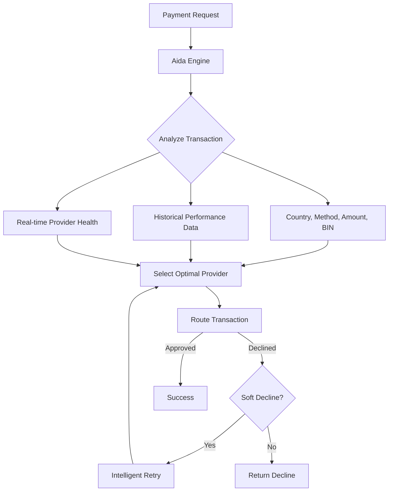

## Overview

Aida is Yuno's AI-powered payment optimization engine. It uses machine learning to analyze transaction patterns and automatically optimize routing decisions, retry strategies, and approval rates in real time.

<Note>
Aida learns from your transaction history over time. Optimization accuracy improves as more data becomes available, typically reaching peak performance after 30 days of production data.
</Note>

## Core Capabilities

<CardGroup cols={2}>
  <Card title="Smart Routing" icon="route">
    Dynamically selects the optimal provider for each transaction based on historical approval rates, cost, and real-time provider availability.
  </Card>
  <Card title="Intelligent Retry" icon="rotate">
    Automatically retries soft-declined transactions with alternative providers, using learned patterns to maximize recovery without exceeding network retry limits.
  </Card>
  <Card title="Approval Rate Optimization" icon="chart-line">
    Adjusts transaction parameters (e.g., 3DS decisioning, provider selection) to maximize approval rates while maintaining risk thresholds.
  </Card>
  <Card title="Cost Optimization" icon="coins">
    Balances approval rates against processing costs, routing to lower-cost providers when approval probability is equivalent.
  </Card>
</CardGroup>

## How Aida Works

## Enabling Aida

<Steps>
  <Step title="Navigate to AI settings">
    Go to **Dashboard > AI > Aida Agent** settings.
  </Step>

  <Step title="Enable Aida optimization">
    Toggle Aida to **Active**. Choose which optimization features to enable:

    | Feature | Default | Description |
    |---------|---------|-------------|
    | Smart Routing | On | AI-selected provider routing |
    | Intelligent Retry | On | Automatic soft-decline retries |
    | Approval Optimization | On | Parameter tuning for approvals |
    | Cost Optimization | Off | Cost-weighted provider selection |
  </Step>

  <Step title="Set constraints">
    Define boundaries for Aida's decision-making:

    - **Maximum retry attempts:** 1-3 (default: 2)
    - **Cost threshold:** Maximum acceptable cost per transaction
    - **Provider exclusions:** Providers Aida should never route to
    - **Country overrides:** Manual routing for specific countries
  </Step>

  <Step title="Review and activate">
    Review the configuration summary and click **Activate**. Aida begins optimizing immediately for new transactions.
  </Step>
</Steps>

## Aida vs Manual Routing

| Aspect | Manual Routing | Aida |
|--------|---------------|------|
| Provider selection | Static rules | Dynamic, data-driven |
| Retry logic | Fixed fallback order | Learned optimal retry paths |
| Adaptation speed | Manual rule updates | Real-time learning |
| New provider onboarding | Manual traffic allocation | Gradual exploration |
| Performance monitoring | Dashboard review | Automated alerts |

<Warning>
Aida respects your manual routing rules as constraints. If you define a routing rule for a specific condition, Aida will not override it. Aida only optimizes within the providers and rules you have configured.
</Warning>

## Monitoring Aida Performance

Track Aida's impact in the [AI Dashboard](/ai/aida-dashboard):

- Approval rate lift compared to baseline
- Cost savings from optimized routing
- Retry success rate
- Provider distribution changes

## Data Privacy

Aida processes transaction metadata (amounts, countries, BINs, outcomes) but never accesses raw cardholder data. All machine learning models are trained on anonymized, aggregated data.
