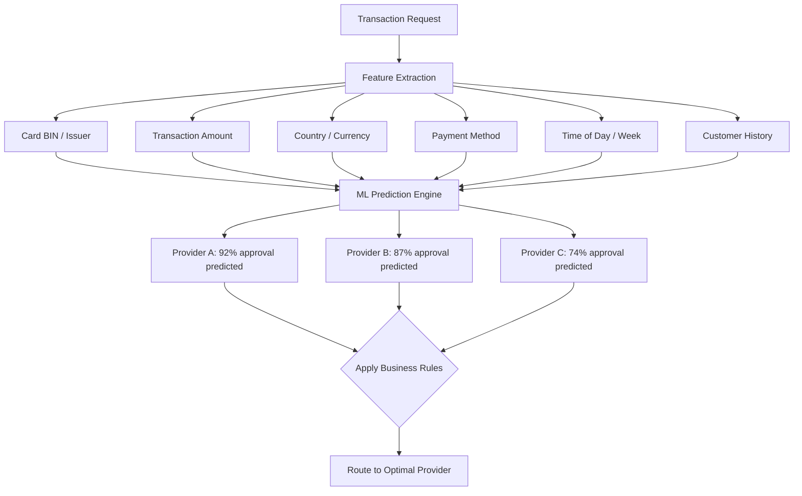

## Overview

Aida is Yuno's machine learning-based payment orchestration engine. It analyzes transaction patterns, provider performance, and card-level data to automatically route payments to the provider most likely to approve each transaction at the lowest cost. This guide walks you through implementing Aida from initial setup to full production optimization.

## How Aida Works

Aida uses a multi-factor ML model trained on your transaction history to predict approval probability for each provider on every transaction:



### Prediction Factors

| Factor | Weight | Description |
|--------|--------|-------------|
| **Card BIN / Issuer** | High | Historical approval rate for this BIN range with each provider |
| **Transaction amount** | Medium | Some providers perform better in specific amount ranges |
| **Country / Currency** | High | Domestic vs. international routing impact |
| **Payment method** | High | Method-specific provider strengths |
| **Time patterns** | Low | Temporal patterns in issuer approval behavior |
| **Customer history** | Medium | Returning customer vs. first-time transaction |
| **Provider health** | High | Real-time provider performance and availability |

## Prerequisites

Before enabling Aida, ensure your account meets these requirements:

| Requirement | Minimum | Recommended |
|-------------|---------|-------------|
| **Connected providers** | 2 providers for the same payment method/country | 3+ providers per market |
| **Transaction volume** | 500 transactions/month | 5,000+ transactions/month |
| **Historical data** | 30 days of transaction history | 90+ days |
| **Routing rules** | At least one active routing rule | Structured rules per market |

<Warning>
  Aida requires a minimum of two providers configured for the same payment method and country combination. With a single provider, there is no routing decision to optimize.
</Warning>

## Training Period Setup

Aida needs a baseline period to learn your transaction patterns before it can make optimized routing decisions.

### Phase 1: Baseline Collection (Days 1-30)

<Steps>
  <Step title="Enable data collection">
    Navigate to **Settings > Smart Routing > Aida** and enable **Baseline Collection Mode**.

    In this mode, Aida observes your transactions and builds its prediction models without changing any routing decisions. Your existing routing rules remain in full control.
  </Step>

  <Step title="Verify data quality">
    After 7 days, check **Dashboard > AI > Aida > Training Status** to confirm:

    - Transaction data is flowing correctly
    - Provider responses are being captured
    - BIN data is being extracted
    - Decline codes are being categorized

    <Note>
      If training status shows gaps in data collection, verify that all providers are returning standard response codes and that your Yuno integration is passing all recommended fields.
    </Note>
  </Step>

  <Step title="Review baseline metrics">
    At day 30, Aida generates a baseline report showing:

    | Metric | Description |
    |--------|-------------|
    | Overall approval rate | Your current weighted average across providers |
    | Per-provider approval rate | Approval rate for each provider by market |
    | BIN-level patterns | Issuer-specific provider preferences |
    | Decline distribution | Soft vs. hard decline breakdown |
    | Estimated improvement | Aida's predicted approval rate lift |
  </Step>
</Steps>

### Phase 2: Shadow Mode (Days 31-45)

In shadow mode, Aida makes routing recommendations alongside your existing rules, but does not execute them. This allows you to compare Aida's predicted routing against your actual routing decisions.

<Steps>
  <Step title="Enable shadow mode">
    In **Settings > Smart Routing > Aida**, switch from **Baseline Collection** to **Shadow Mode**.
  </Step>

  <Step title="Review shadow recommendations">
    Check **Dashboard > AI > Aida > Shadow Analysis** to see:

    - What percentage of transactions Aida would have routed differently
    - Predicted approval rate improvement
    - Estimated cost impact
    - Specific transaction examples where Aida's choice differs
  </Step>

  <Step title="Validate predictions">
    Compare Aida's predicted outcomes against actual results. A healthy shadow period shows:

    | Metric | Target |
    |--------|--------|
    | Prediction accuracy | >85% |
    | Predicted improvement | >2% approval rate lift |
    | Consistent recommendations | Low day-to-day variance in routing suggestions |
  </Step>
</Steps>

## Performance Baselines

Establish clear baselines before activating Aida to measure its impact accurately.

### Metrics to Capture

| Metric | How to Measure | Where |
|--------|---------------|-------|
| **Overall approval rate** | Approved / total attempted transactions | Dashboard > Analytics > Overview |
| **Approval rate by provider** | Per-provider approval percentage | Dashboard > Analytics > Provider Performance |
| **Approval rate by market** | Per-country approval percentage | Dashboard > Analytics > Country |
| **Cost per approved transaction** | Total fees / approved transactions | Dashboard > Analytics > Cost |
| **Cascade rate** | Transactions requiring retry / total transactions | Dashboard > Analytics > Cascade |
| **Average response time** | Mean provider response time | Dashboard > Analytics > Performance |

<Tip>
  Export baseline metrics for at least 30 days before activating Aida. Use this data as your control group for before/after comparison.
</Tip>

## A/B Testing: Control vs. Treatment

The safest way to activate Aida is through a controlled A/B test that gradually shifts traffic.

<Steps>
  <Step title="Configure traffic split">
    In **Settings > Smart Routing > Aida**, set up an A/B test:

    ```
    Control group:  70% of traffic → existing routing rules
    Treatment group: 30% of traffic → Aida-optimized routing
    ```

    <Note>
      Start with a conservative split (70/30 or 80/20) to limit exposure while gathering statistically significant data.
    </Note>
  </Step>

  <Step title="Define success criteria">
    Set clear criteria for declaring the test a success:

    | Metric | Minimum Improvement | Statistical Significance |
    |--------|--------------------|-----------------------|
    | Approval rate | +1.0 percentage points | p < 0.05 |
    | Cost per approved txn | No increase >5% | p < 0.05 |
    | Customer experience | No increase in checkout time | p < 0.05 |
  </Step>

  <Step title="Run the test">
    Allow the test to run until both groups reach sufficient transaction volume:

    | Daily Volume | Minimum Test Duration |
    |-------------|----------------------|
    | &lt;1,000 txns | 3-4 weeks |
    | 1,000-10,000 txns | 1-2 weeks |
    | &gt;10,000 txns | 5-7 days |
  </Step>

  <Step title="Analyze and expand">
    Review results in **Dashboard > AI > Aida > A/B Test Results**:

    - If treatment outperforms: increase to 50/50, then 30/70, then 0/100
    - If results are neutral: extend test duration or review model training data
    - If treatment underperforms: pause Aida, review configuration, retrain

    Ramp up gradually over 2-3 weeks, monitoring at each stage.
  </Step>
</Steps>

## Interpreting the Aida Analytics Dashboard

Access Aida analytics at **Dashboard > AI > Aida > Performance**.

### Key Panels

| Panel | Shows | Action If Anomalous |
|-------|-------|---------------------|
| **Approval Rate Trend** | Daily approval rate, control vs. Aida | If Aida underperforms for >3 days, review provider health |
| **Provider Distribution** | How Aida distributes traffic across providers | Verify distribution matches your provider capacity |
| **BIN Optimization** | Top BIN ranges where Aida improved routing | Use insights to inform manual rule creation as backup |
| **Decline Analysis** | Soft vs. hard decline trends under Aida | Confirm cascade behavior aligns with expectations |
| **Cost Impact** | Per-transaction cost comparison | Ensure cost optimization strategy is applied correctly |
| **Model Confidence** | Aida's prediction confidence per segment | Low-confidence segments may need more data or manual rules |

## Provider Performance Analytics

Aida generates provider-specific insights that help you evaluate your provider portfolio:

| Report | Description | Frequency |
|--------|-------------|-----------|
| **Provider scorecards** | Approval rate, cost, speed, and reliability per provider | Weekly |
| **Provider comparison** | Side-by-side performance across comparable segments | Weekly |
| **Provider recommendations** | Suggestions for adding or removing providers | Monthly |
| **Anomaly detection** | Alerts when a provider's performance deviates from baseline | Real-time |

## Custom Rules vs. Aida

Aida and custom routing rules can coexist. Understand the precedence:

| Scenario | Behavior |
|----------|----------|
| **Custom rule matches, Aida enabled** | Custom rule takes precedence; Aida does not override explicit rules |
| **No custom rule matches, Aida enabled** | Aida makes the routing decision |
| **Custom rule with Aida optimization** | Custom rule selects eligible providers; Aida chooses among them |

<Info>
  The recommended approach is to use custom rules for business constraints (e.g., "PIX must route to Provider X") and let Aida optimize within unconstrained segments (e.g., "for Brazil card payments, Aida chooses the best provider").
</Info>

### Example: Hybrid Configuration

```
Rule 1: Brazil PIX → PagSeguro (manual, no Aida)
Rule 2: Brazil Cards → [PagSeguro, dLocal, Adyen] with Aida optimization
Rule 3: Mexico Cards → [Conekta, dLocal] with Aida optimization
Rule 4: Catch-all → Adyen (manual, no Aida)
```

## When to Enable/Disable Aida Features

| Feature | Enable When | Disable When |
|---------|------------|-------------|
| **Smart Routing** | 2+ providers per segment, 30+ days history | Single provider, &lt;500 txns/month |
| **BIN Optimization** | Card volume >1,000 txns/month per BIN range | Low card volume, mostly APMs |
| **Cost Optimization** | Provider costs vary >10% for same segment | All providers have identical pricing |
| **Decline Retry** | Cascade is configured, soft decline rate >5% | Hard decline dominant, low retry success |
| **Fraud Scoring** | Fraud rate >0.5% or chargeback rate >0.3% | Very low fraud rate, strong external fraud tool |

<Warning>
  Disable Aida routing during provider migrations or major integration changes. Aida's models are trained on historical data and may make suboptimal decisions when provider behavior changes significantly.
</Warning>

## Monitoring and Alerting

Set up these alerts to monitor Aida's performance:

| Alert | Condition | Action |
|-------|-----------|--------|
| **Approval rate drop** | Aida segment approval rate drops >3% from baseline | Review Aida routing decisions, check provider health |
| **Cost increase** | Per-transaction cost increases >10% | Verify cost optimization strategy, check provider pricing changes |
| **Model confidence drop** | Aida confidence score &lt;70% for a segment | Check for data quality issues, consider extending training |
| **Provider concentration** | >90% of traffic routed to single provider | Review whether provider health data is accurate |
| **Cascade rate spike** | Cascade rate increases >50% from baseline | Check primary provider health, review decline codes |

Configure alerts in **Dashboard > AI > Aida > Alerts**.

## FAQ

**How long does Aida take to show results?**
Most merchants see measurable improvement within 2-4 weeks of activating Aida in live mode, following the 30-day baseline collection and 15-day shadow period.

**Does Aida work with a single provider?**
No. Aida requires at least two providers for the same payment method and country to make routing decisions. With a single provider, use Aida's fraud scoring and decline analysis features instead.

**Can I override Aida's routing decisions?**
Yes. Custom routing rules always take precedence over Aida. You can also exclude specific segments from Aida optimization.

**What happens if a provider goes down?**
Aida detects provider outages through real-time health monitoring and automatically redistributes traffic to healthy providers. Recovery is gradual to avoid overloading providers.

**Does Aida handle 3DS decisions?**
Aida can recommend whether to apply 3DS based on transaction risk and issuer preferences, but the final 3DS decision is governed by your security rules and regulatory requirements.

**How does Aida handle new payment methods?**
When you add a new payment method, Aida enters a learning period for that method. During this period, default routing rules apply until sufficient data is collected.

**Can I use Aida in sandbox?**
Aida's shadow mode and baseline collection work in sandbox, but routing optimization requires production transaction volume for meaningful predictions.

**What data does Aida use?**
Aida uses transaction-level data including BIN, amount, currency, country, payment method, provider responses, and timestamps. It does not access or store raw card numbers, CVVs, or customer personal data.
