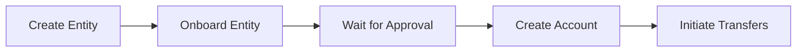

Yuno BaaS provides a unified API for creating bank accounts, processing transfers, and managing entity onboarding across multiple banking providers in the US, UK, Australia, and EU regions.

## Integration flow

1. **Create an entity** — Register an individual or business using the [Create Entity](/api-reference/baas/create-entity) endpoint
2. **Onboard the entity** — Submit KYC/KYB documentation through [Create Entity Onboarding](/api-reference/baas/create-onboarding)
3. **Wait for approval** — Monitor status via [Get Onboarding Status](/api-reference/baas/get-onboarding) or webhook events
4. **Create a bank account** — Open an account using [Create Account](/api-reference/baas/create-account) after onboarding succeeds
5. **Initiate transfers** — Send funds using [Initiate Transfer](/api-reference/baas/create-transfer)

## Entity types

| Type | Description | Required information |
|------|-------------|---------------------|
| **INDIVIDUAL** | Natural person | Name, DOB, tax ID (SSN/ITIN), identity documents |
| **ENTITY** | Business or organization | Business name, type, tax ID (EIN), beneficial owners |

## Onboarding types

| Type | Description |
|------|-------------|
| **ONE_STEP** | Submits all information, declarations, and documents simultaneously for provider processing |
| **PREVIOUSLY_ONBOARDED** | Generates internal Yuno ID without contacting provider — use when the entity was onboarded externally |

## Onboarding statuses

| Status | Description | Terminal |
|--------|-------------|----------|
| `CREATED` | Record created | No |
| `PENDING` | Submitted to provider, awaiting review | No |
| `PENDING_ADDITIONAL_DOCUMENTATION` | Provider requires more documents | No |
| `UNDER_REVIEW` | Provider reviewing submission | No |
| `SUCCEEDED` | Approved — entity can open accounts | Yes |
| `FAILED` | Failed due to errors | Yes |
| `DECLINED` | Provider declined entity | Yes |
| `CANCELLED` | Cancelled by merchant | Yes |
| `EXPIRED` | Expired before completion | Yes |

## Payment rails by region

| Region | Rails | Speed |
|--------|-------|-------|
| **US** | ACH_STANDARD | 1–3 business days |
| | ACH_SAME_DAY | Same day |
| | WIRE | Same day |
| | RTP | Instant |
| **UK** | FPS | Near-instant |
| | CHAPS | Same day (high-value) |
| | BACS | 3 business days |
| **Australia** | NPP | Near-instant |
| | PAYTO | Near-instant |
| | BPAY | 1–2 business days |

<Info>
Instant payment rails (RTP, FPS, NPP) skip the `PROCESSING` status and move directly from `PENDING` to a terminal state.
</Info>

## Account identifiers by region

| Region | Identifiers |
|--------|------------|
| **US** | `account_number`, `routing_number` |
| **UK** | `account_number`, `sort_code`, `iban` |
| **Australia** | `account_number`, `bsb` |
| **EU** | `iban`, `swift` |

## Transfer statuses

| Status | Description | Terminal |
|--------|-------------|----------|
| `PENDING` | Created, awaiting processing | No |
| `PROCESSING` | Submitted to payment network | No |
| `COMPLETED` | Funds successfully delivered | Yes |
| `FAILED` | Transfer failed | Yes |
| `CANCELLED` | Cancelled before processing | Yes |
| `REVERSED` | Completed transfer reversed (e.g., ACH return) | Yes |

## Documentation types

BaaS onboarding supports these document categories:

| Type | Examples |
|------|----------|
| **IDENTITY_DOCUMENT** | Passport, driver's license, national ID |
| **PROOF_OF_ADDRESS** | Utility bill, bank statement, lease agreement |
| **BANK_STATEMENT** | Statement with period and account details |
| **BUSINESS_DOCUMENT** | Articles of incorporation, business license, EIN confirmation |
| **TAX_INFORMATION** | W-9, 1099, tax return, SSN card, ITIN letter, VAT certificate |
| **FINANCIAL_DOCUMENT** | Balance sheet, P&L statement, cash flow, audit report |
| **BIOMETRIC_VERIFICATION** | Facial recognition, fingerprint, voice, iris scan |
| **EMPLOYMENT_INFORMATION** | Employment status, employer, occupation, income |

All file uploads use base64 encoding with `file_name`, `content_type`, and `content` fields.

## Webhook events

### Entity events
- `baas.entity.created`
- `baas.entity.updated`
- `baas.entity.deleted`

### Onboarding events
- `baas.onboarding.created`
- `baas.onboarding.updated`
- `baas.onboarding.pending_documentation`
- `baas.onboarding.succeeded`
- `baas.onboarding.failed`
- `baas.onboarding.declined`
- `baas.onboarding.cancelled`
- `baas.onboarding.expired`

### Account events
- `baas.account.created`
- `baas.account.updated`
- `baas.account.closed`

### Transfer events (outgoing)
- `baas.transfer.created`
- `baas.transfer.processing`
- `baas.transfer.completed`
- `baas.transfer.failed`
- `baas.transfer.cancelled`

### Transfer events (incoming)
- `baas.transfer.received`
- `baas.transfer.reversed`

<Warning>
Your webhook endpoint must return a `200 OK` status with `{"received": true}` in the response body. Yuno retries on 5xx responses and timeouts with exponential backoff.
</Warning>

## Next steps

<CardGroup cols={2}>
  <Card title="Create Entity" icon="user-plus" href="/api-reference/baas/create-entity">
    Register an individual or business entity.
  </Card>
  <Card title="Create Onboarding" icon="clipboard-check" href="/api-reference/baas/create-onboarding">
    Submit KYC/KYB documentation for approval.
  </Card>
  <Card title="Create Account" icon="building-columns" href="/api-reference/baas/create-account">
    Open a bank account after onboarding.
  </Card>
  <Card title="Initiate Transfer" icon="arrow-right-arrow-left" href="/api-reference/baas/create-transfer">
    Send funds between entities.
  </Card>
</CardGroup>
