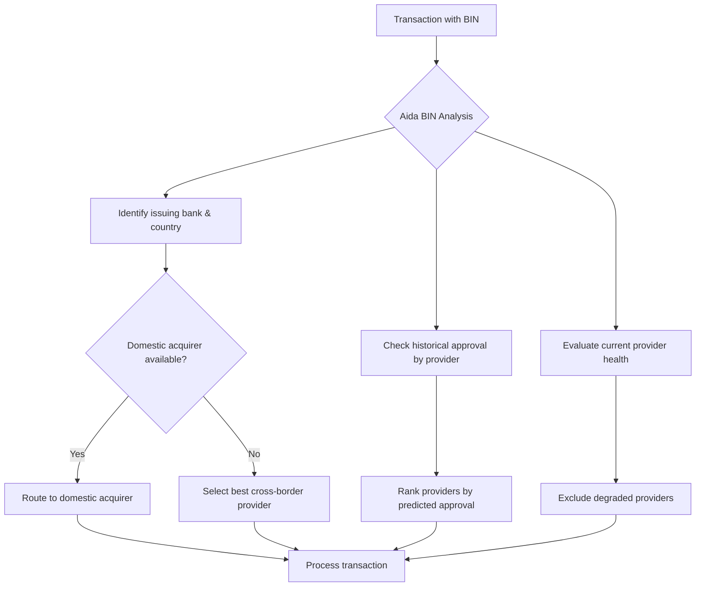
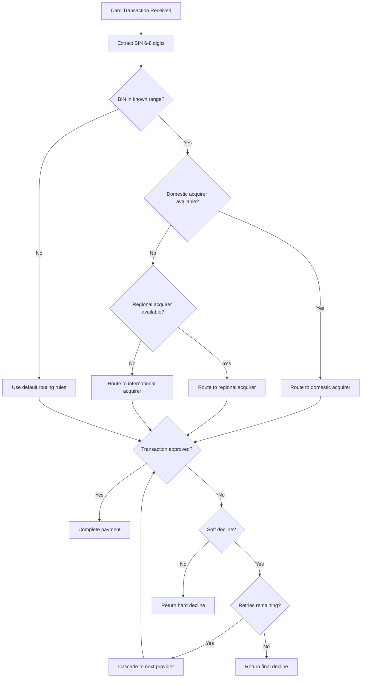

## Overview

Bank Identification Number (BIN) routing uses the first 6-8 digits of a card number to determine the optimal payment provider for each transaction. By identifying the card's issuing bank, country, and card type before processing, you can route transactions to providers with the highest approval rates and lowest costs for that specific card profile.

BIN routing is one of the most effective levers for improving approval rates in Latin America, where domestic acquiring consistently outperforms cross-border processing by 10-25 percentage points.

## What is a BIN?

The BIN (also called Issuer Identification Number or IIN) is the first 6-8 digits of a payment card number. It encodes critical information about the card:

```
Card Number:  4 5 1 2  3 4 X X  X X X X  X X X X
              └──────────┘  └──────────────────┘
              BIN (6-8 digits)    Account Number
```

| BIN Component | Information Encoded |
|---------------|---------------------|
| **Digits 1-2** | Card network (4 = Visa, 5 = Mastercard, 3 = Amex) |
| **Digits 1-6** | Issuing bank and country of issuance |
| **Digits 1-8** | Extended BIN with card product type (debit, credit, prepaid) |

<Info>
  Yuno extracts BIN data automatically during payment processing. You can use this data in routing rules without handling raw card numbers directly.
</Info>

## Why BIN Routing Matters

### Domestic vs. International Routing

The single largest factor in LatAm approval rates is whether a transaction is processed domestically (local acquirer in the card's country of issuance) or internationally (cross-border acquirer).

| Routing Type | Typical Approval Rate | Interchange Cost | Processing Speed |
|-------------|----------------------|-------------------|-----------------|
| **Domestic** | 75-90% | Lower (regulated) | Faster |
| **International** | 50-70% | Higher (cross-border fees) | Slower |

A BIN lookup determines the card's country of issuance, allowing you to route to a local acquirer when available.

### Issuer-Specific Patterns

Different issuers have different approval behaviors with different acquirers. A card issued by Banco do Brasil may have a higher approval rate through one acquirer, while Bradesco-issued cards perform better through another. BIN routing captures these patterns.

## LatAm BIN Range Reference

The following table shows common BIN ranges for major Latin American markets. Use these as a starting point for routing rules.

<Warning>
  BIN ranges change as issuers are assigned new ranges. Always verify against current BIN databases. This table is illustrative, not exhaustive.
</Warning>

### Brazil

| BIN Range | Issuer | Card Type | Network | Notes |
|-----------|--------|-----------|---------|-------|
| 451234-451299 | Banco do Brasil | Credit | Visa | High volume, domestic routing preferred |
| 512345-512399 | Bradesco | Credit | Mastercard | Strong domestic approval rates |
| 401178-401178 | Itau | Debit | Visa | Debit requires specific acquirer support |
| 535678-535699 | Nubank | Credit | Mastercard | Digital bank, high approval via modern acquirers |
| 636368-636368 | Elo | Credit | Elo | Brazil-only network, requires Elo-enabled acquirer |

### Mexico

| BIN Range | Issuer | Card Type | Network | Notes |
|-----------|--------|-----------|---------|-------|
| 401234-401299 | BBVA Mexico | Credit | Visa | Largest issuer, domestic routing critical |
| 521234-521299 | Banamex | Credit | Mastercard | Citigroup subsidiary |
| 455678-455699 | Banorte | Debit | Visa | Debit processing requires PIN or OTP |
| 450012-450019 | Santander MX | Credit | Visa | Strong approval with local acquirers |

### Colombia

| BIN Range | Issuer | Card Type | Network | Notes |
|-----------|--------|-----------|---------|-------|
| 457623-457629 | Bancolombia | Credit | Visa | Dominant issuer, domestic routing essential |
| 531234-531299 | Davivienda | Credit | Mastercard | Second-largest issuer |
| 400123-400129 | Banco de Bogota | Debit | Visa | Savings account debit |

### Argentina

| BIN Range | Issuer | Card Type | Network | Notes |
|-----------|--------|-----------|---------|-------|
| 450799-450799 | Banco Galicia | Credit | Visa | Installment-heavy market |
| 515234-515299 | Banco Nacion | Credit | Mastercard | Government bank |
| 603493-603493 | Naranja | Credit | Local | Local network, requires specific acquirer |

### Chile

| BIN Range | Issuer | Card Type | Network | Notes |
|-----------|--------|-----------|---------|-------|
| 405612-405619 | Banco de Chile | Credit | Visa | Largest private bank |
| 520234-520239 | BancoEstado | Debit | Mastercard | State bank, high debit volume |
| 457300-457309 | Banco Santander CL | Credit | Visa | Domestic routing preferred |

### Peru

| BIN Range | Issuer | Card Type | Network | Notes |
|-----------|--------|-----------|---------|-------|
| 442742-442749 | BCP (Banco de Credito) | Credit | Visa | Dominant issuer |
| 531567-531569 | Interbank | Credit | Mastercard | Second-largest card issuer |
| 404519-404519 | BBVA Peru | Debit | Visa | Debit requires specific acquirer config |

### Local Card Networks

Several LatAm markets have domestic card networks that require dedicated acquirer support:

| Network | Country | BIN Prefix | Acquirer Requirements |
|---------|---------|------------|----------------------|
| **Elo** | Brazil | 636368, 438935, 504175 | Must use Elo-enabled acquirer (e.g., Cielo, Rede) |
| **Naranja** | Argentina | 603493 | Local acquirer only (e.g., Prisma) |
| **Cabal** | Argentina | 604244 | Local acquirer only |
| **Carnet** | Mexico | 506199 | Requires Carnet-enabled acquirer |

<Tip>
  Always create dedicated routing rules for local card networks. These cards will be declined by international acquirers that do not support the network.
</Tip>

## Issuer Response Code Mapping

Different issuers return different response codes for the same underlying reason. Understanding these mappings helps you build more accurate retry logic per BIN range.

### Common Issuer Response Codes

| Response Code | Visa Meaning | Mastercard Meaning | Retry Strategy |
|--------------|-------------|-------------------|----------------|
| `05` | Do not honor | Do not honor | Retry with different provider |
| `14` | Invalid card number | Invalid card number | Do not retry (hard decline) |
| `41` | Lost card | Lost card | Do not retry, flag for fraud |
| `43` | Stolen card | Stolen card | Do not retry, flag for fraud |
| `51` | Insufficient funds | Insufficient funds | Retry with caution (may succeed with different acquirer) |
| `54` | Expired card | Expired card | Do not retry |
| `61` | Exceeds withdrawal limit | Exceeds withdrawal amount limit | Retry with lower amount or different provider |
| `65` | Activity count limit exceeded | Exceeds withdrawal frequency limit | Retry after delay |

### Issuer-Specific Behaviors

Some issuers have unique behaviors that affect routing decisions:

| Issuer Behavior | Affected Markets | Impact on Routing |
|----------------|-----------------|-------------------|
| **Velocity throttling** | Brazil (digital banks), Mexico | Space retries at least 30 seconds apart |
| **BIN-level 3DS mandates** | Colombia, Argentina | Route through 3DS-capable providers for affected BINs |
| **Domestic-only authorization** | Brazil (Elo), Argentina (Naranja) | Must use domestic acquirer; international providers will always decline |
| **Time-based approval variation** | All markets | Some issuers have lower approval rates during batch processing windows (typically 22:00-02:00 local) |
| **Installment-dependent approval** | Argentina, Brazil, Mexico | Some issuers decline single-payment requests for cards that expect installment plans |

<Tip>
  Build an issuer behavior database over time by analyzing your decline data. Group declines by BIN range and response code to identify patterns unique to your transaction mix.
</Tip>

## Soft vs. Hard Decline Patterns by BIN

Understanding decline patterns by BIN range helps determine whether to retry a transaction with an alternative provider (cascade) or stop processing.

| Decline Type | Response Codes | Retry Eligible | Description |
|-------------|----------------|----------------|-------------|
| **Soft Decline** | `insufficient_funds`, `do_not_honor`, `generic_decline`, `try_again` | Yes | Temporary or ambiguous refusal; retry with another provider may succeed |
| **Hard Decline** | `stolen_card`, `lost_card`, `invalid_number`, `expired_card`, `fraud` | No | Permanent refusal; retrying will not succeed and may trigger fraud flags |
| **Issuer Unavailable** | `issuer_timeout`, `system_error` | Yes | Infrastructure issue; retry after delay or with provider that uses different route to issuer |

### BIN-Specific Decline Patterns

| Issuer Pattern | Common Soft Decline Cause | Recommended Action |
|----------------|--------------------------|-------------------|
| **Brazilian digital banks** (Nubank, Inter) | Velocity limits on rapid transactions | Add delay between retries, reduce cascade speed |
| **Mexican debit cards** | OTP/PIN required but not prompted | Ensure 3DS is enabled for these BINs |
| **Colombian cards** | CVV validation stricter than average | Verify CVV is passed correctly in all retry attempts |
| **Argentine installment cards** | Installment plan not supported by acquirer | Route to acquirer that supports `cuotas` |

<Note>
  Track decline patterns by BIN range in **Dashboard > Analytics > Decline Analysis**. Over time, this data reveals issuer-specific behaviors that inform more precise routing rules.
</Note>

## Implementing BIN Routing in Yuno

### Step-by-Step Configuration

<Steps>
  <Step title="Identify your top BIN ranges">
    Go to **Dashboard > Analytics > Card Analysis** to see your transaction volume by BIN range. Focus on the top 20 BIN ranges, which typically account for 80% of card volume.
  </Step>

  <Step title="Map BINs to optimal providers">
    For each high-volume BIN range, identify which provider delivers the highest approval rate. Use **Dashboard > Analytics > Provider Performance** filtered by BIN range.

    | BIN Range | Provider A Approval | Provider B Approval | Optimal Route |
    |-----------|-------------------|-------------------|---------------|
    | 451234 | 87% | 72% | Provider A |
    | 512345 | 78% | 85% | Provider B |
    | 636368 | N/A (Elo unsupported) | 82% | Provider B |
  </Step>

  <Step title="Create BIN-based routing rules">
    Navigate to **Dashboard > Routing Rules > Create Rule**:

    ```
    Rule: Brazil Domestic Visa
    Conditions: country = BR AND card_bin IN [451234, 401178, 450012]
    Strategy: Priority
    Providers:
      1. Local Acquirer (primary)
      2. Regional Acquirer (fallback)
    ```
  </Step>

  <Step title="Configure cascade behavior">
    For each BIN routing rule, set appropriate cascade behavior:

    - **Retry on soft declines**: Enable for `do_not_honor`, `generic_decline`, `insufficient_funds`
    - **Stop on hard declines**: Configure for `stolen_card`, `lost_card`, `fraud`
    - **Max retries**: Set to 2-3 providers maximum

    <Warning>
      Excessive retries on the same transaction can trigger fraud alerts at the issuer level. Limit cascading to 3 providers maximum per transaction.
    </Warning>
  </Step>

  <Step title="Set rule priority">
    Order your BIN routing rules above general country-level rules:

    ```
    1. [Highest] Brazil Elo Cards → Elo-enabled Acquirer
    2. [High] Brazil Domestic Visa → Local Acquirer A, Acquirer B
    3. [High] Brazil Domestic MC → Local Acquirer B, Acquirer A
    4. [Medium] Brazil All Cards → Regional Acquirer
    5. [Low] Catch-all → Default Provider
    ```
  </Step>

  <Step title="Monitor and iterate">
    Review BIN routing performance weekly in **Dashboard > Analytics**. Adjust provider priorities based on rolling 7-day approval rates.
  </Step>
</Steps>

## Aida BIN Optimization

Yuno's AI engine [Aida](/ai/aida-agent) automates BIN routing optimization by continuously analyzing approval patterns across your transaction history.

### How Aida Uses BIN Data



### Aida BIN Capabilities

| Capability | Description |
|------------|-------------|
| **Automatic BIN classification** | Categorizes cards by issuer, country, type, and product without manual BIN table maintenance |
| **Dynamic provider scoring** | Updates provider scores per BIN range based on real-time approval data |
| **Decline pattern learning** | Identifies soft decline patterns by issuer and adjusts retry strategy |
| **Seasonal adjustment** | Adapts to issuer behavior changes during high-volume periods (e.g., Black Friday) |

<Tip>
  Enable Aida's BIN optimization under **Settings > Smart Routing > BIN Analysis**. Aida requires at least 1,000 transactions per BIN range to generate statistically significant routing recommendations.
</Tip>

## Decision Flowchart

Use this flowchart to determine the appropriate routing strategy for any card transaction:



## Monitoring and Analytics

Track BIN routing effectiveness through these key metrics:

| Metric | Target | Where to Find |
|--------|--------|--------------|
| **Approval rate by BIN range** | >80% for domestic, >65% for international | Dashboard > Analytics > Card Analysis |
| **Domestic routing percentage** | >90% of domestic-eligible transactions | Dashboard > Analytics > Routing |
| **Cascade success rate** | >20% of retried transactions approved | Dashboard > Analytics > Cascade |
| **Average providers per transaction** | &lt;1.3 (low cascade rate = good first-attempt routing) | Dashboard > Analytics > Provider Performance |

## Best Practices Checklist

- [ ] Map your top 20 BIN ranges by transaction volume
- [ ] Create specific routing rules for each high-volume BIN range
- [ ] Prioritize domestic acquirers for all identifiable domestic BINs
- [ ] Configure cascade rules that respect soft vs. hard decline types
- [ ] Limit cascade depth to 3 providers maximum
- [ ] Enable Aida BIN optimization for automated adjustment
- [ ] Review BIN routing performance weekly
- [ ] Maintain separate routing rules for debit vs. credit cards
- [ ] Handle local card networks (Elo, Naranja) with dedicated provider rules
- [ ] Monitor for new BIN ranges appearing in your transaction data
- [ ] Set up alerts for sudden drops in approval rate by BIN range
- [ ] Document your BIN routing strategy for team knowledge sharing
