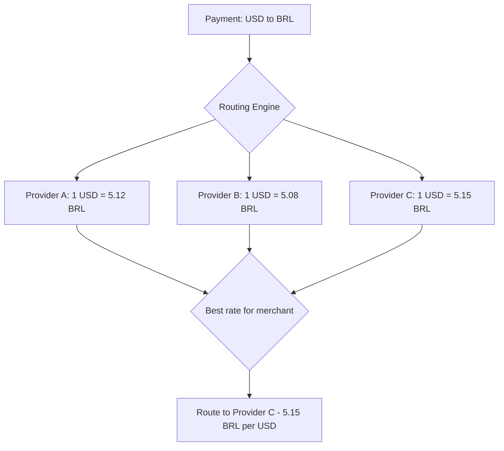

## Overview

Currency optimization reduces the cost of cross-border payments by routing transactions through providers with the best exchange rates, settling in optimal currencies, and minimizing unnecessary currency conversions. For merchants operating across Latin America, effective currency management can reduce FX costs by 0.5-2.0% of transaction volume.

## Currency Pair Routing

Different providers offer different exchange rates for the same currency pair. Route transactions to the provider with the most favorable rate for each pair.

### How Currency Pair Routing Works



### Configuring Currency-Based Routing

In **Dashboard > Routing Rules**, create rules that consider the settlement currency:

```
Rule: USD-to-BRL Best Rate
Conditions: currency = USD AND settlement_currency = BRL
Strategy: Cost (FX-optimized)
Providers:
  1. Provider C (best BRL rate historically)
  2. Provider A (fallback)
```

<Note>
  FX rates fluctuate throughout the day. Yuno's cost-optimized routing evaluates rates at transaction time, not based on static configuration. Provider ranking may shift intraday.
</Note>

## FX Margin Optimization

FX margin is the markup a provider adds to the mid-market exchange rate. Reducing this margin directly increases your revenue on cross-border transactions.

| Strategy | Description | Savings Potential |
|----------|-------------|-------------------|
| **Negotiate rates** | Use transaction volume as leverage to negotiate lower FX margins with providers | 0.2-0.5% |
| **Compare providers** | Route to the provider with the lowest markup for each currency pair | 0.1-0.3% |
| **Lock rates** | Use Yuno's [rate quote API](/features/currency-conversion) to lock favorable rates within the validity window | Avoid adverse movement |
| **Batch settlement** | Consolidate settlements to reduce per-transaction FX conversion fees | 0.1-0.2% |
| **Local currency pricing** | Price in local currency to avoid DCC and its associated markup | 1.0-3.0% |

### Monitoring FX Margins

Track your effective FX costs in **Dashboard > Analytics > Currency**:

| Metric | Description | Target |
|--------|-------------|--------|
| **Effective rate vs. mid-market** | Your actual rate compared to the interbank rate | &lt;1.5% markup |
| **FX cost per transaction** | Total currency conversion cost per payment | Minimize |
| **Rate lock utilization** | Percentage of transactions using locked rates | >80% for cross-border |

## Multi-Currency Settlement

Choose whether to settle in the customer's local currency or convert to your home currency.

### Settlement Strategy Comparison

| Strategy | Pros | Cons | Best For |
|----------|------|------|----------|
| **Local currency settlement** | No FX conversion, lower fees, faster settlement | Requires local bank accounts, currency exposure | Merchants with local entities |
| **Home currency settlement** | Simple treasury management, no currency exposure | FX conversion fees, potentially lower approval rates | Merchants without local entities |
| **Hybrid** | Optimize per market based on volume and cost | More complex treasury operations | Large multi-market merchants |

### Configuring Settlement Currency

Set your settlement currency per provider in **Dashboard > Providers > [Provider Name] > Settlement**:

```
Provider: PagSeguro (Brazil)
Settlement Currency: BRL
Settlement Account: [Brazilian bank account]
Settlement Frequency: Daily

Provider: Adyen (Global)
Settlement Currency: USD
Settlement Account: [US bank account]
Settlement Frequency: Weekly
```

<Tip>
  If you process more than $100K monthly in a single market, consider opening a local bank account and settling in local currency. The FX savings typically exceed the cost of maintaining the account.
</Tip>

## Dynamic Currency Conversion (DCC)

DCC allows international cardholders to pay in their home currency rather than the merchant's currency. The customer sees the converted amount at checkout and chooses whether to pay in their currency or the merchant's.

### DCC Best Practices

| Practice | Description |
|----------|-------------|
| **Transparency** | Always display both the original and converted amounts, the exchange rate, and any markup |
| **Customer choice** | Let the customer choose their preferred currency; never force DCC |
| **Rate disclosure** | Show the margin over mid-market rate where required by regulation |
| **Selective offering** | Only offer DCC when the card currency differs from the transaction currency |

<Warning>
  EU regulations (PSD2) and card network rules require explicit customer consent for DCC and clear disclosure of the exchange rate markup. Non-compliance can result in chargebacks and fines.
</Warning>

### Implementing DCC with Yuno

1. Enable DCC in **Dashboard > Settings > Currency > Dynamic Currency Conversion**
2. Yuno detects international cards via BIN lookup
3. A DCC offer is presented to the customer in the checkout flow
4. If accepted, the payment processes in the cardholder's home currency
5. Settlement occurs in your configured settlement currency

## Country-Currency Compatibility Matrix

Use this matrix to determine the correct currency for each market:

| Country | Local Currency | Common Alt. Currencies | Settlement Options | Notes |
|---------|---------------|----------------------|-------------------|-------|
| Brazil | BRL | USD | BRL (preferred), USD | PIX requires BRL; cards accept USD with conversion |
| Mexico | MXN | USD | MXN, USD | OXXO/SPEI require MXN |
| Colombia | COP | USD | COP, USD | PSE requires COP |
| Argentina | ARS | USD | ARS, USD | Currency controls may affect USD settlement |
| Chile | CLP | USD | CLP, USD | High-value transactions common due to CLP denomination |
| Peru | PEN | USD | PEN, USD | Both currencies widely accepted |
| Uruguay | UYU | USD | UYU, USD | Small market, USD settlement common |

<Note>
  Local payment methods (PIX, OXXO, PSE, Boleto) almost always require the local currency. Card payments are more flexible with currency options.
</Note>

## Settlement Timing Considerations

Settlement timing affects your FX exposure and cash flow:

| Factor | Impact | Recommendation |
|--------|--------|----------------|
| **Settlement frequency** | Daily settlement reduces FX exposure; weekly may offer better batch rates | Daily for volatile currencies (ARS), weekly for stable (USD-BRL) |
| **Cut-off times** | Transactions after cut-off settle in the next cycle | Align cut-off with your peak transaction hours |
| **Weekend/holiday gaps** | No settlement on non-business days increases exposure | Factor in 2-3 day gaps for weekend settlements |
| **Provider settlement speed** | Varies from T+1 to T+7 depending on provider and country | Prefer T+1 or T+2 providers for high-volume markets |

## Using Yuno's Currency Conversion API

Yuno provides a currency conversion API that lets you quote, lock, and apply exchange rates within your payment flow.

### Rate Quote Workflow

<Steps>
  <Step title="Request a rate quote">
    Call the `/v1/currency/convert` endpoint with the source currency, target currency, and amount:

    ```bash
    curl --request GET \
      --url "https://api.y.uno/v1/currency/convert?from=USD&to=BRL&amount=100.00" \
      --header 'X-Api-Key: YOUR_API_KEY' \
      --header 'X-Account-Code: YOUR_ACCOUNT_CODE'
    ```
  </Step>

  <Step title="Present the converted amount">
    Display both the original and converted amounts to the customer, along with the exchange rate. The response includes a `rate_id` and `valid_until` timestamp.
  </Step>

  <Step title="Submit payment with locked rate">
    Include the `rate_id` in your payment request to lock the quoted rate:

    ```json
    {
      "amount": {"value": 100.00, "currency": "USD"},
      "settlement_currency": "BRL",
      "currency_conversion": {"rate_id": "rate_abc123"}
    }
    ```
  </Step>

  <Step title="Handle rate expiration">
    If the `valid_until` timestamp has passed, request a new quote before submitting the payment. Implement client-side countdown to prompt re-quoting.
  </Step>
</Steps>

<Warning>
  The currency conversion endpoint may not be available in sandbox environments. Contact Yuno support to enable it for your account if you receive a 404 response.
</Warning>

## Best Practices for Cross-Border Payments

- **Price in local currency** whenever possible to avoid DCC markup and improve conversion rates
- **Use rate locking** for large transactions to protect against adverse FX movements
- **Monitor FX margins daily** across providers and renegotiate when volume justifies it
- **Settle locally** in markets where you process >$100K/month
- **Match settlement currency to expense currency** to create natural hedges
- **Route by currency pair** to the provider with the best rate for each pair
- **Avoid double conversion** (e.g., USD to EUR to BRL) by routing to providers that support direct pairs
- **Track effective rate vs. mid-market** as your primary FX cost metric
- **Consider currency volatility** when choosing settlement frequency; daily for volatile pairs
- **Comply with local regulations** on DCC disclosure and customer consent
