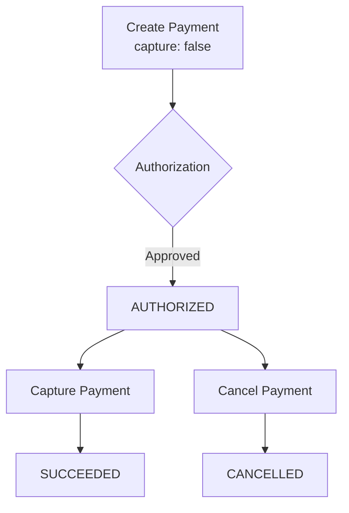

## Overview

Two-step (authorize and capture) payment flows let you reserve funds on a customer's card without immediately charging them. This is useful for scenarios like hotel reservations, pre-orders, or marketplace payments where the final amount may change.

## Flow Diagram



## Step 1: Authorize

Create a payment with `capture: false` to authorize without capturing:

<CodeGroup>
```javascript Node.js
const authorization = await fetch('https://api-sandbox.y.uno/v1/payments', {
  method: 'POST',
  headers: {
    'public-api-key': process.env.YUNO_PUBLIC_KEY,
    'private-secret-key': process.env.YUNO_PRIVATE_KEY,
    'account-code': process.env.YUNO_ACCOUNT_CODE,
    'Content-Type': 'application/json',
  },
  body: JSON.stringify({
    checkout_session: 'session-id',
    payment_method: { type: 'CARD', token: 'one-time-token' },
    amount: { currency: 'USD', value: 150.00 },
    country: 'CO',
    capture: false,  // Authorization only
    customer: {
      email: 'customer@example.com',
    },
  }),
});
const authResult = await authorization.json();
// authResult.status === 'AUTHORIZED'
```

```python Python
import requests

response = requests.post(
    'https://api-sandbox.y.uno/v1/payments',
    headers={
        'public-api-key': YUNO_PUBLIC_KEY,
        'private-secret-key': YUNO_PRIVATE_KEY,
        'account-code': YUNO_ACCOUNT_CODE,
        'Content-Type': 'application/json',
    },
    json={
        'checkout_session': 'session-id',
        'payment_method': {'type': 'CARD', 'token': 'one-time-token'},
        'amount': {'currency': 'USD', 'value': 150.00},
        'country': 'CO',
        'capture': False,  # Authorization only
        'customer': {
            'email': 'customer@example.com',
        },
    },
)
auth_result = response.json()
# auth_result['status'] == 'AUTHORIZED'
```

```go Go
payload := map[string]interface{}{
    "checkout_session": "session-id",
    "payment_method":   map[string]interface{}{"type": "CARD", "token": "one-time-token"},
    "amount":           map[string]interface{}{"currency": "USD", "value": 150.00},
    "country":          "CO",
    "capture":          false, // Authorization only
    "customer": map[string]interface{}{
        "email": "customer@example.com",
    },
}

body, _ := json.Marshal(payload)
req, _ := http.NewRequest("POST",
    "https://api-sandbox.y.uno/v1/payments",
    bytes.NewBuffer(body),
)

req.Header.Set("public-api-key", os.Getenv("YUNO_PUBLIC_KEY"))
req.Header.Set("private-secret-key", os.Getenv("YUNO_PRIVATE_KEY"))
req.Header.Set("account-code", os.Getenv("YUNO_ACCOUNT_CODE"))
req.Header.Set("Content-Type", "application/json")

resp, err := http.DefaultClient.Do(req)
```
</CodeGroup>

<Note>
Authorizations typically expire after 7 days (varies by provider and card issuer). Capture the payment before the authorization expires, or the funds will be released automatically.
</Note>

## Step 2a: Capture

Capture the authorized payment to transfer the funds. Use the `transaction_id` from the authorize response:

<CodeGroup>
```javascript Full Capture
const capture = await fetch(
  `https://api-sandbox.y.uno/v1/payments/${paymentId}/transactions/${transactionId}/capture`,
  {
    method: 'POST',
    headers: {
      'public-api-key': process.env.YUNO_PUBLIC_KEY,
      'private-secret-key': process.env.YUNO_PRIVATE_KEY,
      'account-code': process.env.YUNO_ACCOUNT_CODE,
      'Content-Type': 'application/json',
    },
    body: JSON.stringify({}),
  }
);
// Payment status changes to SUCCEEDED
```

```javascript Partial Capture
const partialCapture = await fetch(
  `https://api-sandbox.y.uno/v1/payments/${paymentId}/transactions/${transactionId}/capture`,
  {
    method: 'POST',
    headers: { /* auth headers */ },
    body: JSON.stringify({
      amount: { currency: 'USD', value: 120.00 },  // Less than authorized
    }),
  }
);
```

```python Python
import requests

capture = requests.post(
    f'https://api-sandbox.y.uno/v1/payments/{payment_id}/transactions/{transaction_id}/capture',
    headers={
        'public-api-key': YUNO_PUBLIC_KEY,
        'private-secret-key': YUNO_PRIVATE_KEY,
        'account-code': YUNO_ACCOUNT_CODE,
        'Content-Type': 'application/json',
    },
    json={},
)
# Payment status changes to SUCCEEDED
```

```go Go
req, _ := http.NewRequest("POST",
    fmt.Sprintf("https://api-sandbox.y.uno/v1/payments/%s/transactions/%s/capture", paymentID, transactionID),
    bytes.NewBufferString("{}"),
)

req.Header.Set("public-api-key", os.Getenv("YUNO_PUBLIC_KEY"))
req.Header.Set("private-secret-key", os.Getenv("YUNO_PRIVATE_KEY"))
req.Header.Set("account-code", os.Getenv("YUNO_ACCOUNT_CODE"))
req.Header.Set("Content-Type", "application/json")

resp, err := http.DefaultClient.Do(req)
// Payment status changes to SUCCEEDED
```
</CodeGroup>

<Warning>
Not all providers support partial capture. Verify provider capabilities in the [Coverage Matrix](/reference/coverage) before implementing partial capture flows.
</Warning>

## Step 2b: Cancel (Void)

Cancel an authorized payment to release the held funds:

<CodeGroup>
```javascript Node.js
const cancel = await fetch(
  `https://api-sandbox.y.uno/v1/payments/${paymentId}/cancel`,
  {
    method: 'POST',
    headers: {
      'public-api-key': process.env.YUNO_PUBLIC_KEY,
      'private-secret-key': process.env.YUNO_PRIVATE_KEY,
      'account-code': process.env.YUNO_ACCOUNT_CODE,
      'Content-Type': 'application/json',
    },
    body: JSON.stringify({
      reason: 'Customer cancelled order',
    }),
  }
);
// Payment status changes to CANCELLED
```

```python Python
import requests

cancel = requests.post(
    f'https://api-sandbox.y.uno/v1/payments/{payment_id}/cancel',
    headers={
        'public-api-key': YUNO_PUBLIC_KEY,
        'private-secret-key': YUNO_PRIVATE_KEY,
        'account-code': YUNO_ACCOUNT_CODE,
        'Content-Type': 'application/json',
    },
    json={
        'reason': 'Customer cancelled order',
    },
)
# Payment status changes to CANCELLED
```

```go Go
payload := map[string]interface{}{
    "reason": "Customer cancelled order",
}

body, _ := json.Marshal(payload)
req, _ := http.NewRequest("POST",
    fmt.Sprintf("https://api-sandbox.y.uno/v1/payments/%s/cancel", paymentID),
    bytes.NewBuffer(body),
)

req.Header.Set("public-api-key", os.Getenv("YUNO_PUBLIC_KEY"))
req.Header.Set("private-secret-key", os.Getenv("YUNO_PRIVATE_KEY"))
req.Header.Set("account-code", os.Getenv("YUNO_ACCOUNT_CODE"))
req.Header.Set("Content-Type", "application/json")

resp, err := http.DefaultClient.Do(req)
// Payment status changes to CANCELLED
```
</CodeGroup>

## Status Transitions

| From | Action | To | Notes |
|------|--------|----|-------|
| `AUTHORIZED` | Capture | `SUCCEEDED` | Full or partial amount |
| `AUTHORIZED` | Cancel | `CANCELLED` | Funds released |
| `AUTHORIZED` | Expiry | `EXPIRED` | Automatic after ~7 days |
| `SUCCEEDED` | Refund | `REFUNDED` | See [Refunds](/guides/direct-api/refunds) |

## Best Practices

- Set internal reminders to capture or cancel authorizations before they expire
- Use cancel (void) instead of refund for un-captured authorizations to avoid processing fees
- Log the authorization ID for reconciliation purposes
- Implement idempotency keys to prevent duplicate captures
