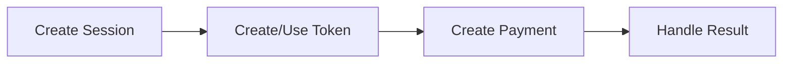

## Overview

Direct API integration gives you complete control over the payment lifecycle through server-to-server REST API calls. This approach is ideal for backend-driven systems, recurring payments, or scenarios where you manage your own checkout UI.

<Warning>
Direct API integration for card payments requires **PCI DSS Level 1** certification because your servers handle raw card data. If you are not PCI Level 1 certified, use one of the [SDK integrations](/guides/sdk/overview) instead.
</Warning>

## Payment Flow

The Direct API payment flow consists of three steps:



<Steps>
  <Step title="Create a checkout session">
    Every payment starts with a checkout session that groups the transaction context:

    ```bash
    curl -X POST https://api-sandbox.y.uno/v1/checkout/sessions \
      -H "public-api-key: YOUR_PUBLIC_KEY" \
      -H "private-secret-key: YOUR_PRIVATE_KEY" \
      -H "account-code: YOUR_ACCOUNT_CODE" \
      -H "Content-Type: application/json" \
      -d '{
        "amount": { "currency": "USD", "value": 100.00 },
        "country": "CO",
        "merchant_order_id": "order-789"
      }'
    ```

    The response includes a `checkout_session` ID used in subsequent API calls.
  </Step>

  <Step title="Tokenize payment data">
    For card payments, create a one-time token with the raw card data:

    ```bash
    curl -X POST https://api-sandbox.y.uno/v1/payment-methods/tokens \
      -H "public-api-key: YOUR_PUBLIC_KEY" \
      -H "Content-Type: application/json" \
      -d '{
        "card": {
          "number": "4111111111111111",
          "expiration_month": "12",
          "expiration_year": "2028",
          "cvv": "123",
          "holder_name": "John Doe"
        }
      }'
    ```

    For alternative payment methods (PIX, bank transfers), tokenization is not required.
  </Step>

  <Step title="Create the payment">
    Submit the payment with the token and customer details:

    ```bash
    curl -X POST https://api-sandbox.y.uno/v1/payments \
      -H "public-api-key: YOUR_PUBLIC_KEY" \
      -H "private-secret-key: YOUR_PRIVATE_KEY" \
      -H "account-code: YOUR_ACCOUNT_CODE" \
      -H "Content-Type: application/json" \
      -d '{
        "checkout_session": "session-id",
        "payment_method": { "type": "CARD", "token": "one-time-token" },
        "amount": { "currency": "USD", "value": 100.00 },
        "country": "CO"
      }'
    ```

    See [Create a Payment](/guides/direct-api/create-payment) for complete examples.
  </Step>

  <Step title="Handle the result">
    The payment response contains a `status` field:

    | Status | Meaning | Action |
    |--------|---------|--------|
    | `SUCCEEDED` | Payment approved | Fulfill the order |
    | `PENDING` | Awaiting async confirmation | Wait for webhook |
    | `DECLINED` | Payment declined | Show error, allow retry |
    | `REQUIRES_ACTION` | 3DS or redirect needed | Redirect the customer |
  </Step>
</Steps>

## Authentication

All API requests require three headers:

| Header | Description |
|--------|-------------|
| `public-api-key` | Your public API key |
| `private-secret-key` | Your private secret key (server-side only) |
| `account-code` | Your merchant account code |

<Note>
Never expose your `private-secret-key` in client-side code or version control. Use environment variables.
</Note>

## Base URLs

| Environment | Base URL |
|-------------|----------|
| Sandbox | `https://api-sandbox.y.uno` |
| Production | `https://api.y.uno` |

## Next Steps

<CardGroup cols={2}>
  <Card title="Create a Payment" icon="credit-card" href="/guides/direct-api/create-payment">
    Detailed payment creation with method-specific examples.
  </Card>
  <Card title="Capture & Cancel" icon="rotate-left" href="/guides/direct-api/capture-and-cancel">
    Two-step authorization flows.
  </Card>
  <Card title="Refunds" icon="arrow-rotate-left" href="/guides/direct-api/refunds">
    Process full and partial refunds.
  </Card>
  <Card title="Webhooks" icon="bell" href="/guides/webhooks/setup">
    Receive real-time payment notifications.
  </Card>
</CardGroup>
