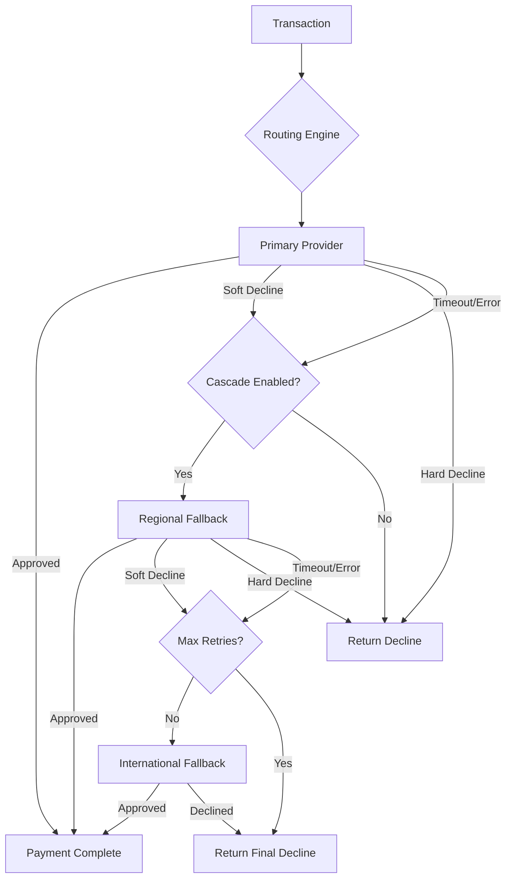

## Overview

Multi-provider orchestration distributes payment transactions across multiple providers to maximize approval rates, minimize costs, and ensure availability. Instead of depending on a single acquirer or gateway, you configure a network of providers that Yuno routes to based on transaction characteristics, provider performance, and your business rules.

## Why Multi-Provider Matters

| Benefit | Description |
|---------|-------------|
| **Higher approval rates** | Route to the provider most likely to approve each specific transaction |
| **Redundancy** | Continue processing if a provider experiences downtime |
| **Cost optimization** | Choose the lowest-cost provider when approval rates are comparable |
| **Geographic coverage** | Use local acquirers in each market for domestic processing advantages |
| **Negotiating leverage** | Multiple provider relationships create competitive pricing dynamics |

<Info>
  Merchants using 3+ providers through Yuno typically see a 5-15% improvement in overall approval rates compared to single-provider setups, primarily from domestic routing and intelligent failover.
</Info>

## Provider Selection Framework

When evaluating providers for your orchestration setup, assess each across these dimensions:

| Criterion | Questions to Answer | Weight |
|-----------|-------------------|--------|
| **Approval rate** | What is the provider's approval rate for your target market, payment method, and card mix? | High |
| **Cost** | What are the per-transaction fees, monthly minimums, and cross-border surcharges? | High |
| **Coverage** | Which countries, currencies, and payment methods does the provider support? | High |
| **Speed** | What is the average response time for authorization requests? | Medium |
| **Features** | Does the provider support 3DS, tokenization, installments, and recurring payments? | Medium |
| **Reliability** | What is the provider's uptime SLA and historical incident frequency? | Medium |
| **Integration** | Is the provider available through Yuno's provider catalog? | Required |

### Provider Role Assignment

Assign each provider a role in your orchestration architecture:

| Role | Description | Example |
|------|-------------|---------|
| **Primary** | First choice for matching transactions; highest approval rate | Local acquirer in target market |
| **Regional fallback** | Second choice; covers the same region with different issuer relationships | Alternative local acquirer |
| **International fallback** | Third choice; cross-border processor with broad coverage | Global gateway (Stripe, Adyen) |
| **Specialized** | Handles specific payment methods or edge cases | Elo-only acquirer, PIX processor |

## Failover Chain Architecture

Design your provider chains as a tiered failover structure:



### Example: Brazil Card Processing Chain

```
Primary:        PagSeguro (domestic Visa/MC, 87% approval)
     │
     ▼ soft decline / timeout
Regional:       dLocal (domestic + regional, 79% approval)
     │
     ▼ soft decline / timeout
International:  Adyen (global fallback, 68% approval)
     │
     ▼ any decline
STOP:           Return decline to customer
```

<Warning>
  Hard declines (stolen card, invalid number, fraud) must never cascade. Retrying hard declines wastes processing fees and can trigger fraud monitoring alerts at the issuer and network level.
</Warning>

## Cascading Payments

Cascading (also called retry or failover) automatically sends a declined transaction to the next provider in your chain. Configure cascading in **Dashboard > Routing Rules**.

### Cascade-Eligible Decline Codes

| Code Category | Examples | Cascade? |
|--------------|----------|----------|
| **Soft declines** | `do_not_honor`, `generic_decline`, `try_again` | Yes |
| **Insufficient funds** | `insufficient_funds` | Yes (with caution) |
| **Issuer unavailable** | `issuer_timeout`, `system_error` | Yes |
| **Hard declines** | `stolen_card`, `lost_card`, `invalid_number` | No |
| **Fraud** | `fraud_suspected`, `security_violation` | No |
| **Card restrictions** | `card_not_enrolled`, `restricted_card` | No |

### Network Retry Limits

Card networks (Visa, Mastercard) impose limits on transaction retries to prevent abuse:

| Network | Retry Limit | Time Window | Penalty |
|---------|-------------|-------------|---------|
| **Visa** | 15 retries per card per 30 days | Rolling 30 days | Excessive retry fees, potential account suspension |
| **Mastercard** | 10 retries per card per 24 hours | Rolling 24 hours | Non-compliance fees |

<Warning>
  Exceeding network retry limits incurs fines and can result in your merchant account being flagged. Yuno tracks retry counts per card, but you should also configure maximum cascade depth (recommended: 2-3 providers) to stay well within limits.
</Warning>

## Provider Health Monitoring

Monitor provider health to detect degradation before it impacts your approval rates.

### Key Metrics

| Metric | Healthy Threshold | Alert Threshold | Critical Threshold |
|--------|-------------------|-----------------|-------------------|
| **Approval rate** | &gt;80% | &lt;70% | &lt;50% |
| **Response time** | &lt;2 seconds | &gt;3 seconds | &gt;5 seconds |
| **Timeout rate** | &lt;1% | &gt;3% | &gt;5% |
| **Error rate** | &lt;0.5% | &gt;2% | &gt;5% |
| **Uptime** | &gt;99.9% | &lt;99.5% | &lt;99% |

### Automated Health Actions

Configure automatic responses to provider degradation in **Dashboard > Routing Rules > Health Settings**:

| Provider State | Automatic Action |
|---------------|-----------------|
| **Healthy** | Route normally per rules |
| **Degraded** (approval rate below threshold) | Reduce traffic share, increase fallback priority |
| **Down** (timeouts >5% or error rate >5%) | Remove from rotation, route all traffic to fallback |
| **Recovery** (metrics returning to normal) | Gradually restore traffic over 15-30 minutes |

<Tip>
  Set up webhook notifications for provider health changes at **Dashboard > Webhooks > Provider Events**. This allows your operations team to respond proactively.
</Tip>

## Cost-Benefit Analysis

Use this template to compare providers and determine optimal routing:

| Factor | Provider A | Provider B | Provider C |
|--------|-----------|-----------|-----------|
| Per-transaction fee | $0.30 | $0.25 | $0.35 |
| Percentage fee | 2.9% | 3.2% | 2.5% |
| Monthly minimum | $500 | $0 | $1,000 |
| Cross-border surcharge | N/A (domestic) | N/A (domestic) | +1.0% |
| Approval rate (your data) | 87% | 82% | 71% |
| Avg response time | 1.2s | 1.8s | 0.9s |
| **Effective cost per approved txn** | **$0.64** | **$0.65** | **$0.85** |

<Note>
  Effective cost per approved transaction is the most important metric. A provider with lower fees but lower approval rates may cost more per successful payment than a provider with higher fees and higher approval rates.
</Note>

### Calculating Effective Cost

```
Effective cost = (per_txn_fee + amount * pct_fee) / approval_rate

Example: Provider A
  Fee per attempt: $0.30 + ($50 * 2.9%) = $0.30 + $1.45 = $1.75
  Failed attempt cost: $0.30 (fee still charged on declines)
  Effective cost: $1.75 / 0.87 = $2.01 per approved $50 txn
```

## A/B Testing Providers

Validate routing changes with controlled experiments before full rollout.

<Steps>
  <Step title="Define hypothesis">
    State what you expect to improve and by how much:

    ```
    Hypothesis: Routing Brazilian Visa cards through Provider B instead of
    Provider A will increase approval rate by 3+ percentage points.
    ```
  </Step>

  <Step title="Configure traffic split">
    In **Dashboard > Routing Rules**, create a round-robin rule with weighted distribution:

    ```
    Rule: Brazil Visa A/B Test
    Conditions: country = BR AND card_brand = Visa
    Strategy: Round Robin
    Distribution:
      - Provider A: 50% (control)
      - Provider B: 50% (treatment)
    ```
  </Step>

  <Step title="Set test duration and sample size">
    Run the test until you reach statistical significance:

    | Transaction Volume | Minimum Test Duration | Minimum Transactions per Variant |
    |-------------------|----------------------|--------------------------------|
    | &lt;1,000/day | 2-4 weeks | 5,000 |
    | 1,000-10,000/day | 1-2 weeks | 5,000 |
    | &gt;10,000/day | 3-7 days | 10,000 |
  </Step>

  <Step title="Analyze results">
    Compare key metrics in **Dashboard > Analytics > Provider Comparison**:

    - Approval rate (primary metric)
    - Average response time
    - Decline code distribution
    - Cost per approved transaction
  </Step>

  <Step title="Roll out or revert">
    If the treatment outperforms control with statistical significance, update routing to send 100% of matching traffic to the winning provider. If results are inconclusive, extend the test or test with a different segment.
  </Step>
</Steps>

## Configuring Routing Rules

### Rule Structure

Each routing rule consists of conditions, a strategy, and a provider list:

```
Rule: [Name]
Conditions: [country] AND [payment_method] AND [card_brand] AND [amount_range]
Strategy: Priority | Cost | Success Rate | Round Robin
Providers:
  1. [Primary]     - weight or priority
  2. [Fallback 1]  - weight or priority
  3. [Fallback 2]  - weight or priority
Cascade: On soft decline, retry next provider (max 3 attempts)
```

### Example Rule Set

```
1. [P1] Brazil PIX
   Conditions: country = BR AND payment_method = PIX
   Strategy: Priority
   Providers: PagSeguro

2. [P2] Brazil Domestic Cards
   Conditions: country = BR AND payment_method = CARD AND card_country = BR
   Strategy: Success Rate
   Providers: PagSeguro, dLocal, Adyen
   Cascade: Soft declines only, max 2 retries

3. [P3] Mexico Cards
   Conditions: country = MX AND payment_method = CARD
   Strategy: Priority
   Providers: Conekta, dLocal
   Cascade: Soft declines only, max 2 retries

4. [P4] Colombia Cards
   Conditions: country = CO AND payment_method = CARD
   Strategy: Success Rate
   Providers: PayU, dLocal
   Cascade: Soft declines only, max 1 retry

5. [P99] Catch-all
   Conditions: (none)
   Strategy: Priority
   Providers: Adyen
   Cascade: None
```

<Warning>
  Always include a catch-all rule at the lowest priority. Without one, transactions that do not match any specific rule will fail with a routing error.
</Warning>

## Handling Provider-Specific Requirements

Some providers have unique requirements that affect orchestration:

| Provider Requirement | Impact | Handling Strategy |
|---------------------|--------|-------------------|
| **Tokenization format** | Tokens are provider-specific and not portable | Use Yuno's universal token; Yuno translates per provider |
| **3DS preferences** | Some providers require 3DS, others make it optional | Configure 3DS rules at the Yuno level, not per provider |
| **Installment support** | Not all providers support installments in all markets | Route installment transactions only to capable providers |
| **MCC codes** | Some providers require specific merchant category codes | Configure MCC per provider in **Dashboard > Providers > Settings** |
| **Soft descriptor** | Character limits and formats vary by provider | Yuno normalizes descriptors; review per-provider limits |

## Best Practices and Anti-Patterns

### Do

- Start with 2-3 providers per market and expand based on data
- Use domestic acquirers as primary providers in each country
- Monitor effective cost per approved transaction, not just per-attempt fees
- A/B test before making major routing changes
- Set up automated alerts for provider health degradation
- Review routing performance weekly and adjust quarterly

### Do Not

- Cascade hard declines to other providers
- Exceed network retry limits (Visa: 15/30 days, MC: 10/24 hours)
- Route to providers without monitoring their health metrics
- Change routing rules based on less than one week of data
- Use more than 3 providers in a single cascade chain
- Ignore cross-border surcharges when comparing provider costs
- Deploy routing changes during peak transaction hours without A/B testing first
