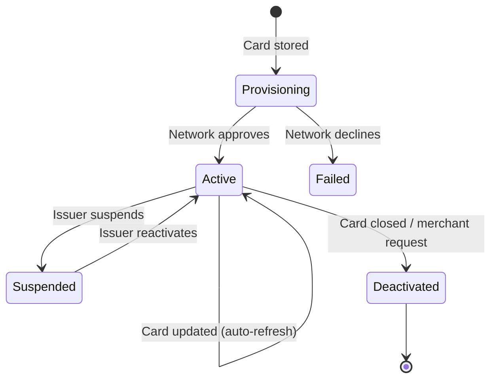
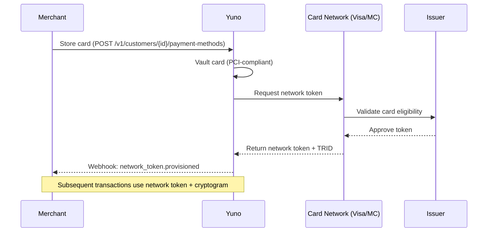
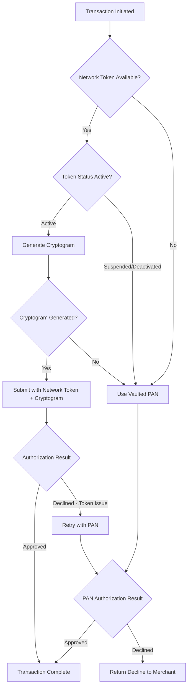

## Overview

Network tokens are card-network-issued replacements for raw Primary Account Numbers (PANs). Unlike vault tokens that reference stored data in Yuno's systems, network tokens are issued by Visa and Mastercard and recognized at the acquirer and issuer level. This guide covers optimization strategies, lifecycle management, and migration best practices.

<Info>
For an introduction to network tokens and basic setup, see [Network Tokens](/features/network-tokens).
</Info>

## Network Tokens vs. PAN

| Characteristic | PAN | Network Token |
|---------------|-----|---------------|
| Format | Raw card number | Network-issued token (same format) |
| Card updates | Fails when card expires or is reissued | Automatically updated by the network |
| Fraud protection | Static credentials | Dynamic cryptogram per transaction |
| Issuer trust level | Standard | Elevated (network-verified) |
| Interchange rates | Standard | Potentially reduced |
| PCI scope | Full PAN in scope | Reduced scope (token is not reusable without cryptogram) |

## Token Lifecycle

Network tokens progress through a defined lifecycle managed by the card networks:



### Lifecycle Stages

| Stage | Description | Action Required |
|-------|-------------|-----------------|
| **Provisioning** | Token requested from network after card storage | None (automatic) |
| **Active** | Token is valid and used for transactions | Monitor health |
| **Refresh** | Card updated (new expiry, reissued) — token mapping updated | None (automatic) |
| **Suspended** | Issuer temporarily disables the token | Falls back to PAN; monitor for reactivation |
| **Deactivated** | Token permanently invalidated | Request new card from customer |

<Note>
Token provisioning is asynchronous. The first transaction after card storage may use the raw PAN while the network token is being provisioned. Subsequent transactions automatically use the network token.
</Note>

## Authorization Rate Impact

Network tokens typically improve authorization rates by 2-5%. The improvement comes from several factors:

- **Issuer trust**: Issuers recognize network tokens as verified, reducing false declines
- **Dynamic cryptograms**: Per-transaction cryptograms eliminate replay attacks, increasing issuer confidence
- **Automatic card updates**: Transactions that would fail due to expired cards succeed because the token maps to the current PAN

### Expected Improvement by Use Case

| Use Case | Typical Lift | Notes |
|----------|-------------|-------|
| Recurring payments | +3-5% | Greatest impact due to card expiry handling |
| Stored credential (COF) | +2-4% | Improved issuer trust |
| One-time payments | +1-2% | Moderate lift from cryptogram trust |
| Cross-border | +2-3% | Reduced fraud-related declines |

## Issuer Support Matrix

Network token acceptance depends on the issuing bank's participation in the token service:

| Network | Service Name | Regions | Coverage |
|---------|-------------|---------|----------|
| Visa | Visa Token Service (VTS) | Global | 85%+ of Visa issuers |
| Mastercard | Mastercard Digital Enablement Service (MDES) | Global | 80%+ of Mastercard issuers |
| American Express | Amex Token Service | US, EU, LATAM | 60%+ of Amex issuers |

<Warning>
Not all cards are eligible for network tokenization. Eligibility depends on the issuing bank's participation. Ineligible cards process normally using the vaulted PAN with no disruption.
</Warning>

## Enabling Network Tokens

<Steps>
  <Step title="Navigate to Dashboard > Settings > Card Processing > Network Tokens" />
  <Step title="Enable network tokenization for your merchant account" />
  <Step title="Select target networks (Visa, Mastercard, or both)">
    Enabling both is recommended for maximum coverage.
  </Step>
  <Step title="Configure token provisioning preferences">
    Choose between automatic provisioning (all eligible cards) or selective provisioning (recurring customers only).
  </Step>
  <Step title="Save and verify">
    Store a test card in sandbox and confirm a `network_token.provisioned` webhook event is received.
  </Step>
</Steps>

## Token Provisioning Flow



## Recurring Payment Optimization

Network tokens provide the greatest value for recurring payments (subscriptions, installments):

1. **No expired card failures**: When a card is renewed, the network updates the token mapping automatically. The customer does not need to re-enter card details.
2. **Higher approval rates**: Issuers apply less friction to network-tokenized recurring charges.
3. **Reduced involuntary churn**: Fewer payment failures mean fewer subscription cancellations.

```json
POST /v1/payments
{
  "amount": { "currency": "USD", "value": 29.99 },
  "country": "CO",
  "payment_method": {
    "vaulted_token": "tok_card_abc123"
  },
  "payment_type": "RECURRING",
  "merchant_order_id": "sub-renewal-456"
}
```

<Info>
When network tokens are enabled, Yuno automatically uses the network token for vaulted card transactions. No changes to your API integration are required.
</Info>

## Token Health Monitoring

Monitor network token health in the Dashboard under **Settings > Card Processing > Network Tokens > Token Health**:

| Metric | Description | Healthy Range |
|--------|-------------|---------------|
| Provisioning success rate | Percentage of cards that receive a network token | Above 70% |
| Active token count | Number of currently active tokens | Growing over time |
| Suspension rate | Percentage of tokens suspended by issuers | Below 5% |
| Auto-refresh success | Percentage of card updates handled automatically | Above 95% |
| Token utilization | Percentage of eligible transactions using tokens | Above 80% |

## Token vs. PAN Performance Comparison

Track the impact of network tokens in the Dashboard under **Analytics > Authorization > Token Comparison**:

- **Approval rate split**: Side-by-side approval rates for tokenized vs. non-tokenized transactions
- **Decline reason analysis**: Compare decline reasons between token and PAN transactions
- **Revenue impact**: Estimated additional revenue from improved approval rates

## Migration Strategy: PAN to Network Tokens

### Phase 1: Enable and Provision

1. Enable network tokenization in Dashboard
2. Tokens are provisioned automatically for new stored cards
3. Trigger bulk provisioning for existing vaulted cards via **Dashboard > Card Processing > Bulk Provision**

### Phase 2: Monitor

1. Compare approval rates between tokenized and non-tokenized transactions (2-4 weeks)
2. Monitor provisioning success rates across card networks
3. Review token health dashboard for suspensions or failures

### Phase 3: Optimize

1. Enable automatic provisioning for all eligible stored cards
2. Set up alerts for provisioning failures and token suspensions
3. Configure fallback behavior: token first, PAN fallback if token unavailable

<Note>
Bulk provisioning for existing cards is processed asynchronously. Large portfolios may take several hours to complete. Monitor progress in the Dashboard.
</Note>

## Troubleshooting Token Provisioning Failures

| Error | Cause | Resolution |
|-------|-------|------------|
| `TOKEN_NOT_ELIGIBLE` | Issuer does not support token service | No action; card will use PAN |
| `TOKEN_PROVISIONING_DECLINED` | Issuer declined the token request | Verify card is active; retry after 24 hours |
| `TOKEN_NETWORK_TIMEOUT` | Network did not respond in time | Automatic retry; check network status page |
| `TOKEN_ALREADY_EXISTS` | Token already provisioned for this card | No action; existing token is used |
| `TOKEN_SUSPENDED` | Issuer suspended the token | Contact customer to verify card status |

<Warning>
Do not retry provisioning for `TOKEN_NOT_ELIGIBLE` errors. These indicate issuer-level limitations that will not resolve with retries.
</Warning>

## Best Practices

- **Enable for all stored cards**: Even if not all cards are eligible, the eligible ones benefit immediately.
- **Monitor approval rate changes**: Track the before/after impact in the Dashboard analytics.
- **Combine with 3D Secure**: Network tokens and 3DS together provide the highest approval rates and strongest fraud protection.
- **Use with recurring payments**: Network tokens eliminate the most common cause of recurring payment failure (expired cards).
- **Review token health regularly**: Monitor provisioning rates and suspension rates to ensure optimal performance.
- **Plan for fallback**: Ensure your integration handles PAN fallback gracefully when tokens are unavailable.

## Issuer Support by Country

Network token support varies significantly across LatAm issuers. The following table shows token service participation for major issuers in each country.

### Brazil

| Issuer | Visa Token Service (VTS) | Mastercard MDES | Notes |
|--------|--------------------------|-----------------|-------|
| Itau Unibanco | Yes | Yes | Full support for both networks |
| Bradesco | Yes | Yes | Full support for both networks |
| Banco do Brasil | Yes | Yes | MDES rollout completed in 2025 |
| Nubank | Yes | No | VTS only; MDES support planned |
| Santander BR | Yes | Yes | Full support for both networks |
| Caixa Economica | No | No | No token service support; PAN fallback |

### Mexico

| Issuer | Visa Token Service (VTS) | Mastercard MDES | Notes |
|--------|--------------------------|-----------------|-------|
| BBVA Mexico | Yes | Yes | Largest issuer; full support |
| Citibanamex | Yes | Yes | Full support for both networks |
| Banorte | Yes | No | VTS only |
| Santander MX | Yes | Yes | Full support for both networks |
| HSBC Mexico | Yes | No | VTS only; MDES in progress |

### Colombia

| Issuer | Visa Token Service (VTS) | Mastercard MDES | Notes |
|--------|--------------------------|-----------------|-------|
| Bancolombia | Yes | Yes | Full support for both networks |
| Davivienda | Yes | No | VTS only |
| Banco de Bogota | Yes | Yes | Full support for both networks |
| BBVA Colombia | Yes | Yes | Full support for both networks |

### Argentina, Chile, and Peru

| Country | Issuer | VTS | MDES | Notes |
|---------|--------|-----|------|-------|
| Argentina | Banco Galicia | Yes | Yes | Full support |
| Argentina | Banco Macro | Yes | No | VTS only |
| Argentina | Mercado Pago | No | No | Digital wallet; not applicable |
| Chile | Banco de Chile | Yes | Yes | Full support |
| Chile | BCI | Yes | No | VTS only |
| Chile | Santander CL | Yes | Yes | Full support |
| Peru | BCP | Yes | Yes | Full support |
| Peru | Interbank | Yes | No | VTS only |
| Peru | BBVA Peru | Yes | Yes | Full support |

<Note>
  Issuer support is subject to change as banks continue to adopt token services. Check the Dashboard under **Settings > Card Processing > Network Tokens > Issuer Coverage** for the most current data. Issuers without token support will process transactions using the vaulted PAN with no disruption.
</Note>

## Fallback Strategy

When network token provisioning or usage fails, the system must gracefully fall back to PAN-based authorization to avoid transaction failures.

### Fallback Decision Flow



### Fallback Scenarios

| Scenario | Behavior | Merchant Action Required |
|----------|----------|------------------------|
| Token not yet provisioned | First transaction uses PAN; subsequent use token | None (automatic) |
| Token suspended by issuer | Falls back to PAN automatically | Monitor; contact customer if persistent |
| Cryptogram generation failure | Retries once, then falls back to PAN | None (automatic) |
| Token-based auth declined | Retries with PAN if decline code is token-related | None (automatic) |
| Issuer does not support tokens | PAN used for all transactions with that card | None (card ineligible) |

### Retry Logic for Token Failures

Configure token retry behavior in **Dashboard > Settings > Card Processing > Network Tokens > Fallback**:

1. **Automatic PAN fallback**: Enabled by default. When a token-based authorization returns a token-specific decline code, Yuno automatically retries with the vaulted PAN.
2. **Retry delay**: PAN fallback retry occurs immediately (no delay) to minimize customer-facing latency.
3. **Decline code mapping**: Token-specific decline codes (`TOKEN_INVALID`, `TOKEN_EXPIRED`, `CRYPTOGRAM_INVALID`) trigger fallback. Standard decline codes (insufficient funds, do not honor) do not trigger fallback.

### Monitoring Token Provisioning Failures

Track provisioning health in **Dashboard > Settings > Card Processing > Network Tokens > Provisioning Log**:

| Metric | Alert Threshold | Action |
|--------|----------------|--------|
| Provisioning failure rate | >30% for any issuer | Check if issuer has disabled token service |
| Cryptogram generation failures | >5% of token transactions | Contact Yuno support for network connectivity review |
| PAN fallback rate | >40% of eligible transactions | Review issuer support and token health |
| Token suspension spike | >10% increase week-over-week | Investigate issuer-level changes |

<Warning>
  A sudden spike in PAN fallback rates may indicate an issuer has suspended token services. Monitor the provisioning log and set up alerts to detect these changes early.
</Warning>

## Token Migration

Migrating from PAN-based stored credentials to network tokens is a phased process. This section provides a detailed migration plan for merchants with existing vaulted card portfolios.

### Pre-Migration Assessment

Before starting migration, evaluate your portfolio:

1. **Card portfolio size**: Count total vaulted cards and active cards (used in last 90 days)
2. **Network distribution**: Break down cards by Visa, Mastercard, and other networks to estimate token eligibility
3. **Issuer coverage**: Cross-reference your top issuers against the issuer support tables above to estimate provisioning success rate
4. **Baseline metrics**: Record current approval rates, decline reasons, and involuntary churn for comparison

### Migration Phases

| Phase | Duration | Actions | Success Criteria |
|-------|----------|---------|-----------------|
| **1. Enable and provision new cards** | Week 1 | Enable tokenization; all new stored cards are tokenized automatically | Provisioning success >70% |
| **2. Bulk provision active cards** | Weeks 2-3 | Trigger bulk provisioning for cards used in the last 90 days via Dashboard | Bulk provisioning completes without errors |
| **3. Monitor and compare** | Weeks 4-7 | Compare approval rates for tokenized vs. non-tokenized transactions | Token approval rate exceeds PAN by >1% |
| **4. Provision remaining cards** | Week 8 | Extend provisioning to all vaulted cards, including inactive | Full portfolio coverage |
| **5. Optimize and enforce** | Ongoing | Set token-first routing; configure PAN fallback; refine issuer-specific behavior | Token utilization >80% |

### Bulk Provisioning

Trigger bulk provisioning in **Dashboard > Card Processing > Bulk Provision**:

1. Select the card portfolio segment (all cards, active-only, specific date range)
2. Choose target networks (Visa, Mastercard, or both)
3. Set the provisioning batch size (recommended: 5,000 cards per batch for large portfolios)
4. Monitor progress in the provisioning log; large portfolios may take several hours

### Measuring Migration Success

After completing migration, track these metrics over a 4-week window:

| Metric | Pre-Migration Baseline | Post-Migration Target | Measurement |
|--------|----------------------|----------------------|-------------|
| Overall approval rate | Record baseline | +2-5% improvement | Dashboard > Analytics > Authorization |
| Recurring payment success | Record baseline | +3-5% improvement | Dashboard > Payments > Recurring |
| Card update requests | Record baseline | 50-70% reduction | Customer support ticket volume |
| Involuntary churn | Record baseline | 20-40% reduction | Subscription cancellation due to payment failure |

<Tip>
  Start bulk provisioning with your highest-volume cards first. These generate the most transaction volume and will produce measurable approval rate improvements fastest, helping justify the migration to stakeholders.
</Tip>
