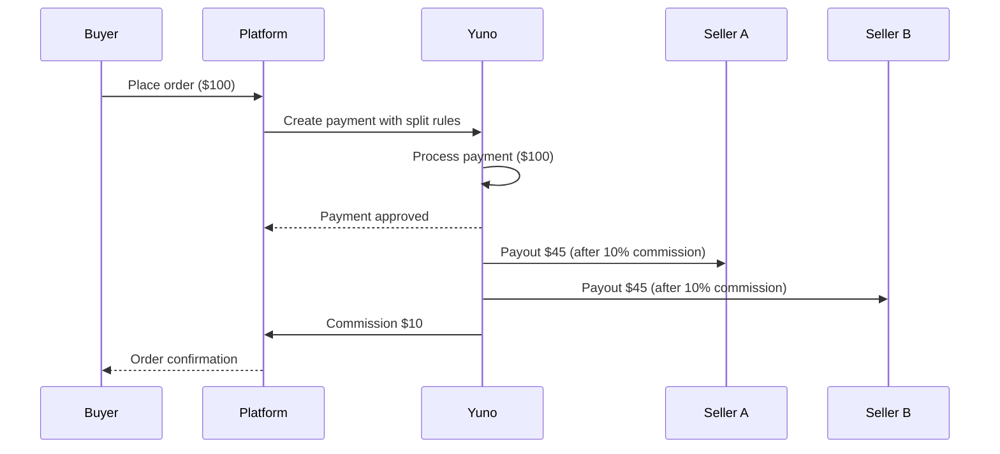
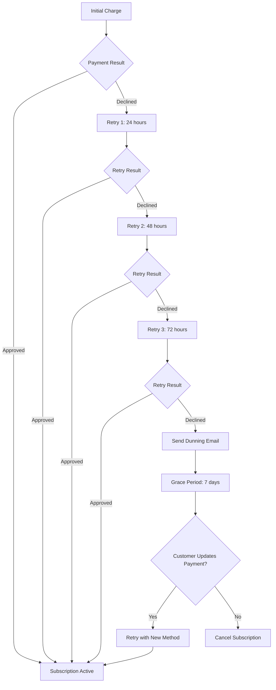
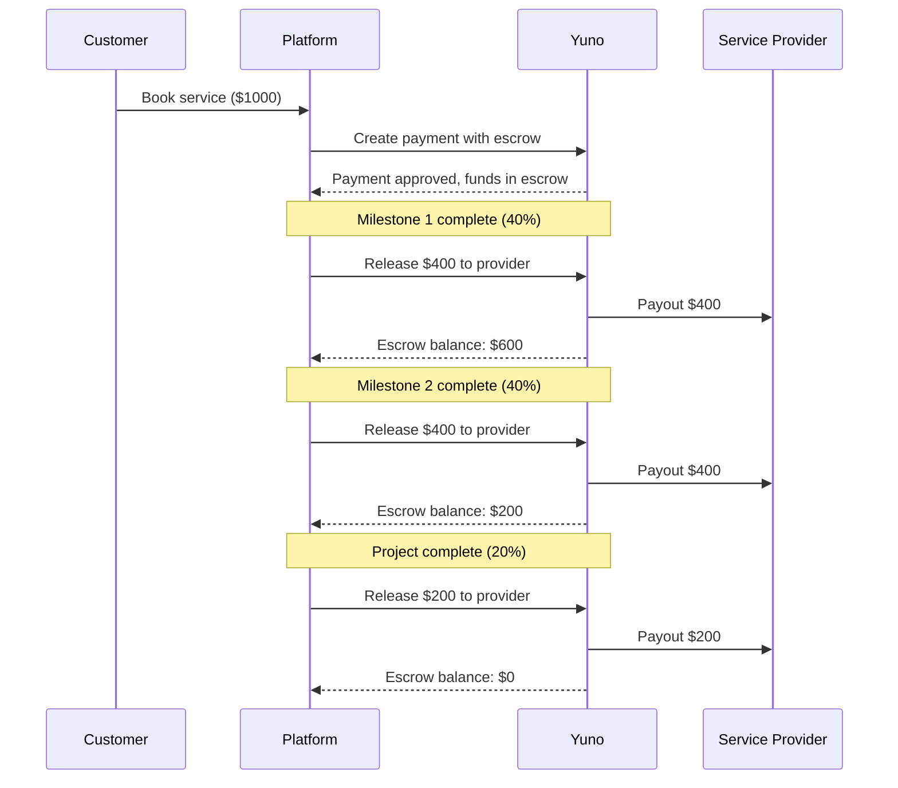
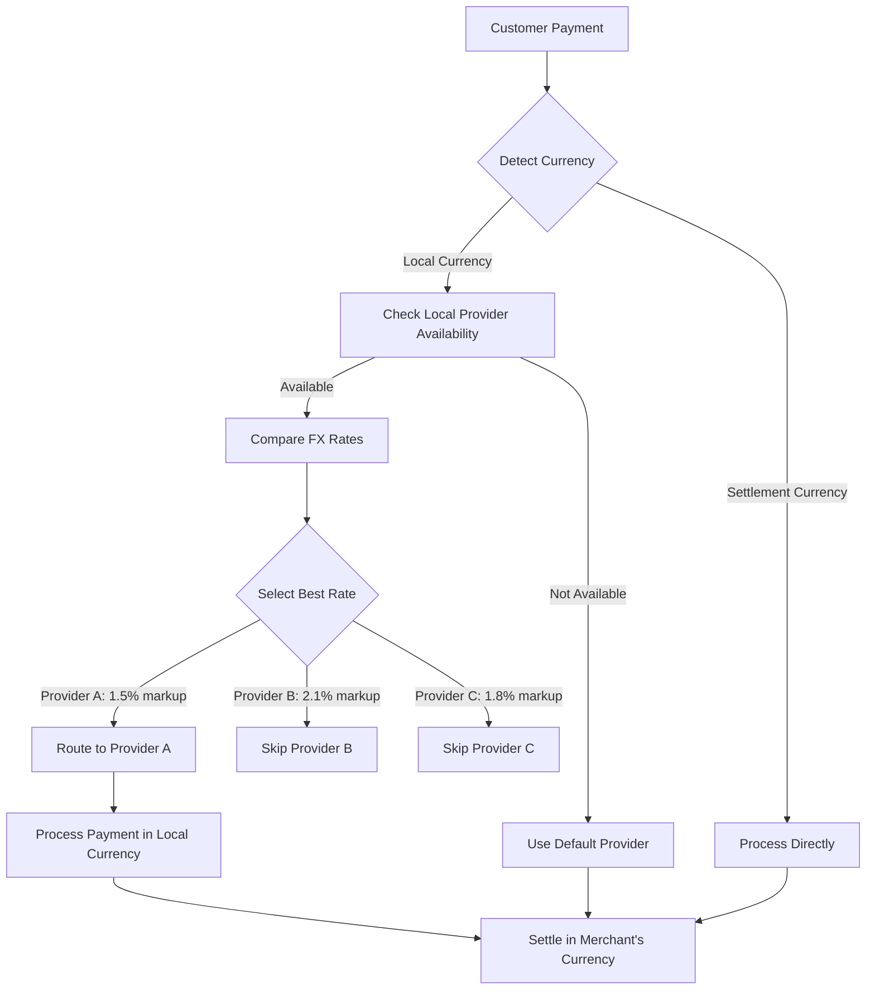
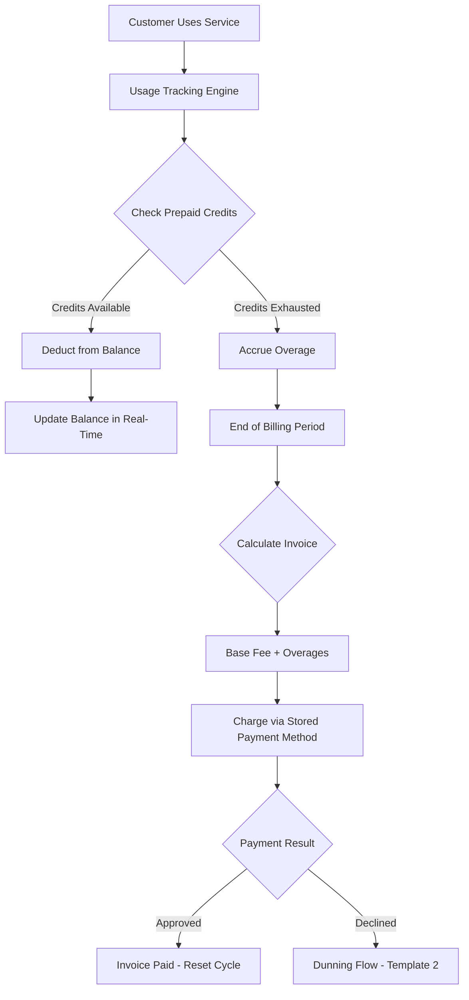
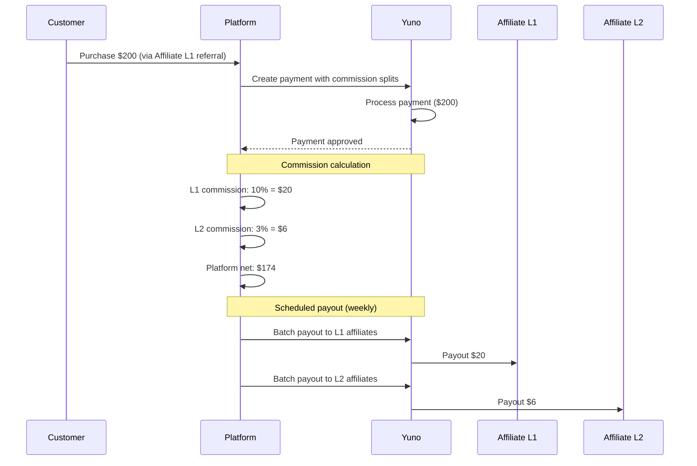

## Overview

Orchestration templates are pre-built workflow patterns for common payment scenarios. Each template includes an architecture diagram, code examples, configuration steps, and monitoring recommendations. Use these as starting points and customize for your specific requirements.

<Note>
These templates use Yuno's payment orchestration engine. Ensure your account has orchestration enabled in **Dashboard > Settings > Features**.
</Note>

---

## Template 1: Marketplace Checkout

### Use Case

A marketplace where buyers purchase from multiple sellers through a single checkout. The platform collects payment, takes a commission, and distributes funds to sellers.

### Architecture



### Code Example

```json
POST /v1/payments
{
  "amount": { "currency": "USD", "value": 100.00 },
  "country": "CO",
  "payment_method": {
    "type": "CARD",
    "token": "tok_card_abc123"
  },
  "merchant_order_id": "marketplace-order-789",
  "split_rules": [
    {
      "recipient_id": "seller_a_001",
      "amount": { "currency": "USD", "value": 45.00 },
      "type": "FIXED",
      "description": "Seller A payout"
    },
    {
      "recipient_id": "seller_b_002",
      "amount": { "currency": "USD", "value": 45.00 },
      "type": "FIXED",
      "description": "Seller B payout"
    },
    {
      "recipient_id": "platform_001",
      "amount": { "currency": "USD", "value": 10.00 },
      "type": "FIXED",
      "description": "Platform commission"
    }
  ]
}
```

### Configuration Steps

<Steps>
  <Step title="Register recipients">
    Create seller accounts in **Dashboard > Payouts > Recipients** with bank account details and KYC verification.
  </Step>
  <Step title="Configure split rules">
    Define default commission rates in **Dashboard > Orchestration > Split Rules** or pass them per transaction via the API.
  </Step>
  <Step title="Set payout schedules">
    Configure payout frequency per recipient (daily, weekly, on-demand) in **Dashboard > Payouts > Schedules**.
  </Step>
  <Step title="Enable escrow (optional)">
    For marketplaces with delivery confirmation, enable escrow to hold funds until the buyer confirms receipt.
  </Step>
</Steps>

### Escrow and Release Patterns

For marketplaces that require delivery confirmation before releasing funds:

```json
POST /v1/payments/{payment_id}/escrow/release
{
  "recipient_id": "seller_a_001",
  "amount": { "currency": "USD", "value": 45.00 },
  "reason": "Delivery confirmed by buyer"
}
```

| Escrow Event | Trigger | Action |
|-------------|---------|--------|
| Hold | Payment approved | Funds held in escrow |
| Partial release | Partial delivery confirmed | Release portion to seller |
| Full release | Full delivery confirmed | Release remaining funds |
| Refund | Dispute or cancellation | Return funds to buyer |

### Monitoring

- **Dashboard > Payments**: Track split payment status and individual recipient payouts
- **Dashboard > Payouts**: Monitor payout execution and settlement times
- **Webhook**: Listen for `payout.completed` and `payout.failed` events

---

## Template 2: Subscription with Dunning

### Use Case

A SaaS platform that charges customers on a recurring basis. When a payment fails, a smart retry cascade attempts to recover the payment before cancelling the subscription.

### Architecture



### Smart Retry Configuration

Configure retry logic in **Dashboard > Orchestration > Retry Rules**:

```json
POST /v1/orchestration/retry-rules
{
  "name": "subscription_dunning",
  "payment_type": "RECURRING",
  "retry_schedule": [
    {
      "attempt": 1,
      "delay_hours": 24,
      "provider_strategy": "SAME_PROVIDER"
    },
    {
      "attempt": 2,
      "delay_hours": 48,
      "provider_strategy": "FAILOVER",
      "fallback_provider": "provider_b"
    },
    {
      "attempt": 3,
      "delay_hours": 72,
      "provider_strategy": "SMART_ROUTING"
    }
  ],
  "max_retries": 3,
  "decline_codes_to_retry": [
    "INSUFFICIENT_FUNDS",
    "TEMPORARY_ERROR",
    "ISSUER_UNAVAILABLE"
  ],
  "decline_codes_to_stop": [
    "STOLEN_CARD",
    "CLOSED_ACCOUNT",
    "FRAUD"
  ]
}
```

### Customer Notification Touchpoints

| Event | Timing | Channel | Content |
|-------|--------|---------|---------|
| Payment failed | Immediately | Email | "Payment failed, we'll retry automatically" |
| Retry 1 failed | +24h | Email | "Second attempt failed, updating card may help" |
| Retry 2 failed | +72h | Email + SMS | "Action required: update payment method" |
| All retries failed | +144h | Email | "Last chance: update payment within 7 days" |
| Grace period ending | +312h | Email + SMS | "Subscription will cancel in 24 hours" |
| Subscription cancelled | +336h | Email | "Subscription cancelled, reactivate anytime" |

<Warning>
Only retry on soft decline codes (insufficient funds, temporary errors). Retrying hard declines (stolen card, fraud) can result in network penalties and increased decline rates on your merchant account.
</Warning>

### Code Example: Creating a Recurring Payment

```json
POST /v1/payments
{
  "amount": { "currency": "USD", "value": 29.99 },
  "country": "CO",
  "payment_method": {
    "vaulted_token": "tok_card_abc123"
  },
  "payment_type": "RECURRING",
  "merchant_order_id": "sub-renewal-456",
  "metadata": {
    "subscription_id": "sub_123",
    "billing_period": "2026-03"
  },
  "retry_rule": "subscription_dunning"
}
```

### Monitoring

- **Dashboard > Payments > Recurring**: Track retry attempts and outcomes
- **Webhook**: Listen for `payment.retry.scheduled`, `payment.retry.succeeded`, `payment.retry.exhausted`
- **Metrics to track**: Recovery rate (successful retries / total retries), involuntary churn rate

---

## Template 3: Split Payment with Escrow

### Use Case

A services platform where payments are held in escrow and released to service providers based on milestone completion. Supports partial releases as milestones are achieved.

### Architecture



### Escrow Configuration

```json
POST /v1/payments
{
  "amount": { "currency": "USD", "value": 1000.00 },
  "country": "CO",
  "payment_method": {
    "type": "CARD",
    "token": "tok_card_abc123"
  },
  "merchant_order_id": "project-789",
  "escrow": {
    "enabled": true,
    "recipient_id": "provider_001",
    "release_policy": "MANUAL",
    "max_hold_days": 90,
    "milestones": [
      {
        "id": "milestone_1",
        "description": "Design phase complete",
        "percentage": 40
      },
      {
        "id": "milestone_2",
        "description": "Development complete",
        "percentage": 40
      },
      {
        "id": "milestone_3",
        "description": "Final delivery",
        "percentage": 20
      }
    ]
  }
}
```

### Releasing Escrow Funds

```json
POST /v1/payments/{payment_id}/escrow/release
{
  "milestone_id": "milestone_1",
  "amount": { "currency": "USD", "value": 400.00 },
  "reason": "Design phase approved by customer"
}
```

### Escrow Timing and Rules

| Rule | Description |
|------|-------------|
| Maximum hold period | Funds auto-release to provider after `max_hold_days` if no action taken |
| Dispute window | Customer can open a dispute within 14 days of a milestone release |
| Auto-release | Configure automatic release based on time or customer confirmation |
| Partial refund | Unreleased escrow funds can be refunded to the customer |

<Warning>
Escrow hold periods are subject to regulatory limits by country. Check local regulations for maximum hold durations.
</Warning>

### Monitoring

- **Dashboard > Payments > Escrow**: View active escrows, balances, and release history
- **Webhook**: Listen for `escrow.funded`, `escrow.released`, `escrow.expired`, `escrow.disputed`
- **Alerts**: Configure alerts for escrows approaching their maximum hold period

---

## Template 4: Cross-Border with FX Optimization

### Use Case

An international merchant that accepts payments in local currencies and settles in their preferred currency. The orchestration engine routes transactions to providers offering the best foreign exchange rates.

### Architecture



### Multi-Currency Settlement Configuration

Configure currency routing in **Dashboard > Orchestration > Currency Rules**:

```json
POST /v1/orchestration/currency-rules
{
  "name": "latam_fx_optimization",
  "settlement_currency": "USD",
  "rules": [
    {
      "payment_currency": "BRL",
      "country": "BR",
      "provider_priority": [
        {
          "provider": "provider_a",
          "reason": "Best BRL/USD rate"
        },
        {
          "provider": "provider_b",
          "reason": "Fallback"
        }
      ],
      "fx_markup_threshold": 2.5
    },
    {
      "payment_currency": "COP",
      "country": "CO",
      "provider_priority": [
        {
          "provider": "provider_c",
          "reason": "Local acquirer, best COP/USD rate"
        }
      ],
      "fx_markup_threshold": 3.0
    },
    {
      "payment_currency": "MXN",
      "country": "MX",
      "provider_priority": [
        {
          "provider": "provider_a",
          "reason": "Competitive MXN/USD rate"
        }
      ],
      "fx_markup_threshold": 2.0
    }
  ]
}
```

### Code Example: Cross-Border Payment

```json
POST /v1/payments
{
  "amount": { "currency": "BRL", "value": 250.00 },
  "country": "BR",
  "payment_method": {
    "type": "CARD",
    "token": "tok_card_abc123"
  },
  "merchant_order_id": "intl-order-456",
  "settlement": {
    "currency": "USD",
    "routing_rule": "latam_fx_optimization"
  },
  "customer": {
    "country": "BR",
    "document": {
      "document_type": "CPF",
      "document_number": "12345678901"
    }
  }
}
```

### FX Rate Comparison Response

When orchestration selects a provider, the response includes FX details:

```json
{
  "payment_id": "pay_xyz789",
  "status": "APPROVED",
  "amount": { "currency": "BRL", "value": 250.00 },
  "settlement": {
    "currency": "USD",
    "value": 48.54,
    "exchange_rate": 5.1504,
    "fx_markup": 1.5,
    "provider": "provider_a"
  }
}
```

### Configuration Steps

<Steps>
  <Step title="Enable multi-currency settlement">
    Navigate to **Dashboard > Settings > Settlement** and add your preferred settlement currencies.
  </Step>
  <Step title="Configure provider priority per currency">
    In **Dashboard > Orchestration > Currency Rules**, set provider rankings based on FX rates and reliability.
  </Step>
  <Step title="Set FX markup thresholds">
    Define maximum acceptable markup percentages. Transactions exceeding the threshold route to alternative providers.
  </Step>
  <Step title="Enable FX rate monitoring">
    Turn on **Dashboard > Analytics > FX Rates** to track provider rates over time and identify optimization opportunities.
  </Step>
</Steps>

<Info>
Yuno's smart routing engine caches FX rates from providers and updates them periodically. The routing decision uses the most recent cached rate. Actual settlement rates may vary slightly due to rate fluctuations between authorization and settlement.
</Info>

### Monitoring

- **Dashboard > Analytics > FX Rates**: Compare provider rates by currency pair
- **Dashboard > Payments**: Filter by settlement currency to track cross-border transactions
- **Webhook**: Listen for `payment.settled` events with FX details
- **Metrics to track**: Average FX markup by provider, settlement timing, provider failover frequency

---

## Template 5: SaaS with Usage-Based Billing

### Use Case

A SaaS platform that combines a base subscription fee with metered usage charges. Customers prepay credits or are invoiced for overages at the end of each billing period. Common for API platforms, cloud infrastructure, and communication services.

### Architecture



### Code Example

```json
POST /v1/payments
{
  "amount": { "currency": "USD", "value": 187.50 },
  "country": "US",
  "payment_method": {
    "vaulted_token": "tok_card_abc123"
  },
  "payment_type": "RECURRING",
  "merchant_order_id": "invoice-2026-03-acme",
  "metadata": {
    "invoice_type": "usage_based",
    "base_fee": 49.00,
    "usage_units": 5540,
    "included_units": 1000,
    "overage_units": 4540,
    "overage_rate": 0.0305,
    "overage_total": 138.50,
    "billing_period": "2026-02",
    "customer_id": "cust_acme_001"
  },
  "retry_rule": "subscription_dunning"
}
```

### Configuration Steps

<Steps>
  <Step title="Set up usage tracking">
    Integrate your metering system to track usage events. Send usage records to your billing engine with timestamps, quantities, and unit types.
  </Step>
  <Step title="Configure credit tiers">
    Define prepaid credit tiers in your billing system. Map each tier to a Yuno payment amount for the upfront purchase (e.g., 10,000 credits = $99).
  </Step>
  <Step title="Define overage pricing">
    Set per-unit overage rates in your billing engine. At period end, calculate total overage charges and create a single Yuno payment for the invoice total (base + overages).
  </Step>
  <Step title="Enable automated invoicing">
    Schedule end-of-period invoice generation. Use Yuno's recurring payment API with vaulted tokens to charge automatically. Attach the dunning retry rule from Template 2 for failed charges.
  </Step>
  <Step title="Configure credit purchase flow">
    Create a separate payment flow for prepaid credit top-ups. These are one-time payments that credit the customer's balance upon approval.
  </Step>
</Steps>

### Monitoring

- **Dashboard > Payments > Recurring**: Track invoice payment success rates per billing cycle
- **Webhook**: Listen for `payment.approved` to confirm balance credit or invoice payment, and `payment.retry.exhausted` to trigger account suspension
- **Metrics to track**: Invoice collection rate, average days to collect, prepaid vs. postpaid revenue split, overage revenue as percentage of total

<Tip>
  For high-usage customers, consider offering prepaid credit packs at a discount. This improves cash flow predictability and reduces the risk of failed end-of-period collections.
</Tip>

---

## Template 6: Affiliate/Commission Network

### Use Case

A platform with multi-tier affiliate or commission structures where referrals generate payouts across multiple levels. Supports referral tracking, tiered commission rates, and scheduled batch payouts to affiliates.

### Architecture



### Commission Tier Configuration

| Tier | Role | Commission Rate | Payout Schedule | Minimum Payout |
|------|------|----------------|-----------------|----------------|
| L1 | Direct referrer | 10% of sale | Weekly | $50 |
| L2 | Referrer of L1 | 3% of sale | Bi-weekly | $100 |
| L3 | Referrer of L2 | 1% of sale | Monthly | $200 |
| Platform | Operator | Remainder after commissions | Real-time | N/A |

### Code Example

```json
POST /v1/payments
{
  "amount": { "currency": "USD", "value": 200.00 },
  "country": "MX",
  "payment_method": {
    "type": "CARD",
    "token": "tok_card_abc123"
  },
  "merchant_order_id": "affiliate-sale-1234",
  "metadata": {
    "affiliate_l1_id": "aff_partner_001",
    "affiliate_l2_id": "aff_recruiter_042",
    "referral_code": "PARTNER001-REF",
    "campaign_id": "spring_2026"
  },
  "split_rules": [
    {
      "recipient_id": "aff_partner_001",
      "amount": { "currency": "USD", "value": 20.00 },
      "type": "FIXED",
      "description": "L1 affiliate commission (10%)"
    },
    {
      "recipient_id": "aff_recruiter_042",
      "amount": { "currency": "USD", "value": 6.00 },
      "type": "FIXED",
      "description": "L2 affiliate commission (3%)"
    },
    {
      "recipient_id": "platform_001",
      "amount": { "currency": "USD", "value": 174.00 },
      "type": "FIXED",
      "description": "Platform net revenue"
    }
  ]
}
```

### Configuration Steps

<Steps>
  <Step title="Register affiliate recipients">
    Create affiliate accounts in **Dashboard > Payouts > Recipients**. Each affiliate requires KYC verification and bank account or wallet details for payouts.
  </Step>
  <Step title="Define commission tiers">
    Configure commission rates per tier in your affiliate management system. Pass calculated split amounts to Yuno's `split_rules` at payment time.
  </Step>
  <Step title="Set payout schedules by tier">
    In **Dashboard > Payouts > Schedules**, create separate schedules per affiliate tier. L1 affiliates typically receive weekly payouts; L2 and L3 on longer cycles. Set minimum payout thresholds to reduce transaction costs.
  </Step>
  <Step title="Track referral attribution">
    Include `affiliate_l1_id`, `affiliate_l2_id`, and `referral_code` in payment metadata for attribution reporting. Use **Dashboard > Payments** filtered by metadata to generate commission reports.
  </Step>
  <Step title="Handle refunds and clawbacks">
    When a customer refunds a purchase, reverse the corresponding commission splits. Configure a clawback window (e.g., 30 days) after which commissions are considered earned and non-reversible.
  </Step>
</Steps>

### Monitoring

- **Dashboard > Payments**: Filter by metadata `affiliate_l1_id` to view sales attributed to each affiliate
- **Dashboard > Payouts**: Monitor batch payout execution, failed payouts, and pending balances per affiliate
- **Webhook**: Listen for `payout.completed`, `payout.failed`, and `payment.refunded` events to update commission ledgers
- **Metrics to track**: Revenue per affiliate, commission payout ratio, refund/clawback rate, affiliate activation rate

<Warning>
  Multi-tier commission structures require careful refund handling. When a sale is refunded, ensure all commission tiers are reversed proportionally. Implement a clawback window to avoid paying out commissions on transactions that are later disputed.
</Warning>

---

## Choosing a Template

<CardGroup cols={2}>
  <Card title="Marketplace Checkout" icon="store">
    Multi-seller payments with commission splits and optional escrow.
  </Card>
  <Card title="Subscription with Dunning" icon="arrows-rotate">
    Recurring payments with smart retry logic and customer recovery flows.
  </Card>
  <Card title="Split Payment with Escrow" icon="vault">
    Milestone-based fund release for services and project-based platforms.
  </Card>
  <Card title="Cross-Border with FX" icon="globe">
    Multi-currency acceptance with optimized foreign exchange routing.
  </Card>
  <Card title="SaaS Usage-Based Billing" icon="gauge">
    Metered billing with prepaid credits, overage invoicing, and automated collection.
  </Card>
  <Card title="Affiliate/Commission Network" icon="sitemap">
    Multi-tier commission splits with referral tracking and scheduled batch payouts.
  </Card>
</CardGroup>

<Note>
Templates can be combined. For example, a marketplace with international sellers can use both the Marketplace Checkout and Cross-Border FX templates together.
</Note>
