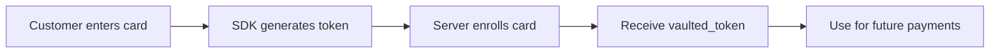

## Overview

Card Enrollment allows you to securely store (vault) a customer's payment method for future use. Once enrolled, the customer receives a `vaulted_token` that can be used for one-click payments without re-entering card details.

<Note>
Vaulted tokens are PCI-compliant references to stored card data. The actual card details are securely held by Yuno and never exposed to your servers.
</Note>

## Enrollment Flow



## Integration

<Steps>
  <Step title="Create an enrollment session (server-side)">
    ```javascript
    const session = await fetch('https://api-sandbox.y.uno/v1/enrollment/sessions', {
      method: 'POST',
      headers: {
        'public-api-key': process.env.YUNO_PUBLIC_KEY,
        'private-secret-key': process.env.YUNO_PRIVATE_KEY,
        'account-code': process.env.YUNO_ACCOUNT_CODE,
        'Content-Type': 'application/json',
      },
      body: JSON.stringify({
        customer_id: 'customer-001',
        country: 'BR',
      }),
    });
    ```
  </Step>

  <Step title="Mount the enrollment form (client-side)">
    ```javascript
    const yuno = await Yuno.initialize({
      publicApiKey: 'your-public-api-key',
      checkoutSession: enrollmentSession.session_id,
      country: 'BR',
    });

    yuno.mountEnrollment({
      elementSelector: '#yuno-enrollment-form',
      onEnrollmentSuccess: (data) => {
        console.log('Vaulted token:', data.vaulted_token);
        // Store the vaulted_token associated with the customer
      },
      onEnrollmentError: (error) => {
        console.error('Enrollment failed:', error);
      },
    });
    ```

    ```html
    <div id="yuno-enrollment-form"></div>
    ```
  </Step>

  <Step title="Enroll the card (server-side)">
    ```javascript
    const enrollment = await fetch('https://api-sandbox.y.uno/v1/enrollments', {
      method: 'POST',
      headers: {
        'public-api-key': process.env.YUNO_PUBLIC_KEY,
        'private-secret-key': process.env.YUNO_PRIVATE_KEY,
        'account-code': process.env.YUNO_ACCOUNT_CODE,
        'Content-Type': 'application/json',
      },
      body: JSON.stringify({
        session_id: enrollmentSession.session_id,
        customer_id: 'customer-001',
        payment_method: { type: 'CARD', token: oneTimeToken },
        country: 'BR',
      }),
    });
    const result = await enrollment.json();
    // result.vaulted_token -> store this for future payments
    ```
  </Step>

  <Step title="Use vaulted token for future payments">
    In subsequent payments, pass the `vaulted_token` instead of collecting card details:

    ```javascript
    const payment = await fetch('https://api-sandbox.y.uno/v1/payments', {
      method: 'POST',
      headers: { /* ... auth headers ... */ },
      body: JSON.stringify({
        checkout_session: checkoutSessionId,
        payment_method: {
          type: 'CARD',
          vaulted_token: 'vtk_abc123xyz',
        },
        amount: { currency: 'BRL', value: 50.00 },
        country: 'BR',
        customer: { id: 'customer-001' },
      }),
    });
    ```

    <Warning>
    Vaulted tokens are scoped to a specific customer. You cannot use a vaulted token created for one customer to charge a different customer.
    </Warning>
  </Step>
</Steps>

## Managing Enrolled Cards

Retrieve a customer's enrolled payment methods:

```javascript
const methods = await fetch(
  'https://api-sandbox.y.uno/v1/customers/customer-001/payment-methods',
  { headers: { /* ... auth headers ... */ } }
);
```

Delete an enrolled card:

```javascript
await fetch(
  'https://api-sandbox.y.uno/v1/customers/customer-001/payment-methods/vtk_abc123xyz',
  { method: 'DELETE', headers: { /* ... auth headers ... */ } }
);
```

## Best Practices

- Always associate vaulted tokens with authenticated customer accounts
- Display masked card details (last 4 digits, brand) for customer recognition
- Provide an option for customers to remove enrolled cards
- Handle expired cards gracefully by prompting re-enrollment
