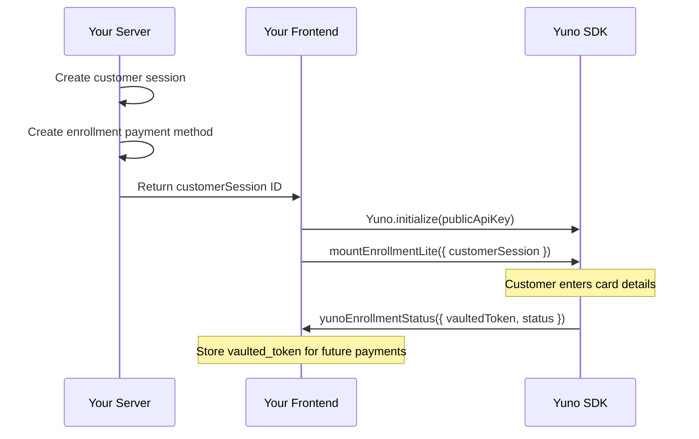

## Overview

Card Enrollment allows you to securely store (vault) a customer's payment method for future use without processing a payment. Once enrolled, the customer receives a `vaulted_token` that can be used for one-click payments without re-entering card details.

<Note>
Vaulted tokens are PCI-compliant references to stored card data. The actual card details are securely held by Yuno and never exposed to your servers.
</Note>

## Prerequisites

Before you begin, make sure you have:

- Yuno API keys (public and private) from [Dashboard > Developers > API Keys](/getting-started/authentication)
- `@yuno-payments/sdk-web` installed via npm or CDN ([Installation](/guides/sdk/overview#installation))
- A Yuno customer created via the [Create Customer API](/api-reference/customers/create)

## Enrollment Flow



## Enrollment Methods

Yuno provides two enrollment approaches:

| Method | Description | Use When |
|--------|-------------|----------|
| **Lite Enrollment** | SDK-managed enrollment form | You want Yuno to handle the card form UI |
| **Headless Enrollment** | API-driven, custom UI | You build your own enrollment form |

## Lite Enrollment

### Integration Steps

<Steps>
  <Step title="Create a customer session (server-side)">
    Create a customer session for enrollment:

    ```javascript
    // Server-side
    const customerSession = await fetch(
      'https://api-sandbox.y.uno/v1/customers/sessions',
      {
        method: 'POST',
        headers: {
          'Content-Type': 'application/json',
          'public-api-key': process.env.YUNO_PUBLIC_KEY,
          'private-secret-key': process.env.YUNO_PRIVATE_KEY,
          'account-code': process.env.YUNO_ACCOUNT_CODE,
        },
        body: JSON.stringify({
          customer_id: 'customer-uuid',
          country: 'BR',
        }),
      }
    ).then(res => res.json());
    ```
  </Step>

  <Step title="Create an enrollment payment method (server-side)">
    Create an enrollment payment method object for the customer session:

    ```javascript
    const enrollmentMethod = await fetch(
      `https://api-sandbox.y.uno/v1/customers/sessions/${customerSession.id}/payment-methods`,
      {
        method: 'POST',
        headers: {
          'Content-Type': 'application/json',
          'public-api-key': process.env.YUNO_PUBLIC_KEY,
          'private-secret-key': process.env.YUNO_PRIVATE_KEY,
          'account-code': process.env.YUNO_ACCOUNT_CODE,
        },
        body: JSON.stringify({
          type: 'CARD',
        }),
      }
    ).then(res => res.json());

    // Return customerSession.id to the client
    ```
  </Step>

  <Step title="Initialize the SDK and mount enrollment form (client-side)">
    ```javascript
    import { Yuno } from '@yuno-payments/sdk-web';

    const yuno = await Yuno.initialize('your-public-api-key');

    yuno.mountEnrollmentLite({
      customerSession: 'customer-session-uuid',
      countryCode: 'BR',
      language: 'pt',
      showLoading: true,

      card: {
        type: 'extends',
        styles: '',
        cardSaveEnable: false,
        documentEnable: true,
      },

      yunoEnrollmentStatus({ status, vaultedToken }) {
        console.log('Enrollment status:', status);

        if (status === 'ENROLLED') {
          console.log('Vaulted token:', vaultedToken);
          // Store vaultedToken associated with the customer
          saveVaultedToken(customerId, vaultedToken);
        }
      },

      yunoError(error) {
        console.error('Enrollment error:', error);
      },

      onLoading(args) {
        console.log('Loading:', args);
      },
    });
    ```

    Add the container element:

    ```html
    <div id="yuno-enrollment"></div>
    ```
  </Step>
</Steps>

### mountEnrollmentLite Parameters

| Property | Type | Required | Default | Description |
|----------|------|----------|---------|-------------|
| `customerSession` | `string` | Yes | -- | Customer session ID from your server |
| `countryCode` | `string` | Yes | -- | ISO 3166-1 alpha-2 country code |
| `language` | `string` | No | Browser locale | UI language: `"en"`, `"es"`, `"pt"` |
| `showLoading` | `boolean` | No | `true` | Show loading indicator |
| `elementSelector` | `string` | No | -- | CSS selector for the form container |
| `issuersFormEnable` | `boolean` | No | `false` | Display bank/issuer selection |
| `card.type` | `"extends"` \| `"step"` | No | `"extends"` | Card form layout |
| `card.styles` | `string` | No | -- | Custom CSS for the card form iframe |
| `card.documentEnable` | `boolean` | No | `true` | Show document fields (CPF, etc.) |
| `card.texts` | `object` | No | -- | Custom label overrides |
| `yunoEnrollmentStatus` | `function` | Yes | -- | Enrollment result callback |
| `yunoError` | `function` | No | -- | Error handler |
| `onLoading` | `function` | No | -- | Loading state callback |

## Headless Enrollment

For full UI control, use the Headless enrollment API:

<Steps>
  <Step title="Create customer session and payment method (server-side)">
    Same as Lite Enrollment steps 1 and 2 above.
  </Step>

  <Step title="Initialize the SDK and create enrollment client">
    ```javascript
    const yuno = await Yuno.initialize('your-public-api-key');

    const apiClientEnroll = yuno.apiClientEnroll({
      countryCode: 'BR',
      customerSession: 'customer-session-uuid',
    });
    ```
  </Step>

  <Step title="Enroll the card with your custom form data">
    ```javascript
    const vaultedTokenResponse = await apiClientEnroll.continueEnrollment({
      customer_session: 'customer-session-uuid',
      payment_method: {
        type: 'CARD',
        card: {
          detail: {
            expiration_month: 12,
            expiration_year: 28,
            number: '4111111111111111',
            security_code: '123',
            holder_name: 'JOHN DOE',
            type: 'CREDIT',
          },
        },
        customer: {
          document: {
            document_number: '12345678901',
            document_type: 'CPF',
          },
        },
      },
    });

    console.log('Vaulted token:', vaultedTokenResponse.vaultedToken);
    console.log('Status:', vaultedTokenResponse.status);
    ```
  </Step>
</Steps>

### apiClientEnroll Methods

| Method | Parameters | Description |
|--------|-----------|-------------|
| `yuno.apiClientEnroll(config)` | `{ countryCode, customerSession }` | Create the Headless enrollment client |
| `apiClientEnroll.continueEnrollment(payload)` | Enrollment payload | Enroll card data and receive vaulted token |

## Enrollment Statuses

The `yunoEnrollmentStatus` callback (Lite) or `continueEnrollment` response (Headless) returns one of these statuses:

| Status | Description |
|--------|-------------|
| `CREATED` | Enrollment session created, waiting for card data |
| `READY_TO_ENROLL` | Customer submitted card details, enrollment in progress |
| `ENROLL_IN_PROCESS` | Enrollment is being processed |
| `ENROLLED` | Card successfully enrolled. `vaultedToken` is available |
| `DECLINED` | Enrollment was declined by the card issuer |
| `REJECTED` | Enrollment rejected by the provider |
| `CANCELED` | Enrollment was canceled |
| `ERROR` | An error occurred during enrollment |
| `EXPIRED` | Enrollment session expired before completion |
| `UNENROLL_IN_PROCESS` | Card is being unenrolled |
| `UNENROLLED` | Previously enrolled card has been removed |

## Using Vaulted Tokens for Payments

Once you have a `vaultedToken`, use it for future payments:

```javascript
// In any checkout integration (Seamless, Lite, Headless)
yuno.mountSeamlessCheckout({
  paymentMethodType: 'CARD',
  vaultedToken: 'vtk_abc123xyz',
});

// Or in Headless:
const oneTimeToken = await apiClientPayment.generateToken({
  checkout_session: sessionId,
  payment_method: {
    type: 'CARD',
    vaulted_token: 'vtk_abc123xyz',
    card: {
      detail: { security_code: '123' },
    },
  },
});
```

## Managing Enrolled Cards

### Retrieve a customer's enrolled payment methods

```javascript
// Server-side
const methods = await fetch(
  `https://api-sandbox.y.uno/v1/customers/${customerId}/payment-methods`,
  {
    headers: {
      'public-api-key': process.env.YUNO_PUBLIC_KEY,
      'private-secret-key': process.env.YUNO_PRIVATE_KEY,
      'account-code': process.env.YUNO_ACCOUNT_CODE,
    },
  }
).then(res => res.json());
```

### Delete an enrolled card

```javascript
// Server-side
await fetch(
  `https://api-sandbox.y.uno/v1/customers/${customerId}/payment-methods/${vaultedToken}`,
  {
    method: 'DELETE',
    headers: {
      'public-api-key': process.env.YUNO_PUBLIC_KEY,
      'private-secret-key': process.env.YUNO_PRIVATE_KEY,
      'account-code': process.env.YUNO_ACCOUNT_CODE,
    },
  }
);
```

## Auto-Vaulting During Payment

Instead of a separate enrollment flow, you can vault cards automatically during payment:

1. Set `vault_on_success: true` when creating the checkout session
2. Ensure the session has a valid `customer_id`
3. On successful payment, the response includes a `vaulted_token`

This approach is available in all checkout integrations (Full, Seamless, Lite, Headless, Secure Fields).

## Complete Working Example (Lite Enrollment)

```html
<!DOCTYPE html>
<html lang="en">
<head>
  <meta charset="UTF-8">
  <meta name="viewport" content="width=device-width, initial-scale=1.0">
  <title>Yuno Card Enrollment</title>
  <script src="https://sdk-web.y.uno/v1.5/main.js"></script>
  <style>
    .container { max-width: 500px; margin: 40px auto; font-family: sans-serif; }
    #enrollment-form { min-height: 200px; }
    #status {
      margin-top: 16px; padding: 16px; border-radius: 8px; display: none;
    }
    .success { background: #dcfce7; color: #166534; }
    .error { background: #fee2e2; color: #991b1b; }
  </style>
</head>
<body>
  <div class="container">
    <h2>Save a Payment Method</h2>
    <p>Add a card for faster checkout next time.</p>
    <div id="enrollment-form"></div>
    <div id="status"></div>
  </div>

  <script>
    (async () => {
      // Get customer session from your server
      const res = await fetch('/api/enrollment-session', { method: 'POST' });
      const { customer_session } = await res.json();

      const yuno = await Yuno.initialize('your-public-api-key');

      yuno.mountEnrollmentLite({
        customerSession: customer_session,
        countryCode: 'BR',
        language: 'pt',
        showLoading: true,
        elementSelector: '#enrollment-form',

        card: {
          type: 'extends',
          documentEnable: true,
        },

        yunoEnrollmentStatus({ status, vaultedToken }) {
          const statusEl = document.getElementById('status');
          statusEl.style.display = 'block';

          if (status === 'ENROLLED') {
            statusEl.className = 'success';
            statusEl.textContent = 'Card saved successfully!';

            // Save the vaulted token on your server
            fetch('/api/save-vaulted-token', {
              method: 'POST',
              headers: { 'Content-Type': 'application/json' },
              body: JSON.stringify({ vaultedToken }),
            });
          } else {
            statusEl.className = 'error';
            statusEl.textContent = `Enrollment ${status.toLowerCase()}. Please try again.`;
          }
        },

        yunoError(error) {
          const statusEl = document.getElementById('status');
          statusEl.style.display = 'block';
          statusEl.className = 'error';
          statusEl.textContent = 'An error occurred. Please try again.';
        },
      });
    })();
  </script>
</body>
</html>
```

## Error Handling

| Error | Cause | Solution |
|-------|-------|----------|
| `INVALID_PUBLIC_API_KEY` | Incorrect or expired API key | Verify in Dashboard > Developers > API Keys |
| `CUSTOMER_SESSION_EXPIRED` | Session expired | Create a new customer session |
| `ENROLLMENT_DECLINED` | Card issuer declined enrollment | Customer should try a different card |
| `INVALID_CARD_DATA` | Card data validation failed | Verify card number, expiry, and CVV |

## Testing

1. Use **sandbox** API keys from Dashboard > Developers > API Keys
2. Use the sandbox API URL: `https://api-sandbox.y.uno`
3. Use [test card numbers](/getting-started/testing) for enrollment testing
4. Verify enrolled cards appear in the customer's payment methods list

## Best Practices

- Always associate vaulted tokens with authenticated customer accounts
- Display masked card details (last 4 digits, brand) for customer recognition
- Provide an option for customers to remove enrolled cards
- Handle expired cards gracefully by prompting re-enrollment
- Use `vault_on_success` during payment for a seamless save-during-pay experience

## Troubleshooting

<AccordionGroup>
  <Accordion title="Enrollment form does not render">
    - Verify the customer session ID is valid and not expired
    - Ensure the enrollment payment method was created for the session
    - Check that the container element exists in the DOM
  </Accordion>

  <Accordion title="Enrollment succeeds but no vaultedToken returned">
    - Check that a valid `customer_id` was used when creating the customer session
    - Verify the enrollment status is `ENROLLED` (not `ENROLL_IN_PROCESS`)
    - Some providers require card verification before returning the token
  </Accordion>
</AccordionGroup>

## Next Steps

<CardGroup cols={2}>
  <Card title="Full Checkout" icon="credit-card" href="/guides/sdk/full-checkout">
    Use vaulted tokens in Full Checkout.
  </Card>
  <Card title="Seamless Checkout" icon="bolt" href="/guides/sdk/seamless-checkout">
    One-click payments with vaulted tokens.
  </Card>
  <Card title="Headless Checkout" icon="code" href="/guides/sdk/headless">
    Build custom payment UI with vaulted tokens.
  </Card>
  <Card title="Web SDK Reference" icon="book" href="/guides/sdk/web-reference">
    Complete parameter and method reference.
  </Card>
</CardGroup>
