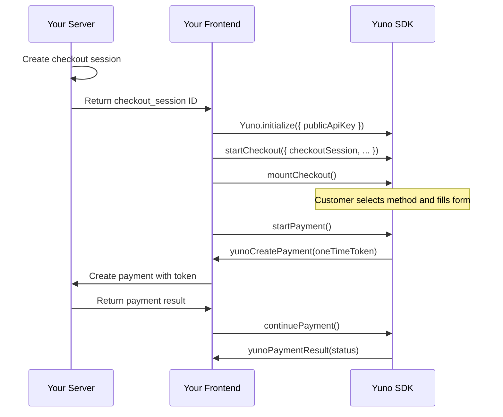

## Overview

Full Checkout provides a complete, pre-built payment UI that displays all payment methods enabled for your merchant account. Yuno handles the entire checkout experience -- payment method selection, form rendering, tokenization, payment creation, and 3DS authentication.

<Note>
Full Checkout is the **fastest integration path** -- around 10 lines of code. Yuno manages the UI, PCI compliance, and payment method rendering automatically.
</Note>

## Prerequisites

Before you begin, make sure you have:

- Yuno API keys (public and private) from [Dashboard > Developers > API Keys](/getting-started/authentication)
- `@yuno-payments/sdk-web` installed via npm or CDN ([Installation](/guides/sdk/overview#installation))
- At least one payment method enabled in your [Dashboard > Connections](/platform/dashboard/connections)
- A server-side endpoint to create checkout sessions

## Integration Flow



<Steps>
  <Step title="Create a checkout session (server-side)">
    Create a checkout session from your server. This returns a `checkout_session` ID that the SDK needs to initialize.

    ```javascript
    // Server-side (Node.js example)
    const sessionResponse = await fetch('https://api-sandbox.y.uno/v1/checkout/sessions', {
      method: 'POST',
      headers: {
        'public-api-key': process.env.YUNO_PUBLIC_KEY,
        'private-secret-key': process.env.YUNO_PRIVATE_KEY,
        'account-code': process.env.YUNO_ACCOUNT_CODE,
        'Content-Type': 'application/json',
      },
      body: JSON.stringify({
        merchant_order_id: 'order-123',
        payment_description: 'Order #123',
        country: 'CO',
        amount: {
          currency: 'USD',
          value: 50.00,
        },
        customer_id: 'customer-uuid', // UUID of your Yuno customer
      }),
    });

    const session = await sessionResponse.json();
    // Return session.checkout_session to the client
    ```

    <Info>
    The checkout session response includes a `checkout_session` field (UUID). Pass this value to the frontend to initialize the SDK. The session returned from our test: `ca129b90-28f3-4e0b-9a18-d3fe24d2b8e4`.
    </Info>

    See the [Create Checkout Session API](/api-reference/checkout-sessions/create) for the full list of parameters.
  </Step>

  <Step title="Initialize the SDK (client-side)">
    ```javascript
    import { Yuno } from '@yuno-payments/sdk-web';
    // Or if using CDN, Yuno is available on the global scope

    const yuno = await Yuno.initialize({
      publicApiKey: 'your-public-api-key',
    });
    ```
  </Step>

  <Step title="Configure and start the checkout">
    Call `startCheckout()` with the checkout session and your callback functions:

    ```javascript
    yuno.startCheckout({
      checkoutSession: 'ca129b90-28f3-4e0b-9a18-d3fe24d2b8e4',
      elementSelector: '#yuno-checkout',
      countryCode: 'CO',
      language: 'en',
      showLoading: true,
      showPaymentStatus: true,

      // Card form configuration (optional)
      card: {
        type: 'extends',
        cardSaveEnable: false,
      },

      // Required: called when the customer submits payment
      async yunoCreatePayment(oneTimeToken) {
        const response = await fetch('/api/create-payment', {
          method: 'POST',
          headers: { 'Content-Type': 'application/json' },
          body: JSON.stringify({
            token: oneTimeToken,
            session: 'ca129b90-28f3-4e0b-9a18-d3fe24d2b8e4',
          }),
        });

        if (response.ok) {
          yuno.continuePayment({ showPaymentStatus: true });
        }
      },

      // Called with the final payment outcome
      yunoPaymentResult(data) {
        switch (data.status) {
          case 'SUCCEEDED':
            window.location.href = `/confirmation?id=${data.paymentId}`;
            break;
          case 'DECLINED':
          case 'REJECTED':
            showError('Payment was declined. Please try again.');
            break;
          case 'PENDING':
            showMessage('Payment is being processed.');
            break;
        }
      },

      // Error handler
      yunoError(error) {
        console.error('Checkout error:', error.message);
      },

      // Optional: loading state updates
      onLoading(isLoading) {
        document.getElementById('spinner').hidden = !isLoading;
      },
    });
    ```
  </Step>

  <Step title="Mount the checkout UI">
    Mount the checkout form into your container element:

    ```javascript
    yuno.mountCheckout();
    ```

    Add the container element to your HTML:

    ```html
    <div id="yuno-checkout"></div>
    ```
  </Step>

  <Step title="Trigger the payment">
    When the customer is ready to pay (e.g., clicks your "Pay Now" button), call:

    ```javascript
    yuno.startPayment();
    ```

    This triggers the `yunoCreatePayment` callback with the one-time token.
  </Step>
</Steps>

## Configuration Options

### startCheckout Parameters

| Property | Type | Required | Default | Description |
|----------|------|----------|---------|-------------|
| `checkoutSession` | `string` | Yes | -- | Checkout session ID from the Create Checkout Session API |
| `elementSelector` | `string` | Yes | -- | CSS selector for the container element (e.g., `"#yuno-checkout"`) |
| `countryCode` | `string` | Yes | -- | ISO 3166-1 alpha-2 country code (e.g., `"CO"`, `"BR"`, `"US"`) |
| `language` | `string` | No | Browser locale | UI language: `"en"`, `"es"`, `"pt"` |
| `showLoading` | `boolean` | No | `true` | Show a loading indicator during SDK operations |
| `showPaymentStatus` | `boolean` | No | `true` | Show the payment status screen after completion |
| `issuersFormEnable` | `boolean` | No | `false` | Display bank/issuer selection for methods that require it |
| `card` | `object` | No | -- | Card form configuration. See [Card Form Options](#card-form-options) |
| `yunoCreatePayment` | `function` | Yes | -- | Callback when token is generated. See [Callbacks](#callbacks) |
| `yunoPaymentResult` | `function` | Yes | -- | Callback with final payment status. See [Callbacks](#callbacks) |
| `yunoError` | `function` | No | -- | Error handler callback |
| `onLoading` | `function` | No | -- | Loading state change callback |

### Card Form Options

| Property | Type | Default | Description |
|----------|------|---------|-------------|
| `type` | `"extends"` \| `"step"` | `"extends"` | Card form layout. `"extends"` renders inline; `"step"` renders as a separate step |
| `cardSaveEnable` | `boolean` | `false` | Show a "Save card for future payments" checkbox |
| `hideCardholderName` | `boolean` | `false` | Hide the cardholder name field |
| `isCreditCardProcessingOnly` | `boolean` | `false` | Show only credit cards, hide debit card options |
| `cardNumberPlaceholder` | `string` | `"Card number"` | Placeholder text for card number field |
| `styles` | `string` | -- | Custom CSS to inject into the card form iframe |
| `texts` | `object` | -- | Custom label overrides for card form fields |
| `onChange` | `function` | -- | Callback fired on card field value changes. Receives `{ error, data }` with IIN info and installment options |

## Callbacks

### yunoCreatePayment(oneTimeToken)

Called when the customer submits the payment form and Yuno generates a one-time token. Use this to create the payment on your server, then call `yuno.continuePayment()`.

```javascript
async yunoCreatePayment(oneTimeToken) {
  // oneTimeToken: string -- single-use token for payment creation
  const response = await fetch('/api/payments', {
    method: 'POST',
    headers: { 'Content-Type': 'application/json' },
    body: JSON.stringify({
      token: oneTimeToken,
      session: checkoutSession,
    }),
  });

  const payment = await response.json();

  // IMPORTANT: check if SDK action is required (e.g., 3DS)
  if (payment.checkout?.sdk_action_required) {
    yuno.continuePayment({ showPaymentStatus: true });
  }
}
```

### yunoPaymentResult(data)

Called with the final payment outcome after the flow completes.

| Parameter | Type | Description |
|-----------|------|-------------|
| `data.status` | `string` | `"SUCCEEDED"`, `"DECLINED"`, `"PENDING"`, `"REJECTED"`, `"CANCELED"`, `"ERROR"` |
| `data.paymentId` | `string` | The payment ID for server-side verification |

<Warning>
Always verify the final payment status **server-side** via [webhooks](/guides/webhooks) or the [GET Payment API](/api-reference/payments/retrieve). Client-side callbacks should not be the sole source of truth.
</Warning>

### yunoError(error)

Called when the SDK encounters an error.

| Parameter | Type | Description |
|-----------|------|-------------|
| `error.message` | `string` | Human-readable error description |
| `error.code` | `string` | Error code for programmatic handling |

### onLoading(isLoading)

Reports loading state changes during SDK operations.

| Parameter | Type | Description |
|-----------|------|-------------|
| `isLoading` | `boolean` | `true` when the SDK is loading, `false` when ready |

## Complete Working Example

```html
<!DOCTYPE html>
<html lang="en">
<head>
  <meta charset="UTF-8">
  <meta name="viewport" content="width=device-width, initial-scale=1.0">
  <title>Yuno Full Checkout</title>
  <script src="https://sdk-web.y.uno/v1.5/main.js"></script>
  <style>
    #yuno-checkout { max-width: 500px; margin: 40px auto; }
    #pay-button {
      display: block; width: 100%; padding: 12px;
      background: #0066FF; color: white; border: none;
      border-radius: 8px; font-size: 16px; cursor: pointer;
      margin-top: 16px;
    }
    #pay-button:disabled { opacity: 0.5; cursor: not-allowed; }
    .spinner { display: none; text-align: center; padding: 20px; }
  </style>
</head>
<body>
  <div id="yuno-checkout"></div>
  <div style="max-width: 500px; margin: 0 auto;">
    <button id="pay-button" disabled>Pay Now</button>
  </div>
  <div id="spinner" class="spinner">Processing...</div>

  <script>
    (async () => {
      // 1. Fetch checkout session from your server
      const sessionRes = await fetch('/api/checkout-session', { method: 'POST' });
      const { checkout_session } = await sessionRes.json();

      // 2. Initialize the SDK
      const yuno = await Yuno.initialize({
        publicApiKey: 'your-public-api-key',
      });

      // 3. Configure the checkout
      yuno.startCheckout({
        checkoutSession: checkout_session,
        elementSelector: '#yuno-checkout',
        countryCode: 'CO',
        language: 'en',
        showLoading: true,
        showPaymentStatus: true,

        async yunoCreatePayment(oneTimeToken) {
          const res = await fetch('/api/payments', {
            method: 'POST',
            headers: { 'Content-Type': 'application/json' },
            body: JSON.stringify({ token: oneTimeToken, session: checkout_session }),
          });

          if (res.ok) {
            yuno.continuePayment({ showPaymentStatus: true });
          }
        },

        yunoPaymentResult(data) {
          if (data.status === 'SUCCEEDED') {
            window.location.href = '/order-confirmation';
          }
        },

        yunoError(error) {
          console.error('Payment error:', error.message);
          alert('Something went wrong. Please try again.');
        },

        onLoading(isLoading) {
          document.getElementById('spinner').style.display = isLoading ? 'block' : 'none';
        },
      });

      // 4. Mount the checkout UI
      yuno.mountCheckout();

      // 5. Enable the pay button
      const payButton = document.getElementById('pay-button');
      payButton.disabled = false;
      payButton.addEventListener('click', () => {
        yuno.startPayment();
      });
    })();
  </script>
</body>
</html>
```

## Error Handling

Common errors you may encounter:

| Error | Cause | Solution |
|-------|-------|----------|
| `INVALID_PUBLIC_API_KEY` | The public API key is incorrect or expired | Verify your key in Dashboard > Developers > API Keys |
| `CHECKOUT_SESSION_EXPIRED` | The checkout session has expired | Create a new checkout session. Sessions are single-use |
| `NO_PAYMENT_METHODS` | No payment methods are configured for the country | Enable payment methods in Dashboard > Connections |
| `ELEMENT_NOT_FOUND` | The `elementSelector` does not match any DOM element | Ensure the container element exists before calling `startCheckout()` |
| `PAYMENT_CREATION_FAILED` | Server-side payment creation returned an error | Check your server logs and ensure the payment API request is correct |

## Customization

Full Checkout appearance can be customized via:

- **SDK theme** -- pass a `theme` object during `Yuno.initialize()`. See [Customization](/guides/sdk/customization)
- **Card form styles** -- pass a `card.styles` CSS string to inject custom CSS into the card iframe
- **Input design** -- set `inputDesignType` to `"float-label"`, `"float-label-static"`, or `"label-placeholder"`
- **Checkout Builder** -- use the no-code visual editor in [Dashboard > Checkout Builder](/platform/dashboard/checkout-builder)

## Testing

1. Use **sandbox** API keys from Dashboard > Developers > API Keys
2. Use the sandbox API URL: `https://api-sandbox.y.uno`
3. Use [test card numbers](/getting-started/testing) to simulate different payment outcomes
4. Set `showPaymentStatus: true` to see the result screen during development

## Troubleshooting

<AccordionGroup>
  <Accordion title="The checkout form is not rendering">
    - Verify the `elementSelector` matches an existing DOM element
    - Ensure the SDK script has loaded before calling `Yuno.initialize()`
    - Check the browser console for JavaScript errors
    - Confirm your public API key is valid
  </Accordion>

  <Accordion title="yunoCreatePayment is never called">
    - Make sure you called `yuno.mountCheckout()` after `startCheckout()`
    - Verify the customer has completed the form before calling `yuno.startPayment()`
    - Check that at least one payment method is enabled for the checkout session's country
  </Accordion>

  <Accordion title="Payment succeeds in sandbox but fails in production">
    - Verify you are using **production** API keys, not sandbox keys
    - Confirm the payment method provider is enabled for production in your Dashboard
    - Check that 3DS is properly configured with your acquiring bank
  </Accordion>

  <Accordion title="3DS challenge is not appearing">
    - Ensure you call `yuno.continuePayment()` after creating the payment server-side
    - Check the payment API response for `sdk_action_required: true`
    - Verify your browser does not block popups or iframes
  </Accordion>
</AccordionGroup>

## Next Steps

<CardGroup cols={2}>
  <Card title="Seamless Checkout" icon="bolt" href="/guides/sdk/seamless-checkout">
    More control over payment method selection.
  </Card>
  <Card title="Customization" icon="palette" href="/guides/sdk/customization">
    Theme and style your checkout.
  </Card>
  <Card title="Card Enrollment" icon="vault" href="/guides/sdk/enrollment">
    Save cards for returning customers.
  </Card>
  <Card title="Web SDK Reference" icon="book" href="/guides/sdk/web-reference">
    Complete parameter and method reference.
  </Card>
</CardGroup>
