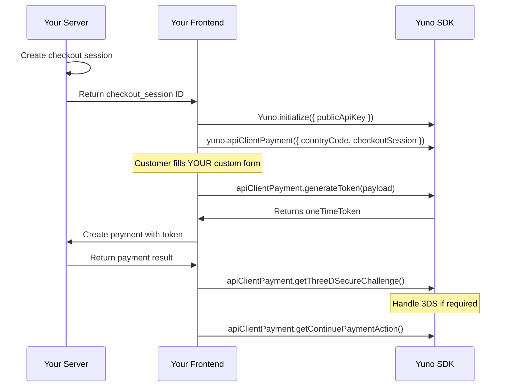

## Overview

Headless Checkout gives you complete control over the checkout UI. You build the entire payment form, collect card data, and Yuno handles tokenization, 3DS challenges, and PCI compliance behind the scenes. This is the most flexible integration, suited for merchants who need to own every pixel of the checkout experience.

<Warning>
This is the **most complex** SDK integration. Consider [Full Checkout](/guides/sdk/full-checkout) or [Seamless Checkout](/guides/sdk/seamless-checkout) unless you need complete UI control.
</Warning>

## Prerequisites

Before you begin, make sure you have:

- Yuno API keys (public and private) from [Dashboard > Developers > API Keys](/getting-started/authentication)
- `@yuno-payments/sdk-web` installed via npm or CDN ([Installation](/guides/sdk/overview#installation))
- A fully custom checkout UI
- A server-side endpoint to create checkout sessions and payments

## How It Works



1. You build and render your own payment form
2. Collect card data or use a vaulted token
3. Call `generateToken()` to create a one-time token via Yuno's SDK (PCI-safe)
4. Create the payment server-side using the token
5. Handle any 3DS or provider challenges

## Integration Steps

<Steps>
  <Step title="Create a checkout session (server-side)">
    ```javascript
    // Server-side (Node.js example)
    const sessionResponse = await fetch('https://api-sandbox.y.uno/v1/checkout/sessions', {
      method: 'POST',
      headers: {
        'public-api-key': process.env.YUNO_PUBLIC_KEY,
        'private-secret-key': process.env.YUNO_PRIVATE_KEY,
        'account-code': process.env.YUNO_ACCOUNT_CODE,
        'Content-Type': 'application/json',
      },
      body: JSON.stringify({
        merchant_order_id: 'order-200',
        payment_description: 'Order #200',
        country: 'US',
        amount: {
          currency: 'USD',
          value: 150.00,
        },
        customer_id: 'customer-uuid',
      }),
    });

    const session = await sessionResponse.json();
    // Return session.checkout_session to the client
    ```
  </Step>

  <Step title="Initialize the SDK (client-side)">
    ```javascript
    import { Yuno } from '@yuno-payments/sdk-web';

    const yuno = await Yuno.initialize({
      publicApiKey: 'your-public-api-key',
    });
    ```
  </Step>

  <Step title="Create the Headless payment client">
    ```javascript
    const apiClientPayment = yuno.apiClientPayment({
      countryCode: 'US',
      checkoutSession: 'checkout-session-uuid',
    });
    ```

    ### apiClientPayment Parameters

    | Parameter | Type | Required | Description |
    |-----------|------|----------|-------------|
    | `countryCode` | `string` | Yes | ISO 3166-1 alpha-2 country code |
    | `checkoutSession` | `string` | Yes | Checkout session ID from your server |
  </Step>

  <Step title="Generate a one-time token">
    Collect card data from your custom form and generate a token:

    **From raw card data:**

    ```javascript
    const oneTimeToken = await apiClientPayment.generateToken({
      checkout_session: 'checkout-session-uuid',
      payment_method: {
        type: 'CARD',
        vaulted_token: null,
        card: {
          save: false,
          detail: {
            expiration_month: 12,
            expiration_year: 28,
            number: '4111111111111111',
            security_code: '123',
            holder_name: 'JOHN DOE',
            type: 'CREDIT',
          },
        },
      },
    });
    ```

    **From a vaulted token (saved card):**

    ```javascript
    const oneTimeToken = await apiClientPayment.generateToken({
      checkout_session: 'checkout-session-uuid',
      payment_method: {
        type: 'CARD',
        vaulted_token: 'vtk_abc123xyz',
        card: {
          detail: {
            security_code: '123',
          },
        },
      },
    });
    ```
  </Step>

  <Step title="Create the payment (server-side)">
    ```javascript
    // Server-side: POST /api/create-payment
    const paymentResponse = await fetch('https://api-sandbox.y.uno/v1/payments', {
      method: 'POST',
      headers: {
        'public-api-key': process.env.YUNO_PUBLIC_KEY,
        'private-secret-key': process.env.YUNO_PRIVATE_KEY,
        'account-code': process.env.YUNO_ACCOUNT_CODE,
        'Content-Type': 'application/json',
      },
      body: JSON.stringify({
        checkout_session: 'checkout-session-uuid',
        payment_method: {
          type: 'CARD',
          token: oneTimeToken.token,
        },
        amount: {
          currency: 'USD',
          value: 150.00,
        },
        country: 'US',
        customer_payer: {
          email: 'john@example.com',
        },
      }),
    });

    const payment = await paymentResponse.json();
    // Return payment to the client
    ```
  </Step>

  <Step title="Handle 3DS challenges">
    After creating the payment, check for 3DS requirements:

    ```javascript
    // Check for 3DS challenge
    const challengeData = await apiClientPayment.getThreeDSecureChallenge(
      'checkout-session-uuid'
    );

    if (challengeData) {
      // Redirect the customer to complete 3DS verification
      window.location.href = challengeData.url;
    }
    ```

    Also check for additional provider actions:

    ```javascript
    const continueData = await apiClientPayment.getContinuePaymentAction({
      checkoutSession: 'checkout-session-uuid',
    });

    if (continueData) {
      // continueData.action: 'REDIRECT_URL'
      // continueData.redirect.init_url: URL to redirect to
      window.location.href = continueData.redirect.init_url;
    }
    ```
  </Step>
</Steps>

## generateToken Payload Reference

### Full Payload Structure

```javascript
{
  checkout_session: string,         // Required
  payment_method: {
    type: 'CARD',                   // Required
    vaulted_token: string | null,   // For saved cards
    card: {
      save: boolean,                // True to vault the card
      detail: {
        expiration_month: number,   // 1-12
        expiration_year: number,    // 2-digit year (e.g., 28)
        number: string,             // Card number (digits only)
        security_code: string,      // CVV/CVC
        holder_name: string,        // Cardholder name
        type: 'CREDIT' | 'DEBIT',  // Card type
      },
      installment: {                // Optional
        id: string,
        value: number,
      },
    },
    device_fingerprint: string,     // Optional: device fingerprinting data
    third_party_session_id: string, // Optional: 3rd party session
  },
}
```

### Parameter Details

| Parameter | Type | Required | Description |
|-----------|------|----------|-------------|
| `checkout_session` | `string` | Yes | The checkout session ID |
| `payment_method.type` | `string` | Yes | Always `"CARD"` for Headless |
| `payment_method.vaulted_token` | `string` | No | Vaulted token for saved cards. Set to `null` for new cards |
| `payment_method.card.save` | `boolean` | No | Set `true` to vault the card on success. Requires a customer ID |
| `payment_method.card.detail.number` | `string` | Yes* | Card number. Not required when using a vaulted token |
| `payment_method.card.detail.expiration_month` | `number` | Yes* | Month (1-12). Not required when using a vaulted token |
| `payment_method.card.detail.expiration_year` | `number` | Yes* | 2-digit year. Not required when using a vaulted token |
| `payment_method.card.detail.security_code` | `string` | Yes | CVV/CVC (always required) |
| `payment_method.card.detail.holder_name` | `string` | Yes* | Cardholder name. Not required when using a vaulted token |
| `payment_method.card.detail.type` | `string` | No | `"CREDIT"` or `"DEBIT"` |
| `payment_method.card.installment` | `object` | No | Installment plan selection |

## Key Methods

| Method | Parameters | Description |
|--------|-----------|-------------|
| `yuno.apiClientPayment(config)` | `{ countryCode, checkoutSession }` | Create the Headless payment client |
| `apiClientPayment.generateToken(payload)` | Token generation payload | Create a one-time token from card data or vaulted token |
| `apiClientPayment.getThreeDSecureChallenge(session)` | Checkout session ID | Get the 3DS challenge URL (returns `null` if not required) |
| `apiClientPayment.getContinuePaymentAction(config)` | `{ checkoutSession }` | Check for additional provider actions needed |

### getContinuePaymentAction Return Value

```typescript
{
  action: 'REDIRECT_URL';
  type: string;
  redirect: {
    init_url: string;     // URL to redirect the customer to
    success_url: string;  // Redirect URL on success
    error_url: string;    // Redirect URL on error
  };
} | null
```

Returns an object when a redirect is needed, or `null` when no action is required.

## Card Vaulting

To vault a card for future one-click payments:

1. Set `card.save: true` in the `generateToken()` payload
2. Ensure the checkout session has a valid `customer_id`
3. On successful payment, the response includes a `vaulted_token`
4. Store the `vaulted_token` associated with the customer for future payments

For subsequent payments, pass the `vaulted_token` instead of full card details:

```javascript
const oneTimeToken = await apiClientPayment.generateToken({
  checkout_session: sessionId,
  payment_method: {
    type: 'CARD',
    vaulted_token: 'vtk_abc123xyz',
    card: {
      detail: { security_code: '123' },
    },
  },
});
```

## Complete Working Example

```html
<!DOCTYPE html>
<html lang="en">
<head>
  <meta charset="UTF-8">
  <meta name="viewport" content="width=device-width, initial-scale=1.0">
  <title>Yuno Headless Checkout</title>
  <script src="https://sdk-web.y.uno/v1.5/main.js"></script>
  <style>
    .form-container {
      max-width: 420px; margin: 40px auto; font-family: sans-serif;
    }
    .field { margin-bottom: 16px; }
    .field label {
      display: block; margin-bottom: 4px;
      font-size: 14px; font-weight: 500; color: #374151;
    }
    .field input, .field select {
      width: 100%; padding: 12px; font-size: 16px;
      border: 1px solid #d1d5db; border-radius: 8px; box-sizing: border-box;
    }
    .field-row { display: flex; gap: 16px; }
    .field-row .field { flex: 1; }
    #pay-button {
      display: block; width: 100%; padding: 14px; margin-top: 24px;
      background: #0066FF; color: white; border: none;
      border-radius: 8px; font-size: 16px; cursor: pointer;
    }
    #pay-button:disabled { opacity: 0.5; }
    #status { margin-top: 16px; padding: 12px; border-radius: 8px; display: none; }
    .success { background: #dcfce7; color: #166534; }
    .error { background: #fee2e2; color: #991b1b; }
  </style>
</head>
<body>
  <div class="form-container">
    <h2>Payment Details</h2>
    <form id="payment-form">
      <div class="field">
        <label>Card Number</label>
        <input type="text" id="card-number" placeholder="4111 1111 1111 1111"
               maxlength="19" inputmode="numeric" required />
      </div>
      <div class="field">
        <label>Cardholder Name</label>
        <input type="text" id="holder-name" placeholder="JOHN DOE" required />
      </div>
      <div class="field-row">
        <div class="field">
          <label>Expiry Month</label>
          <input type="text" id="exp-month" placeholder="12" maxlength="2"
                 inputmode="numeric" required />
        </div>
        <div class="field">
          <label>Expiry Year</label>
          <input type="text" id="exp-year" placeholder="28" maxlength="2"
                 inputmode="numeric" required />
        </div>
        <div class="field">
          <label>CVV</label>
          <input type="text" id="cvv" placeholder="123" maxlength="4"
                 inputmode="numeric" required />
        </div>
      </div>
      <div class="field">
        <label>Card Type</label>
        <select id="card-type">
          <option value="CREDIT">Credit</option>
          <option value="DEBIT">Debit</option>
        </select>
      </div>
      <button type="submit" id="pay-button">Pay $150.00</button>
    </form>
    <div id="status"></div>
  </div>

  <script>
    (async () => {
      // 1. Get checkout session from your server
      const res = await fetch('/api/checkout-session', { method: 'POST' });
      const { checkout_session } = await res.json();

      // 2. Initialize SDK
      const yuno = await Yuno.initialize({ publicApiKey: 'your-public-api-key' });

      // 3. Create Headless client
      const apiClient = yuno.apiClientPayment({
        countryCode: 'US',
        checkoutSession: checkout_session,
      });

      // 4. Handle form submission
      document.getElementById('payment-form').addEventListener('submit', async (e) => {
        e.preventDefault();
        const payButton = document.getElementById('pay-button');
        const statusEl = document.getElementById('status');
        payButton.disabled = true;
        statusEl.style.display = 'none';

        try {
          // Generate token from card data
          const oneTimeToken = await apiClient.generateToken({
            checkout_session,
            payment_method: {
              type: 'CARD',
              vaulted_token: null,
              card: {
                save: false,
                detail: {
                  number: document.getElementById('card-number').value.replace(/\s/g, ''),
                  holder_name: document.getElementById('holder-name').value,
                  expiration_month: parseInt(document.getElementById('exp-month').value),
                  expiration_year: parseInt(document.getElementById('exp-year').value),
                  security_code: document.getElementById('cvv').value,
                  type: document.getElementById('card-type').value,
                },
              },
            },
          });

          // Create payment on server
          const payRes = await fetch('/api/payments', {
            method: 'POST',
            headers: { 'Content-Type': 'application/json' },
            body: JSON.stringify({ token: oneTimeToken.token, session: checkout_session }),
          });
          const payment = await payRes.json();

          // Check for 3DS
          if (payment.checkout?.sdk_action_required) {
            const challenge = await apiClient.getThreeDSecureChallenge(checkout_session);
            if (challenge) {
              window.location.href = challenge.url;
              return;
            }
            const continueAction = await apiClient.getContinuePaymentAction({
              checkoutSession: checkout_session,
            });
            if (continueAction) {
              window.location.href = continueAction.redirect.init_url;
              return;
            }
          }

          // Show result
          statusEl.className = payment.status === 'APPROVED' ? 'success' : 'error';
          statusEl.textContent = `Payment ${payment.status}`;
          statusEl.style.display = 'block';
        } catch (err) {
          console.error('Payment failed:', err);
          statusEl.className = 'error';
          statusEl.textContent = 'Payment failed. Please try again.';
          statusEl.style.display = 'block';
        } finally {
          payButton.disabled = false;
        }
      });
    })();
  </script>
</body>
</html>
```

## Error Handling

| Error | Cause | Solution |
|-------|-------|----------|
| `INVALID_PUBLIC_API_KEY` | Incorrect or expired API key | Verify in Dashboard > Developers > API Keys |
| `CHECKOUT_SESSION_EXPIRED` | Session expired or already used | Create a new checkout session |
| `TOKENIZATION_FAILED` | Card data is invalid | Validate card number, expiry, and CVV before calling `generateToken()` |
| `INVALID_CARD_NUMBER` | Card number does not pass Luhn check | Verify the card number is correct |
| `THREE_DS_FAILED` | 3DS authentication failed | The customer may need to retry or use a different card |

## Testing

1. Use **sandbox** API keys from Dashboard > Developers > API Keys
2. Use the sandbox API URL: `https://api-sandbox.y.uno`
3. Test card numbers for sandbox:
   - `4111 1111 1111 1111` -- Visa (approved)
   - `5500 0000 0000 0004` -- Mastercard (approved)
4. Any future expiry date and any 3-digit CVV work in sandbox

## Troubleshooting

<AccordionGroup>
  <Accordion title="generateToken() fails with invalid card data">
    - Verify the card number passes Luhn validation
    - Ensure expiry month is 1-12 and year is in 2-digit format
    - Check that `security_code` is 3-4 digits
    - Confirm `holder_name` is not empty
  </Accordion>

  <Accordion title="3DS challenge does not appear">
    - Call `getThreeDSecureChallenge()` after creating the payment
    - Check the payment response for `sdk_action_required: true`
    - Also check `getContinuePaymentAction()` for redirect-based flows
  </Accordion>

  <Accordion title="Vaulted token payment fails">
    - Verify the vaulted token belongs to the correct customer
    - Ensure the `security_code` is provided even for vaulted cards
    - Check that the vaulted card has not expired
  </Accordion>
</AccordionGroup>

## Next Steps

<CardGroup cols={2}>
  <Card title="Full Checkout" icon="credit-card" href="/guides/sdk/full-checkout">
    Let Yuno handle the entire UI.
  </Card>
  <Card title="Seamless Checkout" icon="bolt" href="/guides/sdk/seamless-checkout">
    SDK convenience with payment method control.
  </Card>
  <Card title="Card Enrollment" icon="vault" href="/guides/sdk/enrollment">
    Vault cards without processing a payment.
  </Card>
  <Card title="Web SDK Reference" icon="book" href="/guides/sdk/web-reference">
    Complete parameter and method reference.
  </Card>
</CardGroup>
