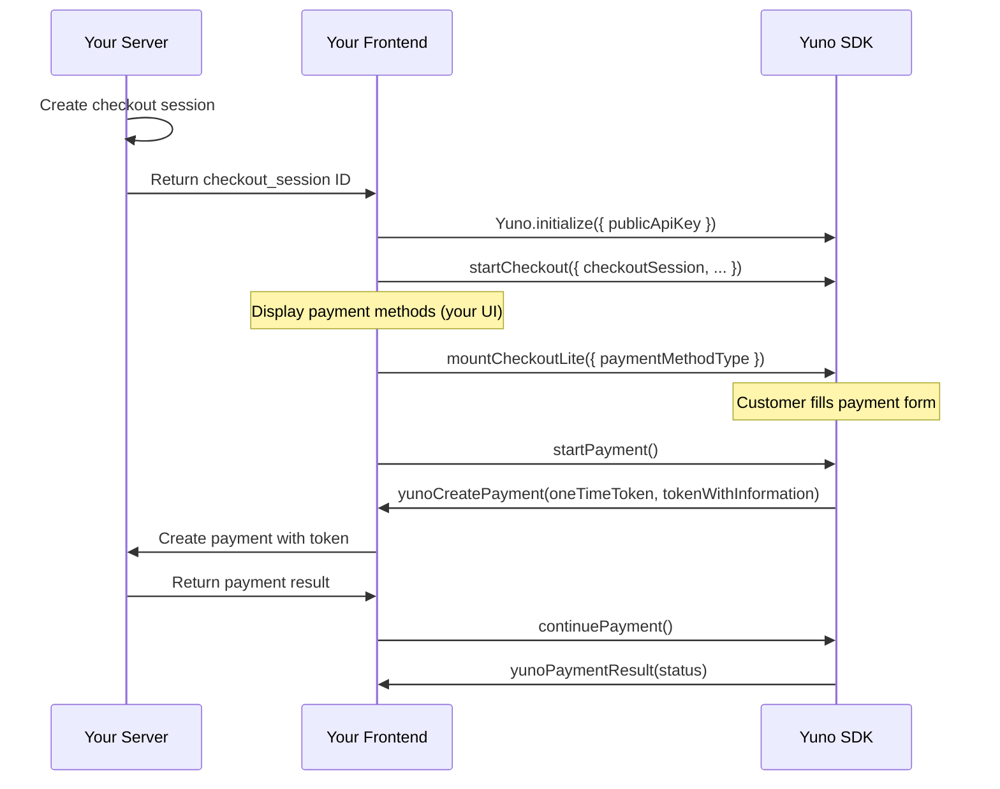

## Overview

Lite Checkout renders a payment form directly in your checkout page while giving you full control over the payment method selection UI. You decide which payment methods to display, how to present them, and when to mount the form -- Yuno handles the secure form rendering and tokenization.

<Note>
Lite Checkout is ideal when you want to control the payment method list and layout but still want Yuno to handle the payment form, tokenization, and PCI compliance.
</Note>

## Prerequisites

Before you begin, make sure you have:

- Yuno API keys (public and private) from [Dashboard > Developers > API Keys](/getting-started/authentication)
- `@yuno-payments/sdk-web` installed via npm or CDN ([Installation](/guides/sdk/overview#installation))
- At least one payment method enabled in your [Dashboard > Connections](/platform/dashboard/connections)
- A server-side endpoint to create checkout sessions and payments

## How It Works



1. **Server:** Create a checkout session
2. **Client:** Initialize the SDK and configure callbacks with `startCheckout()`
3. **Client:** Display payment methods in your own UI
4. **Client:** Mount the Lite form when the customer selects a method with `mountCheckoutLite()`
5. **Client:** Call `startPayment()` to trigger tokenization
6. **Server:** Create the payment with the one-time token
7. **Client:** Call `continuePayment()` for 3DS or async flows

## Integration Steps

<Steps>
  <Step title="Create a checkout session (server-side)">
    ```javascript
    // Server-side (Node.js example)
    const sessionResponse = await fetch('https://api-sandbox.y.uno/v1/checkout/sessions', {
      method: 'POST',
      headers: {
        'public-api-key': process.env.YUNO_PUBLIC_KEY,
        'private-secret-key': process.env.YUNO_PRIVATE_KEY,
        'account-code': process.env.YUNO_ACCOUNT_CODE,
        'Content-Type': 'application/json',
      },
      body: JSON.stringify({
        merchant_order_id: 'order-101',
        payment_description: 'Order #101',
        country: 'BR',
        amount: {
          currency: 'BRL',
          value: 100.00,
        },
        customer_id: 'customer-uuid',
      }),
    });

    const session = await sessionResponse.json();
    // Return session.checkout_session to the client
    ```
  </Step>

  <Step title="Initialize the SDK (client-side)">
    ```javascript
    import { Yuno } from '@yuno-payments/sdk-web';

    const yuno = await Yuno.initialize({
      publicApiKey: 'your-public-api-key',
    });
    ```
  </Step>

  <Step title="Configure the checkout">
    Call `startCheckout()` with your callbacks. This registers the callbacks but does not mount any UI yet.

    ```javascript
    yuno.startCheckout({
      checkoutSession: 'checkout-session-uuid',
      elementSelector: '#payment-form',
      countryCode: 'BR',
      language: 'pt',
      showLoading: true,

      card: {
        type: 'extends',
        cardSaveEnable: false,
        onChange(event) {
          // event.data includes IIN info and installment options
          console.log('Card changed:', event);
        },
      },

      async yunoCreatePayment(oneTimeToken, tokenWithInformation) {
        const response = await fetch('/api/create-payment', {
          method: 'POST',
          headers: { 'Content-Type': 'application/json' },
          body: JSON.stringify({
            token: oneTimeToken,
            session: 'checkout-session-uuid',
          }),
        });

        if (response.ok) {
          yuno.continuePayment({ showPaymentStatus: true });
        }
      },

      yunoPaymentResult(data) {
        if (data.status === 'SUCCEEDED') {
          window.location.href = '/order-confirmation';
        }
      },

      yunoError(error) {
        console.error('Checkout error:', error.message);
      },
    });
    ```
  </Step>

  <Step title="Mount the Lite form for a payment method">
    When the customer selects a payment method from your UI, mount the form:

    ```javascript
    yuno.mountCheckoutLite({
      paymentMethodType: 'CARD',
      vaultedToken: null, // pass a vaulted token for saved cards
    });
    ```

    Add the container element to your HTML:

    ```html
    <div id="payment-form"></div>
    ```
  </Step>

  <Step title="Mount external payment buttons (optional)">
    For wallet payment methods, mount external buttons in your own containers:

    ```javascript
    await yuno.mountExternalButtons([
      { paymentMethodType: 'APPLE_PAY', elementSelector: '#apple-pay' },
      { paymentMethodType: 'GOOGLE_PAY', elementSelector: '#google-pay' },
      { paymentMethodType: 'PAYPAL', elementSelector: '#paypal' },
    ]);
    ```

    ```html
    <div id="apple-pay"></div>
    <div id="google-pay"></div>
    <div id="paypal"></div>
    ```
  </Step>

  <Step title="Trigger the payment">
    When the customer is ready to pay:

    ```javascript
    yuno.startPayment();
    ```

    This triggers the `yunoCreatePayment` callback with the one-time token.
  </Step>

  <Step title="Create the payment (server-side)">
    Use the one-time token to create the payment on your server:

    ```javascript
    // Server-side: POST /api/create-payment
    const paymentResponse = await fetch('https://api-sandbox.y.uno/v1/payments', {
      method: 'POST',
      headers: {
        'public-api-key': process.env.YUNO_PUBLIC_KEY,
        'private-secret-key': process.env.YUNO_PRIVATE_KEY,
        'account-code': process.env.YUNO_ACCOUNT_CODE,
        'Content-Type': 'application/json',
      },
      body: JSON.stringify({
        checkout_session: 'checkout-session-uuid',
        payment_method: {
          type: 'CARD',
          token: oneTimeToken,
        },
        amount: {
          currency: 'BRL',
          value: 100.00,
        },
        country: 'BR',
        customer_payer: {
          document: {
            document_type: 'CPF',
            document_number: '12345678901',
          },
          email: 'customer@example.com',
        },
      }),
    });

    const payment = await paymentResponse.json();
    // Return payment to the client
    ```
  </Step>
</Steps>

## Configuration Options

### startCheckout Parameters

| Property | Type | Required | Default | Description |
|----------|------|----------|---------|-------------|
| `checkoutSession` | `string` | Yes | -- | Checkout session ID from your server |
| `elementSelector` | `string` | Yes | -- | CSS selector for the form container |
| `countryCode` | `string` | Yes | -- | ISO 3166-1 alpha-2 country code |
| `language` | `string` | No | Browser locale | UI language: `"en"`, `"es"`, `"pt"` |
| `showLoading` | `boolean` | No | `true` | Show loading indicator |
| `card` | `object` | No | -- | Card form configuration |
| `yunoCreatePayment` | `function` | Yes | -- | Token callback |
| `yunoPaymentResult` | `function` | Yes | -- | Payment result callback |
| `yunoError` | `function` | No | -- | Error handler |
| `onLoading` | `function` | No | -- | Loading state callback |

### mountCheckoutLite Parameters

| Parameter | Type | Required | Description |
|-----------|------|----------|-------------|
| `paymentMethodType` | `string` | Yes | Payment method type: `"CARD"`, `"PIX"`, `"PSE"`, `"BOLETO"`, etc. |
| `vaultedToken` | `string` | No | Vaulted token for saved payment methods |

### Supported Payment Method Types

| Type | Description |
|------|-------------|
| `CARD` | Credit and debit cards |
| `PIX` | Brazilian instant payment |
| `PSE` | Colombian bank transfer |
| `BOLETO` | Brazilian bank slip |
| `APPLE_PAY` | Apple Pay (via external button) |
| `GOOGLE_PAY` | Google Pay (via external button) |
| `PAYPAL` | PayPal (via external button) |

## Callbacks

### yunoCreatePayment(oneTimeToken, tokenWithInformation)

Called when Yuno generates a token from the form. Create the payment server-side, then call `yuno.continuePayment()`.

| Parameter | Type | Description |
|-----------|------|-------------|
| `oneTimeToken` | `string` | Single-use token for the Create Payment API |
| `tokenWithInformation` | `object` | Token with metadata (method type, last four digits, brand) |

### yunoPaymentResult(data)

Called with the final payment outcome.

| Parameter | Type | Description |
|-----------|------|-------------|
| `data.status` | `string` | `"SUCCEEDED"`, `"DECLINED"`, `"PENDING"`, `"REJECTED"`, `"CANCELED"`, `"ERROR"` |
| `data.paymentId` | `string` | The payment ID |

### yunoError(error)

Called when the SDK encounters an error.

### onLoading(isLoading)

Reports loading state changes.

## Complete Working Example

```html
<!DOCTYPE html>
<html lang="en">
<head>
  <meta charset="UTF-8">
  <meta name="viewport" content="width=device-width, initial-scale=1.0">
  <title>Yuno Lite Checkout</title>
  <script src="https://sdk-web.y.uno/v1.5/main.js"></script>
  <style>
    .container { max-width: 600px; margin: 40px auto; font-family: sans-serif; }
    .methods { display: grid; grid-template-columns: 1fr 1fr; gap: 12px; margin-bottom: 20px; }
    .method-card {
      padding: 16px; border: 2px solid #e5e7eb; border-radius: 12px;
      cursor: pointer; text-align: center; transition: border-color 0.2s;
    }
    .method-card:hover { border-color: #93c5fd; }
    .method-card.selected { border-color: #0066FF; background: #eff6ff; }
    #payment-form { min-height: 100px; margin-bottom: 16px; }
    #pay-button {
      display: block; width: 100%; padding: 14px;
      background: #0066FF; color: white; border: none;
      border-radius: 8px; font-size: 16px; cursor: pointer;
    }
    .wallet-buttons { display: flex; gap: 12px; margin-bottom: 20px; }
    .wallet-buttons > div { flex: 1; }
  </style>
</head>
<body>
  <div class="container">
    <h2>Select Payment Method</h2>

    <div class="methods">
      <div class="method-card" onclick="selectMethod('CARD', this)">Credit/Debit Card</div>
      <div class="method-card" onclick="selectMethod('PIX', this)">PIX</div>
      <div class="method-card" onclick="selectMethod('PSE', this)">PSE</div>
      <div class="method-card" onclick="selectMethod('BOLETO', this)">Boleto</div>
    </div>

    <div class="wallet-buttons">
      <div id="apple-pay"></div>
      <div id="google-pay"></div>
    </div>

    <div id="payment-form"></div>

    <button id="pay-button" onclick="pay()">Pay R$100.00</button>
  </div>

  <script>
    let yuno;
    let checkoutSession;

    async function init() {
      const res = await fetch('/api/checkout-session', { method: 'POST' });
      const data = await res.json();
      checkoutSession = data.checkout_session;

      yuno = await Yuno.initialize({ publicApiKey: 'your-public-api-key' });

      yuno.startCheckout({
        checkoutSession,
        elementSelector: '#payment-form',
        countryCode: 'BR',
        language: 'pt',
        showLoading: true,

        async yunoCreatePayment(oneTimeToken) {
          const response = await fetch('/api/payments', {
            method: 'POST',
            headers: { 'Content-Type': 'application/json' },
            body: JSON.stringify({ token: oneTimeToken, session: checkoutSession }),
          });
          if (response.ok) {
            yuno.continuePayment({ showPaymentStatus: true });
          }
        },

        yunoPaymentResult(data) {
          if (data.status === 'SUCCEEDED') {
            window.location.href = '/order-confirmation';
          }
        },

        yunoError(error) {
          console.error('Error:', error.message);
        },
      });

      // Mount wallet buttons
      await yuno.mountExternalButtons([
        { paymentMethodType: 'APPLE_PAY', elementSelector: '#apple-pay' },
        { paymentMethodType: 'GOOGLE_PAY', elementSelector: '#google-pay' },
      ]);
    }

    function selectMethod(type, el) {
      document.querySelectorAll('.method-card').forEach(c => c.classList.remove('selected'));
      el.classList.add('selected');
      yuno.mountCheckoutLite({ paymentMethodType: type });
    }

    function pay() {
      yuno.startPayment();
    }

    init();
  </script>
</body>
</html>
```

## Error Handling

| Error | Cause | Solution |
|-------|-------|----------|
| `INVALID_PUBLIC_API_KEY` | Incorrect or expired API key | Verify in Dashboard > Developers > API Keys |
| `CHECKOUT_SESSION_EXPIRED` | Session expired or already used | Create a new checkout session |
| `PAYMENT_METHOD_NOT_AVAILABLE` | Method not available for the country | Check Dashboard > Connections |
| `ELEMENT_NOT_FOUND` | Container element does not exist | Ensure the element exists before mounting |

## Testing

1. Use **sandbox** API keys from Dashboard > Developers > API Keys
2. Use the sandbox API URL: `https://api-sandbox.y.uno`
3. Use [test card numbers](/getting-started/testing) to simulate different payment outcomes
4. Test each payment method type separately to ensure forms render correctly

## Troubleshooting

<AccordionGroup>
  <Accordion title="Form does not render after selecting a payment method">
    - Verify `mountCheckoutLite()` is called with a valid `paymentMethodType`
    - Ensure `startCheckout()` was called first with a valid checkout session
    - Check that the payment method is enabled for the session's country
  </Accordion>

  <Accordion title="External buttons do not appear">
    - Apple Pay requires Safari on macOS/iOS with a configured wallet
    - Google Pay requires a compatible browser with a configured account
    - PayPal buttons render only when PayPal is enabled in your Dashboard
  </Accordion>

  <Accordion title="Payment fails after token generation">
    - Check your server-side payment creation logic
    - Verify all required payment fields (amount, country, customer) are included
    - Ensure `continuePayment()` is called for payments requiring 3DS
  </Accordion>
</AccordionGroup>

## Next Steps

<CardGroup cols={2}>
  <Card title="Full Checkout" icon="credit-card" href="/guides/sdk/full-checkout">
    Simpler integration -- Yuno handles everything.
  </Card>
  <Card title="Seamless Checkout" icon="bolt" href="/guides/sdk/seamless-checkout">
    SDK-managed payment creation in one flow.
  </Card>
  <Card title="Customization" icon="palette" href="/guides/sdk/customization">
    Theme and style your checkout.
  </Card>
  <Card title="Web SDK Reference" icon="book" href="/guides/sdk/web-reference">
    Complete parameter and method reference.
  </Card>
</CardGroup>
