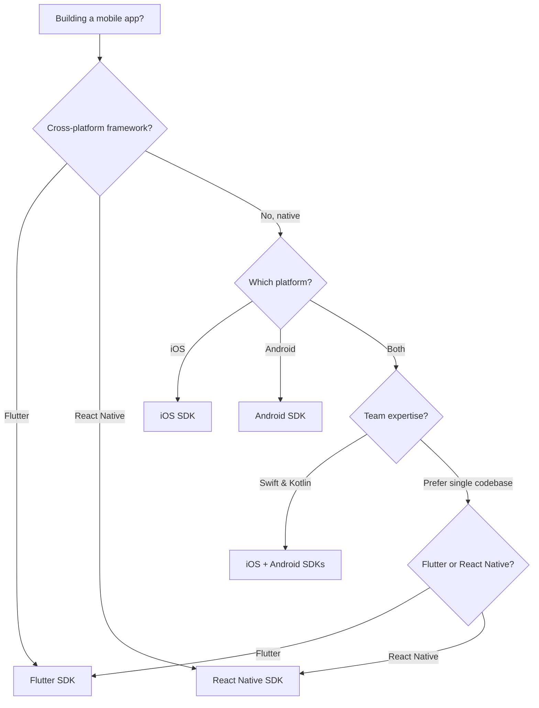

## Which mobile SDK should I use?

Yuno provides native and cross-platform mobile SDKs. Use the decision tree below to find the best fit for your app.

## Comparison

| | iOS SDK | Android SDK | Flutter SDK | React Native SDK |
|---|---|---|---|---|
| **Language** | Swift | Kotlin | Dart | TypeScript |
| **Min platform** | iOS 14+ | API 21+ | iOS 14+ / API 21+ | iOS 14+ / API 21+ |
| **IDE** | Xcode 15+ | Android Studio | VS Code / Android Studio | VS Code / Xcode |
| **Installation** | CocoaPods, SPM | Gradle (Maven) | pub.dev | npm |
| **Bundle size impact** | ~2 MB | ~1.8 MB | ~2.5 MB | ~2.2 MB |
| **Full Checkout** | Yes | Yes | Yes | Yes |
| **Seamless Checkout** | Yes | Yes | Yes | Yes |
| **Lite Checkout** | Yes | Yes | Yes | Yes |
| **Headless SDK** | Yes | Yes | Via platform channels | Via native modules |
| **3DS handling** | Built-in | Built-in | Built-in | Built-in |
| **Card vaulting** | Yes | Yes | Yes | Yes |
| **PCI scope** | SAQ-A | SAQ-A | SAQ-A | SAQ-A |
| **Apple Pay** | Yes | -- | iOS only | iOS only |
| **Google Pay** | -- | Yes | Android only | Android only |

## Prerequisites by platform

<Tabs>
  <Tab title="iOS">
    - Xcode 15 or later
    - iOS 14.0+ deployment target
    - Swift 5.9+
    - CocoaPods 1.14+ or Swift Package Manager
    - Yuno API keys ([Authentication](/getting-started/authentication))
  </Tab>
  <Tab title="Android">
    - Android Studio Hedgehog (2023.1) or later
    - Minimum SDK: API 21 (Android 5.0)
    - Kotlin 1.9+ (Kotlin Gradle Plugin 1.4.0+)
    - Gradle 8.0+ (Android Gradle Plugin 4.0.0+)
    - Java 8 enabled
    - AndroidX (not legacy support libraries)
    - ProGuard 6.2.2+ (if using code shrinking)
    - Yuno API keys ([Authentication](/getting-started/authentication))
  </Tab>
  <Tab title="Flutter">
    - Flutter 3.16+
    - Dart 3.2+
    - iOS 14+ / Android API 21+
    - Xcode 15+ (for iOS builds)
    - Android Studio (for Android builds)
    - Yuno API keys ([Authentication](/getting-started/authentication))
  </Tab>
  <Tab title="React Native">
    - React Native 0.72+
    - Node.js 18+
    - iOS 14+ / Android API 21+
    - Xcode 15+ (for iOS builds)
    - Android Studio (for Android builds)
    - Yuno API keys ([Authentication](/getting-started/authentication))
  </Tab>
</Tabs>

## Integration types

All Yuno mobile SDKs offer multiple integration levels:

<CardGroup cols={2}>
  <Card title="Full SDK" icon="credit-card">
    Renders all available payment methods in a pre-built checkout UI. Fastest integration path with minimal code.
  </Card>
  <Card title="Lite SDK" icon="bolt">
    You control which payment methods are shown. Yuno handles the payment form and tokenization.
  </Card>
  <Card title="Seamless SDK" icon="wand-magic-sparkles">
    Flexible payment solution with pre-built UI components and customization options. Recommended for most integrations.
  </Card>
  <Card title="Headless SDK" icon="code">
    Full control over the UI. Yuno handles tokenization and PCI compliance behind the scenes.
  </Card>
</CardGroup>

## Shared architecture

All Yuno mobile SDKs follow the same integration pattern:

1. **Create a checkout session** server-side via the [Checkout Sessions API](/api-reference/checkout-sessions/create)
2. **Initialize the SDK** with your public API key and `YunoConfig`
3. **Start the checkout** by passing the session token to the SDK
4. **Handle the one-time token (OTT)** — the SDK generates a token you use to create the payment server-side
5. **Call `continuePayment()`** — after creating the payment, call this method so the SDK can handle async flows (3DS, redirects)
6. **Handle callbacks** for payment success, error, processing, reject, and cancellation states
7. **Verify payment status** server-side via webhooks or the [GET Payment API](/api-reference/payments/retrieve)

<Warning>
Never use your private secret key in mobile apps. Only the public API key should be embedded in client-side code. All payment creation and verification must happen server-side.
</Warning>

## Payment status states

All mobile SDKs return these payment states through their callbacks:

| State | Description |
|-------|-------------|
| `succeeded` / `SUCCEEDED` | Payment completed successfully |
| `fail` / `FAIL` | Payment failed due to an error |
| `processing` / `PROCESSING` | Payment is being processed (async methods) |
| `reject` / `REJECT` | Payment was rejected (insufficient funds, fraud, etc.) |
| `internalError` / `INTERNAL_ERROR` | Unexpected server-side error |
| `userCancell` / `CANCELED` | User cancelled the payment flow |

<Note>
The exact enum names vary by platform (Swift uses camelCase, Kotlin uses UPPER_CASE), but the semantics are identical.
</Note>

## Get started

<CardGroup cols={2}>
  <Card title="iOS SDK" icon="apple" href="/guides/sdk/ios-checkout">
    Native Swift integration for iPhone and iPad.
  </Card>
  <Card title="Android SDK" icon="android" href="/guides/sdk/android-checkout">
    Native Kotlin integration for Android devices.
  </Card>
  <Card title="Flutter SDK" icon="flutter" href="/guides/sdk/flutter-checkout">
    Cross-platform integration with a single Dart codebase.
  </Card>
  <Card title="React Native SDK" icon="react" href="/guides/sdk/react-native-checkout">
    Cross-platform integration for React Native apps.
  </Card>
</CardGroup>

## Next steps

<CardGroup cols={2}>
  <Card title="Web SDK Overview" icon="globe" href="/guides/sdk/overview">
    Building for the web instead? Start here.
  </Card>
  <Card title="Customization" icon="palette" href="/guides/sdk/customization">
    Theme and style your mobile checkout.
  </Card>
</CardGroup>