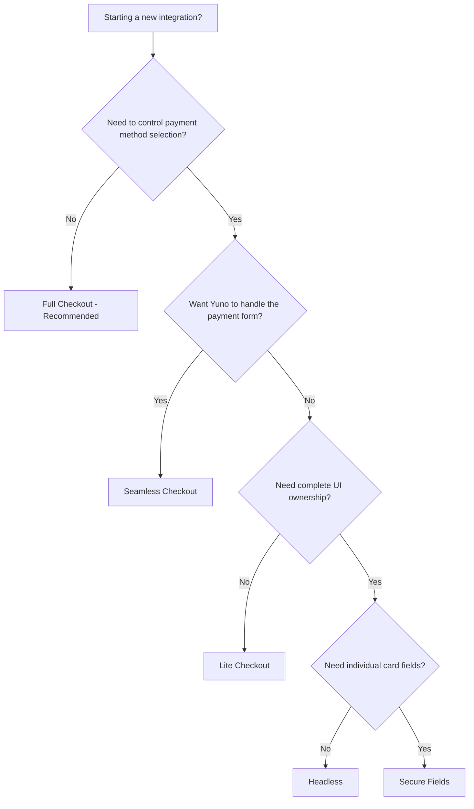

## Which integration should I use?

Yuno offers multiple Web SDK integration types, each with a different balance of convenience and control. For most merchants, **Full Checkout** or **Seamless Checkout** is the right choice.



## Comparison

| | Full | Seamless | Lite | Secure Fields | Headless |
|---|---|---|---|---|---|
| **Best for** | Most integrations | Custom method selection | Custom checkout pages | Individual field styling | Full UI control |
| **Effort** | ~10 lines of code | Low | Medium | Medium-High | High |
| **UI control** | Theme and branding | Payment method list | Layout and styling | Per-field styling | Complete |
| **PCI scope** | SAQ-A | SAQ-A | SAQ-A | SAQ-A | SAQ-A |
| **Payment methods** | All, automatic | All, you select | All, you select | Cards only | Cards only |
| **Auto payment methods** | Yes | Yes | No | No | No |
| **Dashboard conditions** | Yes | Yes | Yes | Yes | No |
| **Recommendation** | **Recommended** | **Recommended** | Advanced | Advanced | Advanced |

## Installation

Install the Yuno Web SDK via npm, CDN script tag, or dynamic injection.

<Tabs>
  <Tab title="npm">
    ```bash
    npm install @yuno-payments/sdk-web
    ```

    Then import in your JavaScript or TypeScript:

    ```javascript
    import { Yuno } from '@yuno-payments/sdk-web';
    ```

    <Tip>
    The npm package includes TypeScript type definitions out of the box. Import types like `YunoConfig`, `PaymentResult`, and `YunoError` directly.
    </Tip>
  </Tab>

  <Tab title="yarn">
    ```bash
    yarn add @yuno-payments/sdk-web
    ```

    ```javascript
    import { Yuno } from '@yuno-payments/sdk-web';
    ```
  </Tab>

  <Tab title="pnpm">
    ```bash
    pnpm add @yuno-payments/sdk-web
    ```

    ```javascript
    import { Yuno } from '@yuno-payments/sdk-web';
    ```
  </Tab>

  <Tab title="CDN Script Tag">
    Add the script tag to your HTML `<head>`:

    ```html
    <script src="https://sdk-web.y.uno/v1.5/main.js"></script>
    ```

    For production, use Subresource Integrity (SRI) with a pinned version:

    ```html
    <script
      src="https://sdk-web.y.uno/v1.5/main.js"
      integrity="sha384-{hash}"
      crossorigin="anonymous"
    ></script>
    ```

    <Tip>
    Obtain the current SRI hash from the [Yuno npm package page](https://www.npmjs.com/package/@yuno-payments/sdk-web). Update the hash whenever you upgrade the SDK version.
    </Tip>
  </Tab>

  <Tab title="Dynamic Injection">
    Load the SDK dynamically at runtime:

    ```javascript
    const script = document.createElement('script');
    script.src = 'https://sdk-web.y.uno/v1.5/main.js';
    script.onload = () => {
      // Yuno is now available on the global scope
      console.log('Yuno SDK loaded');
    };
    document.head.appendChild(script);
    ```
  </Tab>
</Tabs>

### Prerequisites

Before integrating, make sure you have:

- A Yuno merchant account with API keys ([Authentication](/getting-started/authentication))
- At least one payment method enabled in your [Dashboard](/platform/dashboard/connections)
- A server-side endpoint to create checkout sessions

<Warning>
Never include your **private secret key** in client-side code. Use only the **public API key** in the browser.
</Warning>

## SDK Initialization

All integration types start by initializing the SDK:

```javascript
const yuno = await Yuno.initialize({
  publicApiKey: 'your-public-api-key',
});
```

### Initialization Parameters

| Parameter | Type | Required | Description |
|-----------|------|----------|-------------|
| `publicApiKey` | `string` | Yes | Your Yuno public API key from Dashboard > Developers > API Keys |
| `countryCode` | `string` | No | ISO 3166-1 alpha-2 country code (e.g., `"CO"`, `"BR"`, `"MX"`) |
| `language` | `string` | No | UI language: `"en"`, `"es"`, `"pt"`. Defaults to browser locale |
| `theme` | `object` | No | Theme customization object. See [Customization](/guides/sdk/customization) |

## Full Checkout (Recommended)

Full Checkout is the fastest path to accepting payments. Mount it with a single call and Yuno renders the entire checkout UI -- payment method selection, card forms, alternative methods, and 3DS handling -- all included.

**Why start here:**
- **Fastest time-to-value** -- one mount call, ~10 lines of code
- **All payment methods** render automatically based on your configuration
- **SAQ-A compliance** -- zero card data touches your servers
- **Production-ready** -- responsive, accessible, localized out of the box

Get started with the [Full Checkout integration guide](/guides/sdk/full-checkout).

## Seamless Checkout

Seamless Checkout combines SDK convenience with control over payment method selection. Yuno handles the payment form and creates payments in a single flow -- you control which methods to show and when.

**Why use Seamless:**
- **Single-flow payment creation** -- the only integration that handles token-to-payment seamlessly
- **Payment method control** -- you decide which methods to display
- **External buttons** -- mount Apple Pay and Google Pay buttons anywhere in your UI
- **Low development effort** -- similar to Full Checkout with more flexibility

Get started with the [Seamless Checkout integration guide](/guides/sdk/seamless-checkout).

## Advanced Integrations

For merchants who need more control over the checkout experience:

### Lite Checkout

Embed a payment form directly in your page with full layout control. Yuno supplies available payment methods; you decide which to display and manage the UI. Supports external buttons for Apple Pay, Google Pay, and PayPal.

See the [Lite Checkout guide](/guides/sdk/lite-checkout).

### Secure Fields

Individual, tokenized input fields (card number, expiry, CVV) that you place and style independently. Each field renders in a secure iframe -- card data never touches your servers. Web only.

See the [Secure Fields guide](/guides/sdk/secure-fields).

### Headless

Build your own checkout UI from scratch. You collect card data, call `generateToken()` for tokenization, and Yuno handles 3DS. Maximum flexibility, highest integration effort.

See the [Headless guide](/guides/sdk/headless).

## TypeScript Support

The Yuno Web SDK includes TypeScript type definitions. Import types directly from the package:

```typescript
import { Yuno, YunoConfig, PaymentResult, YunoError } from '@yuno-payments/sdk-web';

const config: YunoConfig = {
  publicApiKey: 'YOUR_PUBLIC_API_KEY',
  countryCode: 'CO',
  language: 'en',
};

const yuno = await Yuno.initialize(config);
```

Key type definitions:

| Type | Description |
|------|-------------|
| `YunoConfig` | Initialization configuration object |
| `SeamlessCheckoutConfig` | Seamless checkout startup configuration |
| `PaymentResult` | Payment outcome object with status, paymentId, and error details |
| `YunoError` | Error object with code and message |
| `TokenWithInformation` | One-time token with payment method metadata |
| `CardOptions` | Card form configuration options |
| `RenderMode` | Render mode configuration (`"modal"` or `"element"`) |

## SDK Versions

The current SDK version is **v1.5**. When integrating, always check the latest version of `@yuno-payments/sdk-web` on [npm](https://www.npmjs.com/package/@yuno-payments/sdk-web) to ensure compatibility.

<Warning>
If you are upgrading from a previous SDK version, review the release notes for breaking changes in the initialization API. The legacy `Yuno.initialize('public-key')` string-based initialization has been replaced by the object-based API shown above.
</Warning>

## Testing in Sandbox

Use the sandbox environment to test your integration without processing real payments:

1. Use your **sandbox** API keys from Dashboard > Developers > API Keys
2. Use the sandbox API base URL: `https://api-sandbox.y.uno`
3. Use [test card numbers](/getting-started/testing) provided in the Yuno documentation
4. All checkout sessions created in sandbox mode are free and do not incur charges

## Next Steps

<CardGroup cols={2}>
  <Card title="Full Checkout" icon="credit-card" href="/guides/sdk/full-checkout">
    Recommended -- get live in minutes.
  </Card>
  <Card title="Seamless Checkout" icon="bolt" href="/guides/sdk/seamless-checkout">
    SDK convenience with payment method control.
  </Card>
  <Card title="Customization" icon="palette" href="/guides/sdk/customization">
    Theme, branding, and styling options.
  </Card>
  <Card title="Web SDK Reference" icon="book" href="/guides/sdk/web-reference">
    Complete parameter and method reference.
  </Card>
</CardGroup>
