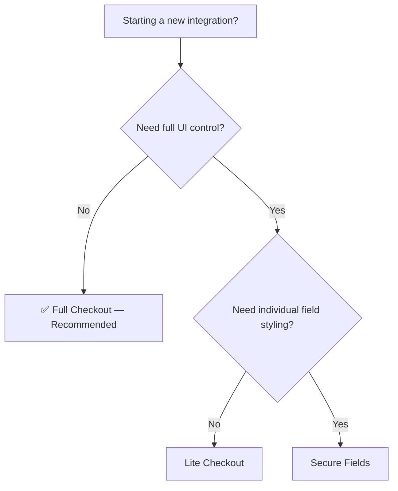

## Which SDK should I use?

For most integrations, **Full Checkout** is the recommended starting point. It gets you live with all payment methods in minutes, with zero PCI scope.



## Comparison

| | Full Checkout | Lite Checkout | Secure Fields |
|---|---|---|---|
| **Best for** | Most integrations | Custom checkout pages | Full UI ownership |
| **Integration effort** | ~10 lines of code | Medium | High |
| **UI customization** | Theme & branding | Layout + styling | Complete control |
| **PCI scope** | SAQ-A (lowest) | SAQ-A | SAQ-A |
| **Payment methods** | All, automatically | All, select which to show | Cards only |
| **Recommendation** | **Recommended** | When you need more control | When you need individual fields |

## Full Checkout (Recommended)

Full Checkout is the fastest path to accepting payments. Mount it with a single call and Yuno renders the entire checkout UI — payment method selection, card forms, alternative methods, and 3DS handling — all included.

**Why start here:**
- **Fastest time-to-value** — one mount call, ~10 lines of code
- **All payment methods** render automatically based on your configuration
- **SAQ-A compliance** — zero card data touches your servers
- **Production-ready** — responsive, accessible, localized out of the box

Get started with the [Full Checkout integration guide](/guides/sdk/full-checkout).

## Alternative SDKs

If Full Checkout doesn't meet your requirements, Yuno offers two additional options:

### Lite Checkout

Embed a payment form directly in your page with more layout control. Use this when you need the checkout to feel like a native part of your site but still want Yuno to handle payment method rendering.

See the [Lite Checkout guide](/guides/sdk/lite-checkout).

### Secure Fields

Individual, tokenized input fields (card number, expiry, CVV) that you place and style independently. Use this when you need complete control over every element of your payment form.

See the [Secure Fields guide](/guides/sdk/secure-fields).

## Installation

Install the Yuno Web SDK via npm or CDN:

<CodeGroup>
```bash npm
npm install @yuno-payments/sdk-web
```

```html CDN
<script src="https://sdk-web.y.uno/v1/static/js/main.js"></script>
```
</CodeGroup>

## SDK Versions

When integrating, always check the latest version of `@yuno-payments/sdk-web` on [npm](https://www.npmjs.com/package/@yuno-payments/sdk-web) to ensure compatibility.

<Warning>
If you are upgrading from a previous SDK version, review the [migration notes](https://github.com/yuno-payments) for breaking changes in the initialization API.
</Warning>

## Next Steps

<CardGroup cols={2}>
  <Card title="Full Checkout" icon="credit-card" href="/guides/sdk/full-checkout">
    Recommended — get live in minutes.
  </Card>
  <Card title="Customization" icon="palette" href="/guides/sdk/customization">
    Theme, branding, and styling options.
  </Card>
  <Card title="Lite Checkout" icon="window" href="/guides/sdk/lite-checkout">
    Embed a payment form in your page.
  </Card>
  <Card title="Secure Fields" icon="lock" href="/guides/sdk/secure-fields">
    Individual tokenized input fields.
  </Card>
</CardGroup>
