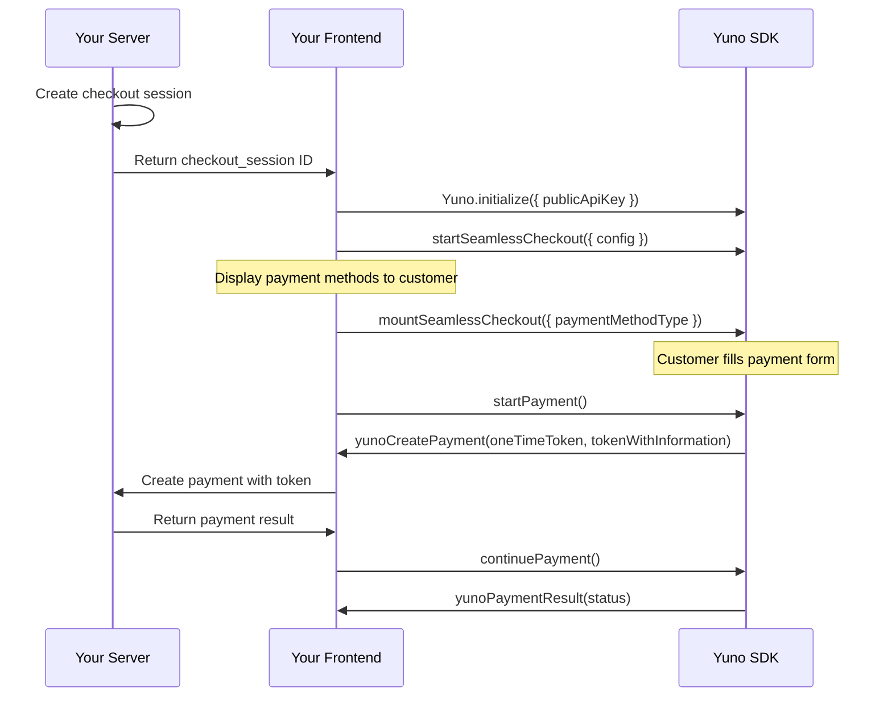

## Overview

Seamless Checkout lets Yuno handle the checkout flow while you manage payment method selection. It creates payments in a single flow -- from token generation to payment creation -- with minimal code. This is the only integration that handles the complete payment cycle seamlessly.

<Info>
**Recommended by Yuno** for the smoothest SDK integration experience. Seamless Checkout gives you control over which payment methods to display while Yuno handles forms, tokenization, and 3DS.
</Info>

## Prerequisites

Before you begin, make sure you have:

- Yuno API keys (public and private) from [Dashboard > Developers > API Keys](/getting-started/authentication)
- `@yuno-payments/sdk-web` installed via npm or CDN ([Installation](/guides/sdk/overview#installation))
- At least one payment method enabled in your [Dashboard > Connections](/platform/dashboard/connections)
- A server-side endpoint to create checkout sessions and payments

## How It Works



1. You display available payment methods to the customer (your UI)
2. When the customer selects a method, mount the Seamless Checkout form
3. Yuno renders the payment form, handles tokenization, and calls your `yunoCreatePayment` callback
4. You create the payment server-side, then call `yuno.continuePayment()` to complete the flow

## Integration Steps

<Steps>
  <Step title="Create a checkout session (server-side)">
    Create a checkout session from your server using the [Create Checkout Session API](/api-reference/checkout-sessions/create).

    ```javascript
    // Server-side (Node.js example)
    const sessionResponse = await fetch('https://api-sandbox.y.uno/v1/checkout/sessions', {
      method: 'POST',
      headers: {
        'public-api-key': process.env.YUNO_PUBLIC_KEY,
        'private-secret-key': process.env.YUNO_PRIVATE_KEY,
        'account-code': process.env.YUNO_ACCOUNT_CODE,
        'Content-Type': 'application/json',
      },
      body: JSON.stringify({
        merchant_order_id: 'order-456',
        payment_description: 'Order #456',
        country: 'CO',
        amount: {
          currency: 'USD',
          value: 99.00,
        },
        customer_id: 'customer-uuid',
      }),
    });

    const session = await sessionResponse.json();
    // Return session.checkout_session to the client
    ```

    To enable automatic card vaulting on successful payment, include `vault_on_success: true` in the payment method configuration and a valid `customer_id`.
  </Step>

  <Step title="Initialize the SDK (client-side)">
    ```javascript
    import { Yuno } from '@yuno-payments/sdk-web';

    const yuno = await Yuno.initialize({
      publicApiKey: 'your-public-api-key',
    });
    ```
  </Step>

  <Step title="Start Seamless Checkout">
    Configure the checkout with all options and callbacks:

    ```javascript
    yuno.startSeamlessCheckout({
      checkoutSession: 'checkout-session-uuid',
      elementSelector: '#checkout-form',
      countryCode: 'CO',
      language: 'en',
      showLoading: true,
      issuersFormEnable: true,
      showPaymentStatus: true,

      renderMode: {
        type: 'modal',
      },

      card: {
        type: 'extends',
        cardSaveEnable: false,
        hideCardholderName: false,
      },

      // Required: called when token is generated
      async yunoCreatePayment(oneTimeToken, tokenWithInformation) {
        const response = await fetch('/api/create-payment', {
          method: 'POST',
          headers: { 'Content-Type': 'application/json' },
          body: JSON.stringify({
            token: oneTimeToken,
            session: 'checkout-session-uuid',
          }),
        });

        if (response.ok) {
          yuno.continuePayment({ showPaymentStatus: true });
        }
      },

      // Optional: fires when customer selects a payment method
      yunoPaymentMethodSelected(data) {
        console.log('Selected:', data.paymentMethodType);
      },

      // Required: handle final payment result
      yunoPaymentResult(data) {
        if (data.status === 'SUCCEEDED') {
          window.location.href = `/confirmation?id=${data.paymentId}`;
        }
      },

      // Optional: error handler
      yunoError(error) {
        console.error('Checkout error:', error.message);
      },

      // Optional: loading state
      onLoading(isLoading) {
        document.getElementById('spinner').hidden = !isLoading;
      },
    });
    ```
  </Step>

  <Step title="Mount the checkout for a payment method">
    When the customer selects a payment method from your UI, mount the form:

    ```javascript
    yuno.mountSeamlessCheckout({
      paymentMethodType: 'CARD',
      vaultedToken: null, // pass a vaulted token for saved payment methods
    });
    ```

    Add the container element to your HTML:

    ```html
    <div id="checkout-form"></div>
    ```
  </Step>

  <Step title="Trigger the payment">
    When the customer clicks your pay button:

    ```javascript
    yuno.startPayment();
    ```

    This triggers the `yunoCreatePayment` callback with the one-time token.
  </Step>
</Steps>

## Configuration Options

### startSeamlessCheckout Parameters

| Property | Type | Required | Default | Description |
|----------|------|----------|---------|-------------|
| `checkoutSession` | `string` | Yes | -- | Checkout session ID from the Create Checkout Session API |
| `elementSelector` | `string` | Yes | -- | CSS selector for the container element |
| `countryCode` | `string` | Yes | -- | ISO 3166-1 alpha-2 country code |
| `language` | `string` | No | Browser locale | UI language: `"en"`, `"es"`, `"pt"` |
| `showLoading` | `boolean` | No | `true` | Show loading indicator during SDK operations |
| `issuersFormEnable` | `boolean` | No | `false` | Display bank/issuer dropdown for methods that require it |
| `showPaymentStatus` | `boolean` | No | `true` | Show payment status screen after completion |
| `renderMode` | `object` | No | `{ type: "modal" }` | Controls how the checkout form renders. See [Render Modes](#render-modes) |
| `card` | `object` | No | -- | Card form configuration. See [Card Form Options](#card-form-options) |

### mountSeamlessCheckout Parameters

| Parameter | Type | Required | Description |
|-----------|------|----------|-------------|
| `paymentMethodType` | `string` | Yes | Payment method type: `"CARD"`, `"PIX"`, `"PSE"`, `"APPLE_PAY"`, etc. |
| `vaultedToken` | `string` | No | Vaulted token for returning customers with saved payment methods |

### Render Modes

Control how the payment form appears:

```javascript
// Modal (default) -- opens in an overlay
renderMode: { type: 'modal' }

// Inline -- renders inside a container
renderMode: {
  type: 'element',
  elementSelector: '#checkout-container',
}

// Split -- separate containers for APM form and action form
renderMode: {
  type: 'element',
  elementSelector: {
    apmForm: '#apm-container',
    actionForm: '#action-container',
  },
}
```

| Property | Type | Required | Description |
|----------|------|----------|-------------|
| `type` | `"modal"` \| `"element"` | Yes | Render mode type |
| `elementSelector` | `string` \| `object` | For `"element"` only | Container selector(s) for inline rendering |

### Card Form Options

| Property | Type | Default | Description |
|----------|------|---------|-------------|
| `type` | `"extends"` \| `"step"` | `"extends"` | Card form layout |
| `cardSaveEnable` | `boolean` | `false` | Show "Save card" checkbox |
| `hideCardholderName` | `boolean` | `false` | Hide cardholder name field |
| `isCreditCardProcessingOnly` | `boolean` | `false` | Show only credit cards |
| `cardNumberPlaceholder` | `string` | `"Card number"` | Card number placeholder text |
| `styles` | `string` | -- | Custom CSS for the card form iframe |
| `texts` | `object` | -- | Custom label overrides |
| `onChange` | `function` | -- | Fires on field changes with `{ error, data }` including IIN/BIN info |

## Callbacks

### yunoCreatePayment(oneTimeToken, tokenWithInformation)

Called when the customer submits the form and Yuno generates a token.

| Parameter | Type | Description |
|-----------|------|-------------|
| `oneTimeToken` | `string` | Single-use token for the Create Payment API |
| `tokenWithInformation` | `object` | Token with metadata: payment method type, last four digits, brand |

After creating the payment on your server, call `yuno.continuePayment()` to handle 3DS or finalize the flow.

### yunoPaymentMethodSelected(data)

Fires when the user selects a payment method.

| Parameter | Type | Description |
|-----------|------|-------------|
| `data.paymentMethodType` | `string` | The selected payment method type (e.g., `"CARD"`, `"PIX"`) |

### yunoPaymentResult(data)

Called with the final payment outcome.

| Parameter | Type | Description |
|-----------|------|-------------|
| `data.status` | `string` | `"SUCCEEDED"`, `"DECLINED"`, `"PENDING"`, `"REJECTED"`, `"CANCELED"`, `"ERROR"` |
| `data.paymentId` | `string` | The payment ID |

### yunoError(error)

Called when the SDK encounters an error.

| Parameter | Type | Description |
|-----------|------|-------------|
| `error.message` | `string` | Error description |
| `error.code` | `string` | Error code |

## External Buttons

Mount Apple Pay, Google Pay, and PayPal buttons outside the main checkout form in your own UI containers:

```javascript
await yuno.mountExternalButtons([
  { paymentMethodType: 'APPLE_PAY', elementSelector: '#apple-pay-container' },
  { paymentMethodType: 'GOOGLE_PAY', elementSelector: '#google-pay-container' },
]);
```

```html
<div id="apple-pay-container"></div>
<div id="google-pay-container"></div>
```

Remove buttons when no longer needed:

```javascript
// Remove a specific button
yuno.unmountExternalButton('APPLE_PAY');

// Remove all external buttons
yuno.unmountAllExternalButtons();
```

## Card Vaulting

To automatically save cards on successful payment:

1. Set `vault_on_success: true` when creating the checkout session (server-side)
2. Ensure a valid `customer_id` is associated with the checkout session
3. Set `card.cardSaveEnable: true` in `startSeamlessCheckout()` to show the save checkbox

On success, the response includes a `vaulted_token` that you can use for future one-click payments by passing it to `mountSeamlessCheckout({ vaultedToken })`.

## Complete Working Example

```html
<!DOCTYPE html>
<html lang="en">
<head>
  <meta charset="UTF-8">
  <meta name="viewport" content="width=device-width, initial-scale=1.0">
  <title>Yuno Seamless Checkout</title>
  <script src="https://sdk-web.y.uno/v1.5/main.js"></script>
  <style>
    .container { max-width: 600px; margin: 40px auto; font-family: sans-serif; }
    .methods { display: flex; gap: 12px; margin-bottom: 20px; }
    .method-btn {
      padding: 12px 24px; border: 2px solid #ddd; border-radius: 8px;
      background: white; cursor: pointer; font-size: 14px;
    }
    .method-btn.active { border-color: #0066FF; background: #f0f5ff; }
    #checkout-form { min-height: 200px; }
    #pay-button {
      display: block; width: 100%; padding: 14px; margin-top: 16px;
      background: #0066FF; color: white; border: none;
      border-radius: 8px; font-size: 16px; cursor: pointer;
    }
  </style>
</head>
<body>
  <div class="container">
    <h2>Choose a payment method</h2>
    <div class="methods">
      <button class="method-btn" onclick="selectMethod('CARD')">Card</button>
      <button class="method-btn" onclick="selectMethod('PIX')">PIX</button>
      <button class="method-btn" onclick="selectMethod('PSE')">PSE</button>
    </div>
    <div id="checkout-form"></div>
    <div id="apple-pay-container"></div>
    <div id="google-pay-container"></div>
    <button id="pay-button" onclick="pay()">Pay $99.00</button>
  </div>

  <script>
    let yuno;
    let checkoutSession;

    async function init() {
      // 1. Get checkout session from server
      const res = await fetch('/api/checkout-session', { method: 'POST' });
      const data = await res.json();
      checkoutSession = data.checkout_session;

      // 2. Initialize SDK
      yuno = await Yuno.initialize({
        publicApiKey: 'your-public-api-key',
      });

      // 3. Configure Seamless Checkout
      yuno.startSeamlessCheckout({
        checkoutSession,
        elementSelector: '#checkout-form',
        countryCode: 'CO',
        language: 'en',
        showLoading: true,
        issuersFormEnable: true,
        showPaymentStatus: true,
        renderMode: { type: 'element', elementSelector: '#checkout-form' },
        card: { type: 'extends', cardSaveEnable: false },

        async yunoCreatePayment(oneTimeToken, tokenWithInformation) {
          const response = await fetch('/api/payments', {
            method: 'POST',
            headers: { 'Content-Type': 'application/json' },
            body: JSON.stringify({ token: oneTimeToken, session: checkoutSession }),
          });
          if (response.ok) {
            yuno.continuePayment({ showPaymentStatus: true });
          }
        },

        yunoPaymentResult(data) {
          if (data.status === 'SUCCEEDED') {
            window.location.href = '/order-confirmation';
          }
        },

        yunoError(error) {
          console.error('Error:', error.message);
        },
      });

      // 4. Mount external wallet buttons
      await yuno.mountExternalButtons([
        { paymentMethodType: 'APPLE_PAY', elementSelector: '#apple-pay-container' },
        { paymentMethodType: 'GOOGLE_PAY', elementSelector: '#google-pay-container' },
      ]);
    }

    function selectMethod(type) {
      document.querySelectorAll('.method-btn').forEach(btn => btn.classList.remove('active'));
      event.target.classList.add('active');
      yuno.mountSeamlessCheckout({ paymentMethodType: type });
    }

    function pay() {
      yuno.startPayment();
    }

    init();
  </script>
</body>
</html>
```

## Error Handling

| Error | Cause | Solution |
|-------|-------|----------|
| `INVALID_PUBLIC_API_KEY` | Incorrect or expired API key | Verify in Dashboard > Developers > API Keys |
| `CHECKOUT_SESSION_EXPIRED` | Session has expired or been used | Create a new checkout session |
| `NO_PAYMENT_METHODS` | No methods configured for the country | Enable methods in Dashboard > Connections |
| `PAYMENT_METHOD_NOT_AVAILABLE` | The selected method is not available | Check that the method is enabled for the session's country |
| `ELEMENT_NOT_FOUND` | Container element does not exist | Ensure the DOM element exists before mounting |

## Testing

1. Use **sandbox** API keys from Dashboard > Developers > API Keys
2. Use the sandbox API URL: `https://api-sandbox.y.uno`
3. Use [test card numbers](/getting-started/testing) to simulate different outcomes
4. Test external buttons (Apple Pay, Google Pay) using their respective test environments

## Troubleshooting

<AccordionGroup>
  <Accordion title="Payment method form does not appear after selection">
    - Verify you called `mountSeamlessCheckout()` with a valid `paymentMethodType`
    - Ensure the `elementSelector` container exists in the DOM
    - Check that the payment method is enabled for the session's country
  </Accordion>

  <Accordion title="External buttons are not rendering">
    - Apple Pay requires Safari on macOS/iOS with a configured Apple Pay wallet
    - Google Pay requires a compatible browser with a configured Google Pay account
    - These buttons only render when the wallet provider is available on the device
  </Accordion>

  <Accordion title="yunoCreatePayment callback fires but payment fails">
    - Check your server-side payment creation for errors
    - Verify the one-time token is being sent correctly
    - Ensure `yuno.continuePayment()` is called after the payment is created
  </Accordion>
</AccordionGroup>

## Next Steps

<CardGroup cols={2}>
  <Card title="Full Checkout" icon="credit-card" href="/guides/sdk/full-checkout">
    Pre-built UI with zero payment method management.
  </Card>
  <Card title="Customization" icon="palette" href="/guides/sdk/customization">
    Theme and style your checkout.
  </Card>
  <Card title="Card Enrollment" icon="vault" href="/guides/sdk/enrollment">
    Vault cards for returning customers.
  </Card>
  <Card title="Web SDK Reference" icon="book" href="/guides/sdk/web-reference">
    Complete parameter and method reference.
  </Card>
</CardGroup>
