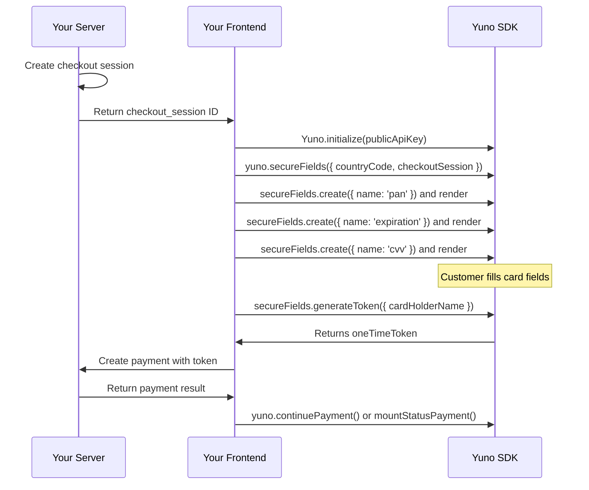

## Overview

Secure Fields lets you embed individual, PCI-compliant card input fields (card number, expiry date, CVV) directly into your custom checkout UI. Each field is rendered in a secure iframe managed by Yuno, so sensitive card data never touches your servers.

<Note>
Secure Fields gives you complete design freedom while keeping your PCI scope at **SAQ-A** level, the lowest compliance burden. This integration is **Web only**.
</Note>

## Prerequisites

Before you begin, make sure you have:

- Yuno API keys (public and private) from [Dashboard > Developers > API Keys](/getting-started/authentication)
- `@yuno-payments/sdk-web` installed via npm or CDN ([Installation](/guides/sdk/overview#installation))
- A custom checkout page where you control the form layout
- A server-side endpoint to create checkout sessions and payments

## How It Works



## Integration Steps

<Steps>
  <Step title="Create a checkout session (server-side)">
    ```javascript
    // Server-side (Node.js example)
    const sessionResponse = await fetch('https://api-sandbox.y.uno/v1/checkout/sessions', {
      method: 'POST',
      headers: {
        'public-api-key': process.env.YUNO_PUBLIC_KEY,
        'private-secret-key': process.env.YUNO_PRIVATE_KEY,
        'account-code': process.env.YUNO_ACCOUNT_CODE,
        'Content-Type': 'application/json',
      },
      body: JSON.stringify({
        merchant_order_id: 'order-789',
        payment_description: 'Order #789',
        country: 'US',
        amount: {
          currency: 'USD',
          value: 75.00,
        },
        customer_id: 'customer-uuid',
      }),
    });

    const session = await sessionResponse.json();
    // Return session.checkout_session to the client
    ```
  </Step>

  <Step title="Initialize the SDK">
    ```javascript
    import { Yuno } from '@yuno-payments/sdk-web';

    const yuno = await Yuno.initialize('your-public-api-key');
    ```

    <Info>
    Secure Fields uses the string-based initialization: `Yuno.initialize(publicApiKey)`. This differs from other integrations that use the object-based initialization.
    </Info>
  </Step>

  <Step title="Create a Secure Fields instance">
    ```javascript
    const secureFields = yuno.secureFields({
      countryCode: 'US',
      checkoutSession: 'checkout-session-uuid',
      installmentEnable: false, // set to true to show installment options
    });
    ```

    ### secureFields() Parameters

    | Parameter | Type | Required | Default | Description |
    |-----------|------|----------|---------|-------------|
    | `countryCode` | `string` | Yes | -- | ISO 3166-1 alpha-2 country code |
    | `checkoutSession` | `string` | Yes | -- | Checkout session ID from your server |
    | `installmentEnable` | `boolean` | No | `false` | Display installment options when available |
  </Step>

  <Step title="Create and mount individual fields">
    Create each field with configuration, then render it into a container element:

    ```javascript
    // Card number field
    const cardNumber = secureFields.create({
      name: 'pan',
      options: {
        placeholder: '0000 0000 0000 0000',
        label: 'Card Number',
        showError: true,
        validationType: 'on_blur_full',
        onChange: ({ error, data }) => {
          if (error) {
            console.log('Validation error:', error);
          }
          if (data) {
            // data includes card IIN info (scheme, brand, type, issuer)
            console.log('Card info:', data);
          }
        },
        onFocus: () => console.log('Card number focused'),
        onBlur: () => console.log('Card number blurred'),
      },
    });
    cardNumber.render('#card-number');

    // Expiry date field
    const expiry = secureFields.create({
      name: 'expiration',
      options: {
        placeholder: 'MM / YY',
        label: 'Expiry Date',
        showError: true,
        validationType: 'on_blur_full',
      },
    });
    expiry.render('#expiry-date');

    // CVV field
    const cvv = secureFields.create({
      name: 'cvv',
      options: {
        placeholder: '123',
        label: 'CVV',
        showError: true,
        validationType: 'on_blur_full',
      },
    });
    cvv.render('#cvv');
    ```

    Add container elements to your HTML:

    ```html
    <form id="payment-form">
      <div>
        <div id="card-number"></div>
      </div>
      <div style="display: flex; gap: 16px;">
        <div id="expiry-date" style="flex: 1;"></div>
        <div id="cvv" style="flex: 1;"></div>
      </div>
      <input type="text" id="cardholder-name" placeholder="Cardholder Name" />
      <button type="submit">Pay $75.00</button>
    </form>
    ```
  </Step>

  <Step title="Generate a one-time token">
    When the customer submits the form, generate a token from the secure fields:

    ```javascript
    document.getElementById('payment-form').addEventListener('submit', async (e) => {
      e.preventDefault();

      try {
        const oneTimeToken = await secureFields.generateToken({
          checkoutSession: 'checkout-session-uuid',
          cardHolderName: document.getElementById('cardholder-name').value,
          saveCard: false, // set to true to vault the card
        });

        // Send the token to your server to create the payment
        const response = await fetch('/api/create-payment', {
          method: 'POST',
          headers: { 'Content-Type': 'application/json' },
          body: JSON.stringify({
            token: oneTimeToken,
            session: 'checkout-session-uuid',
          }),
        });

        const payment = await response.json();

        // Handle 3DS or display payment status
        if (payment.checkout?.sdk_action_required) {
          yuno.continuePayment();
        } else {
          yuno.mountStatusPayment({
            checkoutSession: 'checkout-session-uuid',
            countryCode: 'US',
            language: 'en',
            yunoPaymentResult: (data) => {
              console.log('Payment result:', data.status);
            },
          });
        }
      } catch (error) {
        console.error('Tokenization failed:', error);
      }
    });
    ```

    <Warning>
    The one-time token expires after a single use. Generate a new token for each payment attempt.
    </Warning>
  </Step>
</Steps>

## Field Configuration

### create() Options

| Option | Type | Default | Description |
|--------|------|---------|-------------|
| `name` | `"pan"` \| `"expiration"` \| `"cvv"` | -- | **Required.** The field type to create |
| `options.placeholder` | `string` | -- | Placeholder text inside the field |
| `options.label` | `string` | -- | Visible label above the field |
| `options.showError` | `boolean` | `false` | Display validation error messages below the field |
| `options.validationType` | `string` | `"on_blur_full"` | When to validate: `"on_change"`, `"on_blur"`, `"on_blur_full"` |
| `options.errorMessage` | `string` | -- | Custom error message text |
| `options.inputMode` | `"numeric"` \| `"text"` | `"numeric"` | Mobile keyboard type |
| `options.styles` | `string` | -- | Custom CSS for the field iframe |

### Field Design Types

Configure label/placeholder presentation using `designType`:

```javascript
const cardNumber = secureFields.create({
  name: 'pan',
  designType: 'float-label', // or 'float-label-static' or 'label-placeholder'
  options: { /* ... */ },
});
```

| Design Type | Behavior |
|-------------|----------|
| `float-label` | Label floats above the field when focused or filled; appears as placeholder when empty |
| `float-label-static` | Label is always displayed above the field |
| `label-placeholder` | Label displays only as placeholder text inside the field |

### Field Callbacks

| Callback | Parameters | Description |
|----------|-----------|-------------|
| `onChange` | `{ error, data }` | Fires on every value change. `data` includes card IIN info (scheme, brand, type, issuer) and installment options |
| `onFocus` | -- | Fires when the field receives focus |
| `onBlur` | -- | Fires when the field loses focus |
| `onRenderedSecureField` | -- | Fires after the field iframe has fully rendered |

### onChange Data Object

The `onChange` callback `data` object includes:

| Property | Type | Description |
|----------|------|-------------|
| `data.scheme` | `string` | Card scheme (e.g., `"VISA"`, `"MASTERCARD"`) |
| `data.brand` | `string` | Card brand |
| `data.type` | `string` | Card type (`"CREDIT"`, `"DEBIT"`) |
| `data.issuer` | `string` | Card issuer name |
| `data.isCardIINLoading` | `boolean` | Whether IIN lookup is in progress |
| `data.isInstallmentLoading` | `boolean` | Whether installment data is loading |
| `data.installments` | `array` | Available installment plans |

## generateToken() Parameters

| Parameter | Type | Required | Description |
|-----------|------|----------|-------------|
| `checkoutSession` | `string` | Yes | The checkout session ID |
| `cardHolderName` | `string` | Yes | The cardholder's name |
| `saveCard` | `boolean` | No | Set to `true` to vault the card. Requires a customer ID on the checkout session |
| `vaultedToken` | `string` | No | Previously enrolled card token (for re-tokenization) |
| `installment` | `object` | No | Selected installment plan: `{ id, value, amount }` |
| `customer.document` | `object` | No | Customer document: `{ document_number, document_type }` |
| `cardType` | `string` | No | Force card type: `"DEBIT"` or `"CREDIT"` |

You can also use `generateTokenWithInformation()` to receive extended metadata along with the token.

## Styling Secure Fields

Each Secure Fields iframe accepts custom CSS via the `styles` option:

```javascript
const cardNumber = secureFields.create({
  name: 'pan',
  options: {
    placeholder: '0000 0000 0000 0000',
    styles: `
      #root {
        .Yuno-fieldset__box {
          .Yuno-input__content {
            background: #f9fafb;
            border: 1px solid #d1d5db;
            border-radius: 8px;
            padding: 12px;
          }
        }
      }
    `,
  },
});
```

Available CSS classes for styling:

| Class | Description |
|-------|-------------|
| `.Yuno-fieldset__box` | Field container |
| `.Yuno-input__content` | Input content area |
| `.Yuno-input__label` | Field label |
| `.Yuno-input__base` | Base input element |
| `.Yuno-input__label--error` | Label in error state |
| `.Yuno-error-text-field__message` | Error message text |

See [Customization](/guides/sdk/customization) for the full list of style properties and CSS variables.

## Complete Working Example

```html
<!DOCTYPE html>
<html lang="en">
<head>
  <meta charset="UTF-8">
  <meta name="viewport" content="width=device-width, initial-scale=1.0">
  <title>Yuno Secure Fields</title>
  <script src="https://sdk-web.y.uno/v1.5/main.js"></script>
  <style>
    .form-container {
      max-width: 420px; margin: 40px auto;
      font-family: 'Inter', sans-serif;
    }
    .field-group { margin-bottom: 16px; }
    .field-group label {
      display: block; margin-bottom: 4px;
      font-size: 14px; font-weight: 500; color: #374151;
    }
    .field-row { display: flex; gap: 16px; }
    .field-row > div { flex: 1; }
    #card-number, #expiry-date, #cvv {
      height: 48px; border: 1px solid #d1d5db; border-radius: 8px;
    }
    #cardholder-name {
      width: 100%; padding: 12px; font-size: 16px;
      border: 1px solid #d1d5db; border-radius: 8px; box-sizing: border-box;
    }
    #pay-button {
      display: block; width: 100%; padding: 14px; margin-top: 24px;
      background: #0066FF; color: white; border: none;
      border-radius: 8px; font-size: 16px; cursor: pointer;
    }
    #pay-button:disabled { opacity: 0.5; cursor: not-allowed; }
    .error { color: #ef4444; font-size: 12px; margin-top: 4px; }
    .card-info { font-size: 12px; color: #6b7280; margin-top: 4px; }
  </style>
</head>
<body>
  <div class="form-container">
    <h2>Payment Details</h2>
    <form id="payment-form">
      <div class="field-group">
        <label>Card Number</label>
        <div id="card-number"></div>
        <div id="card-info" class="card-info"></div>
      </div>

      <div class="field-row">
        <div class="field-group">
          <label>Expiry Date</label>
          <div id="expiry-date"></div>
        </div>
        <div class="field-group">
          <label>CVV</label>
          <div id="cvv"></div>
        </div>
      </div>

      <div class="field-group">
        <label>Cardholder Name</label>
        <input type="text" id="cardholder-name" placeholder="John Doe" required />
      </div>

      <button type="submit" id="pay-button">Pay $75.00</button>
    </form>
  </div>

  <script>
    (async () => {
      // 1. Get checkout session from your server
      const res = await fetch('/api/checkout-session', { method: 'POST' });
      const { checkout_session } = await res.json();

      // 2. Initialize SDK
      const yuno = await Yuno.initialize('your-public-api-key');

      // 3. Create Secure Fields instance
      const secureFields = yuno.secureFields({
        countryCode: 'US',
        checkoutSession: checkout_session,
      });

      // 4. Create and mount fields
      const cardNumber = secureFields.create({
        name: 'pan',
        options: {
          placeholder: '0000 0000 0000 0000',
          showError: true,
          validationType: 'on_blur_full',
          onChange: ({ error, data }) => {
            const infoEl = document.getElementById('card-info');
            if (data?.scheme) {
              infoEl.textContent = `${data.scheme} ${data.type || ''}`;
            }
          },
        },
      });
      cardNumber.render('#card-number');

      const expiry = secureFields.create({
        name: 'expiration',
        options: {
          placeholder: 'MM / YY',
          showError: true,
          validationType: 'on_blur_full',
        },
      });
      expiry.render('#expiry-date');

      const cvv = secureFields.create({
        name: 'cvv',
        options: {
          placeholder: '123',
          showError: true,
          validationType: 'on_blur_full',
        },
      });
      cvv.render('#cvv');

      // 5. Handle form submission
      document.getElementById('payment-form').addEventListener('submit', async (e) => {
        e.preventDefault();
        const payButton = document.getElementById('pay-button');
        payButton.disabled = true;

        try {
          const oneTimeToken = await secureFields.generateToken({
            checkoutSession: checkout_session,
            cardHolderName: document.getElementById('cardholder-name').value,
          });

          const payRes = await fetch('/api/payments', {
            method: 'POST',
            headers: { 'Content-Type': 'application/json' },
            body: JSON.stringify({ token: oneTimeToken, session: checkout_session }),
          });
          const payment = await payRes.json();

          if (payment.checkout?.sdk_action_required) {
            yuno.continuePayment();
          } else {
            window.location.href = '/order-confirmation';
          }
        } catch (err) {
          console.error('Payment failed:', err);
          alert('Payment failed. Please try again.');
        } finally {
          payButton.disabled = false;
        }
      });
    })();
  </script>
</body>
</html>
```

## Error Handling

| Error | Cause | Solution |
|-------|-------|----------|
| `INVALID_PUBLIC_API_KEY` | Incorrect or expired API key | Verify in Dashboard > Developers > API Keys |
| `CHECKOUT_SESSION_EXPIRED` | Session expired or already used | Create a new checkout session |
| `TOKENIZATION_FAILED` | Card data validation failed | Check that all fields are filled correctly |
| `FIELD_VALIDATION_ERROR` | Individual field has invalid input | Listen to `onChange` callbacks for field-level errors |
| `ELEMENT_NOT_FOUND` | Render target does not exist | Ensure container elements exist before calling `render()` |

## Testing

1. Use **sandbox** API keys from Dashboard > Developers > API Keys
2. Use the sandbox API URL: `https://api-sandbox.y.uno`
3. Use [test card numbers](/getting-started/testing) for different outcomes:
   - `4111 1111 1111 1111` -- Visa (approved)
   - `5500 0000 0000 0004` -- Mastercard (approved)
4. Any future expiry date and any 3-digit CVV are valid in sandbox

## Troubleshooting

<AccordionGroup>
  <Accordion title="Fields render but are blank or invisible">
    - Check that the container elements have a defined height (at least 48px)
    - Ensure no CSS is hiding the iframe (e.g., `overflow: hidden` on parent)
    - Verify the SDK script loaded successfully
  </Accordion>

  <Accordion title="generateToken() fails with validation error">
    - Ensure all three fields (pan, expiration, cvv) are mounted and filled
    - Check `onChange` callbacks for field-level errors before calling `generateToken()`
    - Verify `cardHolderName` is provided and not empty
  </Accordion>

  <Accordion title="3DS challenge does not appear">
    - Call `yuno.continuePayment()` when the payment response has `sdk_action_required: true`
    - Ensure popups and iframes are not blocked by your browser
    - Check your acquiring bank's 3DS configuration
  </Accordion>
</AccordionGroup>

## Next Steps

<CardGroup cols={2}>
  <Card title="Customization" icon="palette" href="/guides/sdk/customization">
    Style Secure Fields to match your brand.
  </Card>
  <Card title="Card Enrollment" icon="vault" href="/guides/sdk/enrollment">
    Vault cards for one-click payments.
  </Card>
  <Card title="Full Checkout" icon="credit-card" href="/guides/sdk/full-checkout">
    Simpler integration with pre-built UI.
  </Card>
  <Card title="Web SDK Reference" icon="book" href="/guides/sdk/web-reference">
    Complete parameter and method reference.
  </Card>
</CardGroup>
