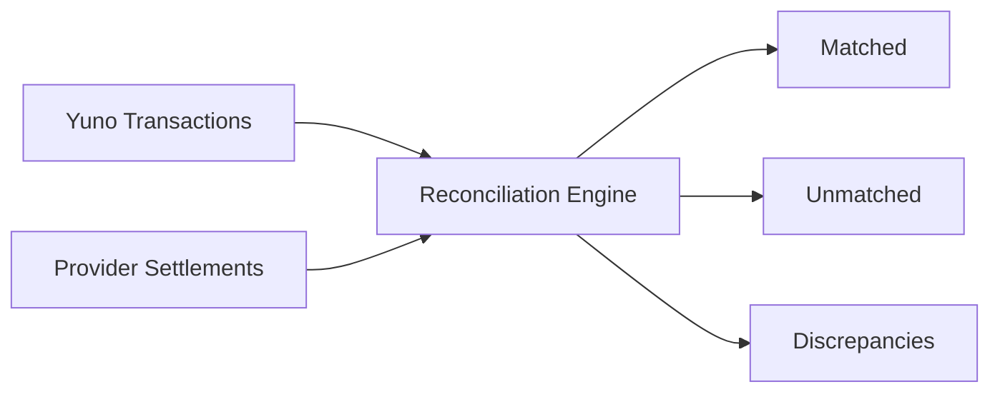

## Overview

Reconciliation matches your Yuno payment records with settlement reports from payment providers. This ensures every transaction is accounted for and helps identify discrepancies between expected and actual fund movements.

<Note>
Reconciliation is available for production transactions only. Sandbox transactions do not generate settlement data.
</Note>

## How Reconciliation Works

Yuno automatically ingests settlement files from connected providers and matches them against your transaction records.

## Accessing Reconciliations

Navigate to **Dashboard > Reconciliations** to view the reconciliation dashboard.

## Reconciliation Statuses

| Status | Description | Action Required |
|--------|-------------|-----------------|
| **Matched** | Transaction and settlement amounts agree | None |
| **Partially Matched** | Amounts differ (e.g., fee deductions) | Review fee breakdown |
| **Unmatched - Yuno** | Transaction exists in Yuno but not in provider settlement | Contact provider |
| **Unmatched - Provider** | Settlement record exists but no Yuno transaction | Investigate |
| **Discrepancy** | Amounts or currencies do not match | Manual review |

## Settlement Timeline

Settlement timelines vary by provider and payment method:

| Payment Method | Typical Settlement |
|---------------|-------------------|
| Credit Card | T+1 to T+30 (varies by provider) |
| Debit Card | T+1 to T+2 |
| PIX | T+0 (instant) to T+1 |
| Bank Transfer | T+1 to T+3 |
| OXXO | T+1 to T+2 after customer payment |

## Filtering and Search

| Filter | Options |
|--------|---------|
| **Date Range** | Settlement date range |
| **Provider** | Specific provider connection |
| **Status** | Matched, Unmatched, Discrepancy |
| **Payment Method** | Card, PIX, etc. |
| **Amount Range** | Min/max settlement amount |

## Exporting Reports

Export reconciliation data for accounting systems:

<Steps>
  <Step title="Apply filters">
    Set date range, provider, and status filters as needed.
  </Step>
  <Step title="Click Export">
    Select format: CSV, XLSX, or PDF.
  </Step>
  <Step title="Download">
    The report includes transaction ID, provider reference, amounts, fees, and reconciliation status.
  </Step>
</Steps>

## Handling Discrepancies

<Accordion title="Amount mismatch">
Common cause: Provider fees, currency conversion, or tax withholding. Compare the gross vs. net amounts and verify the fee schedule with your provider.
</Accordion>

<Accordion title="Missing settlements">
If a Yuno transaction has no matching settlement after the expected timeline, check: 1) Provider settlement schedule, 2) Transaction was not voided/refunded, 3) Provider dashboard for the specific transaction.
</Accordion>

<Accordion title="Duplicate settlements">
Rare but possible during provider system issues. Flag the duplicate and contact the provider for resolution.
</Accordion>

<Warning>
Reconciliation discrepancies should be investigated promptly. Unresolved discrepancies may indicate processing errors, fee changes, or potential fraud.
</Warning>
