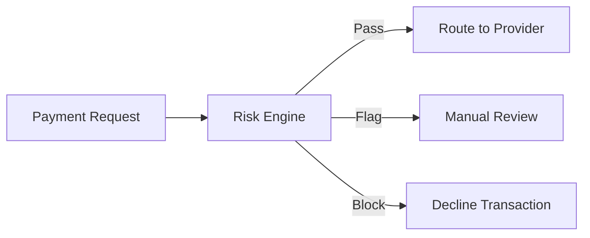

## Overview

Risk Conditions allow you to define rules that evaluate transactions for potential fraud before they reach the payment provider. Rules can block, flag, or require additional verification for suspicious transactions.

## How Risk Evaluation Works



Yuno evaluates risk conditions in real time during payment creation. The risk decision is applied before the transaction is sent to the provider.

## Creating Risk Conditions

<Steps>
  <Step title="Navigate to Risk Conditions">
    Go to **Dashboard > Risk Conditions** and click **Create Condition**.
  </Step>

  <Step title="Define the trigger">
    Select the attributes to evaluate:

    | Attribute | Description | Examples |
    |-----------|-------------|---------|
    | **Amount** | Transaction value thresholds | Block if amount > $5,000 |
    | **Country** | Origin or destination country | Flag if country = high-risk list |
    | **Card BIN** | Card issuer identification | Block specific BIN ranges |
    | **Email** | Customer email patterns | Flag disposable email domains |
    | **Velocity** | Transaction frequency | Block if > 5 attempts in 1 hour |
    | **Device** | Device fingerprint data | Flag new devices |
    | **IP Address** | Geolocation and proxy detection | Block VPN/proxy IPs |
  </Step>

  <Step title="Set the action">
    Choose what happens when the condition matches:

    | Action | Effect |
    |--------|--------|
    | **Block** | Immediately decline the transaction |
    | **Flag** | Process but mark for manual review |
    | **3DS Challenge** | Force 3DS authentication |
    | **Allow** | Explicitly allow (override other conditions) |
  </Step>

  <Step title="Set priority and activate">
    Assign a priority (higher priority conditions are evaluated first) and toggle to **Active**.
  </Step>
</Steps>

## Common Risk Rules

<Accordion title="High-value transaction blocking">
Block transactions above a threshold to prevent large fraudulent charges:
```
Condition: amount > 10000
Action: Block
Message: "Transaction exceeds maximum allowed amount"
```
</Accordion>

<Accordion title="Velocity limiting">
Prevent rapid repeated attempts from the same customer:
```
Condition: same customer_email AND count > 5 in last 1 hour
Action: Block
Message: "Too many payment attempts"
```
</Accordion>

<Accordion title="Geographic restrictions">
Flag or block transactions from unexpected countries:
```
Condition: customer_country NOT IN [BR, CO, MX, CL, PE]
Action: Flag for review
```
</Accordion>

<Accordion title="BIN-based rules">
Apply rules based on card issuer for known fraud patterns:
```
Condition: card_bin IN [blocked_bin_list]
Action: Block
```
</Accordion>

## Manual Review Queue

Transactions flagged by risk conditions appear in **Dashboard > Risk > Review Queue**. Reviewers can:

- **Approve:** Release the payment for processing
- **Decline:** Cancel the transaction
- **Escalate:** Forward to a senior reviewer

<Note>
Configure notification alerts in **Settings > Notifications** to receive emails when flagged transactions enter the review queue.
</Note>

## Risk Analytics

Monitor fraud prevention performance in **Dashboard > Risk > Analytics**:

| Metric | Description |
|--------|-------------|
| Block rate | Percentage of transactions blocked |
| Flag rate | Percentage flagged for review |
| False positive rate | Legitimate transactions incorrectly blocked |
| Fraud detection rate | Fraudulent transactions caught |

<Warning>
Overly aggressive risk rules can block legitimate customers. Monitor false positive rates and adjust thresholds regularly. Start with flagging (manual review) before enabling automatic blocking.
</Warning>
