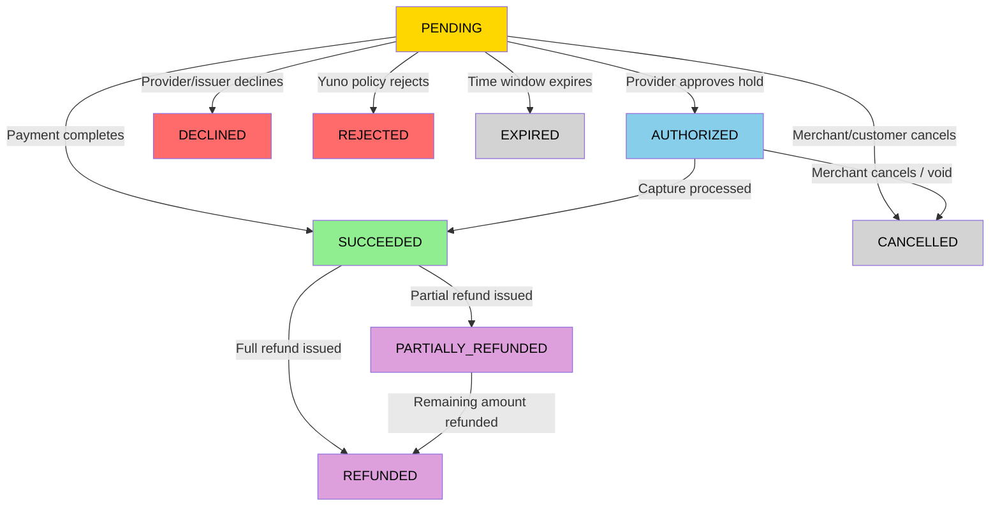

## Overview

Every payment in Yuno progresses through a series of statuses that represent its lifecycle from creation to final settlement or failure. Understanding these statuses is essential for building correct payment flows, handling webhooks, and displaying accurate information to your customers.

## Payment Statuses

| Status | Description | Terminal | Next Possible Statuses |
|--------|-------------|----------|------------------------|
| `PENDING` | Payment created, awaiting customer action or provider processing | No | `AUTHORIZED`, `SUCCEEDED`, `DECLINED`, `REJECTED`, `EXPIRED`, `CANCELLED` |
| `AUTHORIZED` | Funds reserved on customer's payment method (card only) | No | `SUCCEEDED`, `CANCELLED` |
| `SUCCEEDED` | Payment completed and funds transferred to merchant | Yes | `REFUNDED`, `PARTIALLY_REFUNDED` |
| `DECLINED` | Payment rejected by provider, issuer, or risk engine | Yes | -- |
| `REJECTED` | Payment rejected by Yuno due to validation or policy rules | Yes | -- |
| `CANCELLED` | Payment cancelled by merchant or customer before completion | Yes | -- |
| `EXPIRED` | Payment not completed within the allowed time window | Yes | -- |
| `REFUNDED` | Full refund processed; total amount returned to customer | Yes | -- |
| `PARTIALLY_REFUNDED` | Partial refund processed; remaining amount retained | Yes | `REFUNDED` |

<Note>
Terminal statuses represent the final state of a payment. No further transitions are possible from terminal statuses, except for refund operations on `SUCCEEDED` payments and full refund completion on `PARTIALLY_REFUNDED` payments.
</Note>

## Status Transition Diagram



## Transaction Sub-Statuses

Provider-level detail is available in the `transaction.status` field within the payment response. These sub-statuses provide granular information from the downstream provider.

| Sub-Status | Description | Parent Payment Status |
|------------|-------------|----------------------|
| `CREATED` | Transaction record created at provider | `PENDING` |
| `PROCESSING` | Provider is actively processing | `PENDING` |
| `AWAITING_PAYMENT` | Waiting for customer action (e.g., PIX QR scan, voucher payment) | `PENDING` |
| `APPROVED` | Provider approved the transaction | `AUTHORIZED` or `SUCCEEDED` |
| `DENIED` | Provider denied the transaction | `DECLINED` |
| `ERROR` | Provider returned an error | `DECLINED` or `REJECTED` |
| `CANCELLED` | Transaction cancelled at provider level | `CANCELLED` |
| `EXPIRED` | Transaction expired at provider level | `EXPIRED` |
| `REFUNDED` | Refund confirmed by provider | `REFUNDED` or `PARTIALLY_REFUNDED` |
| `CHARGEBACK` | Chargeback initiated against transaction | `SUCCEEDED` |

## Webhook Events by Status

Each payment status transition triggers a corresponding webhook event to your configured endpoint.

| Payment Status | Webhook Event | Trigger |
|---------------|---------------|---------|
| `PENDING` | `payment.created` | Payment object created |
| `AUTHORIZED` | `payment.authorized` | Funds reserved on card |
| `SUCCEEDED` | `payment.succeeded` | Payment completed successfully |
| `DECLINED` | `payment.declined` | Provider or issuer declined |
| `REJECTED` | `payment.rejected` | Yuno validation or policy rejected |
| `CANCELLED` | `payment.cancelled` | Merchant or customer cancelled |
| `EXPIRED` | `payment.expired` | Payment time window elapsed |
| `REFUNDED` | `refund.succeeded` | Full refund processed |
| `PARTIALLY_REFUNDED` | `refund.succeeded` | Partial refund processed |

<Note>
Configure webhook endpoints in [Dashboard > Settings > Webhooks](/platform/dashboard/webhooks). Always verify the webhook signature before processing events.
</Note>

## Common Status Flows by Payment Method

### Card (Two-Step: Authorize + Capture)

```
PENDING → AUTHORIZED → SUCCEEDED
```

1. Customer submits card details, payment enters `PENDING`
2. Issuer approves hold, payment moves to `AUTHORIZED`
3. Merchant captures, payment transitions to `SUCCEEDED`

### Card (One-Step: Direct Charge)

```
PENDING → SUCCEEDED
```

1. Customer submits card details, payment enters `PENDING`
2. Issuer approves and captures immediately, payment moves to `SUCCEEDED`

### PIX (Instant Transfer)

```
PENDING → SUCCEEDED
```

1. Payment created with QR code, enters `PENDING`
2. Customer scans QR code and confirms, payment moves to `SUCCEEDED`

If the customer does not complete the payment within the PIX expiration window (typically 30 minutes), the flow becomes:

```
PENDING → EXPIRED
```

### Boleto / Cash Voucher

```
PENDING → SUCCEEDED
```

1. Voucher generated, payment enters `PENDING`
2. Customer pays at authorized location, payment moves to `SUCCEEDED` (typically 1-3 business days)

### Bank Transfer (PSE, SPEI)

```
PENDING → SUCCEEDED
```

1. Redirect URL generated, payment enters `PENDING`
2. Customer completes bank transfer, payment moves to `SUCCEEDED`

### Declined Payment (Any Method)

```
PENDING → DECLINED
```

The provider or issuer rejects the transaction during processing.

## Handling Statuses in Your Application

### PENDING

- Display a "Processing" state to the customer
- For async methods (PIX, Boleto), show the QR code or voucher details
- Set a reasonable timeout for customer action
- Listen for webhook events to detect transitions

### AUTHORIZED

- Funds are reserved but not captured
- You must call the [Capture endpoint](/reference/api-reference-overview) to complete the payment
- Uncaptured authorizations expire (typically 7 days, varies by provider)
- Use [Cancel](/guides/direct-api/capture-and-cancel) to release the hold

### SUCCEEDED

- Confirm the order to the customer
- Fulfill the product or service
- Store the payment ID for potential refund operations

### DECLINED

- Display a generic decline message to the customer (do not expose raw provider error codes)
- Check the `decline_reason` field for categorized decline information
- See [Provider Errors](/troubleshooting/provider-errors) for retry guidance
- Soft declines may be retried; hard declines should not

### REJECTED

- Review the error details for validation issues
- Fix the request payload or configuration before retrying
- See [Error Codes](/troubleshooting/error-codes) for specific resolution steps

### CANCELLED

- Confirm cancellation to the customer
- Release any reserved inventory
- No further action required

### EXPIRED

- Notify the customer that the payment window closed
- Offer to create a new payment
- For voucher-based methods, generate a new voucher if the customer still wants to pay

### REFUNDED / PARTIALLY_REFUNDED

- Notify the customer of the refund
- Update order status in your system
- Refund settlement timing depends on the payment method and provider

<Warning>
Never rely solely on client-side status checks. Always use webhooks as the primary mechanism for detecting payment status changes, as some transitions (e.g., async payment completion) happen outside the customer's browser session.
</Warning>
